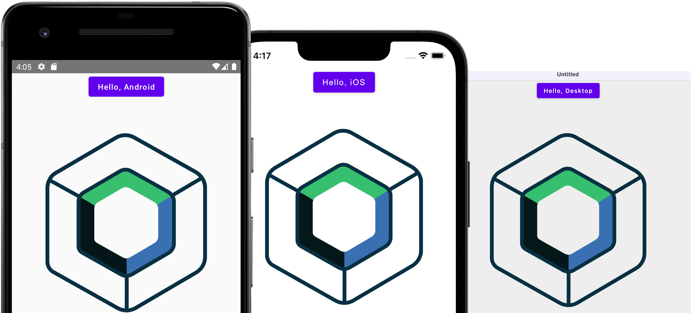

[](http://kotlinlang.org)
[](https://opensource.org/licenses/Apache-2.0)

<p align="center">
  
</p>

# Awake

A Kotlin Multiplatform game engine. Write your game once in `commonMain` and run it on
Android, iOS, Desktop, and the Web — Awake picks the right graphics backend for each
(Vulkan, or WebGPU on the web).

<p align="center">
  
</p>

> **Not published yet.** Build from source. Nothing has shipped to Maven Central.

## Try it

The demo suite is [`samples/scene3d-playground`](samples/scene3d-playground) — a rotating
cube with four camera modes, a glTF model viewer, GPU skinning, and texture sampling.

```bash
./gradlew :samples:scene3d-playground:run
```

For the web version (needs Chrome/Edge 113+ for WebGPU), run
`:samples:scene3d-playground:wasmJsBrowserDevelopmentRun` and open the URL it prints.

Desktop and Web are the targets with runnable apps today. iOS and Android build the shared
framework and AAR, but this sample has no app wrapper for them yet.

There's also [`samples/ui-showcase`](samples/ui-showcase), a gallery of every UI component.

## How a game fits together

Three pieces, roughly:

1. **A `Game`** — your code. Implement `ready(renderer)` and `render(delta, width, height)`
   (plus optional `resize`/`pause`/`resume`/`dispose`).
2. **An application** — `VulkanGameApplication` or `WebGpuGameApplication`. Hand it your
   `Game` and your shader paths; it builds the device, swapchain, and pipelines for you.
3. **A scene, if you want one** — `sceneGame { }` gives you an ECS world with `Transform`,
   `MeshRenderer`, `Camera`, and `Light` components, plus the systems that drive them.

Meshes and materials come from `renderer.createMesh(...)` / `renderer.createMaterial(...)`.
A mesh's vertex format decides which pipeline draws it, so skinned and textured meshes go
through the same `MeshRenderer` path as everything else.

The demo pages under `samples/scene3d-playground/src/commonMain` are worked examples of all
of this, and they're shared verbatim by both backends.

## Modules

All modules are `0.1.0-SNAPSHOT` and target Android, iOS, Desktop, and Web unless noted.

| Module | Status | What it does |
| :--- | :--- | :--- |
| [`awake:base`](awake/base) | Alpha | Math, assets, input |
| [`awake:ecs`](awake/ecs/README.md) | Alpha | Sparse-set ECS runtime |
| [`awake:engine`](awake/engine) | Alpha | Bootstrap and app lifecycle |
| [`awake:engine:ui`](awake/engine/ui) | Alpha | Immediate-mode UI stack |
| [`awake:scene`](awake/scene/README.md) | Alpha | Scene graph and components |
| [`awake:physics:api`](awake/physics/api) | Alpha | Backend-neutral physics contract |
| [`awake:backend:vulkan`](awake/backend/vulkan) | Alpha | Main renderer (no Web) |
| [`awake:backend:webgpu`](awake/backend/webgpu) | Experimental | Web renderer (Web only) |
| [`awake:backend:jolt`](awake/backend/jolt) | Alpha | Jolt Physics implementation |
| [`awake:backend:opengl`](awake/backend/opengl) | Frozen | Legacy; bugfixes only |

## Shaders

Shaders are authored once as WGSL and compiled to each backend's format. After editing one:

```bash
./gradlew :samples:scene3d-playground:syncAwakeShaders
```

Vulkan loads the compiled `.spv` binaries at runtime, **not** the `.frag`/`.vert` sources
next to them — so editing a source without recompiling silently changes nothing. The
`verifyShaderBinaries` check catches that and fails the build.

## Verifying UI and icons

Awake's UI is verified against real external references, not just against its own previous
output. Three different questions, three different tools — a passing golden says a render
did not change, never that it is correct.

| Question | Tool | Command |
|---|---|---|
| Did this change? | snapshot goldens + signature maps | `./gradlew :samples:ui-showcase:desktopTest` |
| Does it look like shadcn? | captures from `ui.shadcn.com` | `ShadcnReferenceComparisonTest` |
| Is this token value right? | pinned `shadcn-ui/ui` checkout | `ShadcnReferenceTokenExpandedTest` |
| Does this icon match Heroicons? | rasterized official SVG | `tools/capture_heroicons_reference.py` |

```bash
tools/fetch_shadcn_reference.sh                 # pin the reference (run first)
./gradlew :samples:ui-showcase:desktopTest
python3 tools/generate_parity_report.py         # refresh the parity report
python3 tools/generate_ui_status.py             # refresh the status matrix
```

Two rules worth knowing before touching a baseline: never re-record without opening the diff
first, and treat a parity number from a badly cropped pair as *unmeasured* rather than passing.
`skills/awake-ui-verification/SKILL.md` carries the full reasoning,
`docs/reference/ui-validation.md` the policy, and `tools/README.md` the toolchain.

## Docs

- [`CHANGELOG.md`](CHANGELOG.md) — what changed
- [`docs/MVP_PLAN.md`](docs/MVP_PLAN.md) — near-term status
- [`docs/MMORPG_ROADMAP.md`](docs/MMORPG_ROADMAP.md) — long-horizon plan
- [`docs/reference/developer-docs.md`](docs/reference/developer-docs.md) — docs workflow
- [`docs/reference/ui-fidelity-status.md`](docs/reference/ui-fidelity-status.md) — UI fidelity status matrix: what's done, partial, or missing per area, with the gap in each
- [`docs/reference/shadcn-parity.md`](docs/reference/shadcn-parity.md) — generated report on how close the UI is to real shadcn/ui
- [`tools/README.md`](tools/README.md) — asset generators and the parity toolchain

`./gradlew developerDocs` builds the API reference and UI tutorial pages.

## License

[Apache License, Version 2.0](LICENSE).
