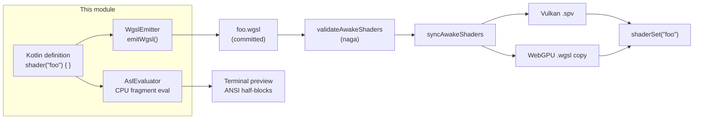

# Awake Shader DSL (ASL)

Procedural shader authoring for Awake: shaders are defined in Kotlin,
emitted as WGSL text, and fed into the existing naga shader pipeline unchanged. This module is
pure text generation — no render contract, no GPU backend, no UI dependency. Plan and
decisions: [2026-08-23-asl-procedural-shader-plan.md](../../docs/tasks/archive/2026-08-23-asl-procedural-shader-plan.md).

## Where ASL sits



Everything right of the emitted `.wgsl` already existed; ASL only changes where that text
comes from. `shaderSet`, `PipelineSpec`, and both backends never know ASL exists.

## Usage

```kotlin
val CheckerShader = shader("checker") {
    val uniforms = uniformBlock("Uniforms", group = 0, binding = 0)
    val tiles by uniforms.field(GpuDataShape.Vec4)
    val colorA by uniforms.field(GpuDataShape.Vec4)
    val colorB by uniforms.field(GpuDataShape.Vec4)

    val out = varyings("VertexOutput")
    val uv by out.varying(GpuDataShape.Vec2, location = 0)

    vertex {
        val inPosition by input(GpuDataShape.Vec3, location = 0)
        val inUv by input(GpuDataShape.Vec2, location = 1)
        out.position set vec4(inPosition, 1f.lit)
        uv set inUv
    }

    fragment {
        val cell = let("cell", floor(uv * tiles.x))
        val parity = let("parity", fract((cell.x + cell.y) * 0.5f.lit) * 2f.lit)
        colorOutput(mix(colorA, colorB, parity))
    }
}

CheckerShader.emitWgsl() // -> WGSL text
```

The Kotlin property name *is* the WGSL identifier (`by` delegation), so nothing is spelled
twice. Structural mistakes — duplicate binding/location, a fragment reading a varying the
vertex stage never wrote, constructor arity, shape-mismatched math — throw
`AslDefinitionException` at definition time. Genuine type checking stays naga's job.

## Headless terminal preview

CPU-evaluates the fragment stage per pixel and prints ANSI true-color half-blocks. No window,
no saved file, no GPU:

```bash
./gradlew :awake:asset:shader-dsl:previewShader -Pargs="64 32 --wgsl"
```

`--probe <u> <v>` swaps the image for one pixel's full variable view — every intermediate
`let` plus the final color, the part a GPU capture tool needs pixel-history for:

```bash
./gradlew :awake:asset:shader-dsl:previewShader -Pargs="--probe 0.3 0.1"
```

```
probe 'checker' at uv=(0.3, 0.1)
  let cell = [2.0, 0.0]
  let parity = [0.0]
  color -> [0.9, 0.2, 0.3, 1.0]
```

`AslEvaluator` doubles as the test oracle: the same interpreter that drives the preview pins
the shader math to hand-derived values in `AslEvaluatorTest`, and
`AslEvaluator.traceFragment` gives tests and tools the same per-`let` trace the probe prints.

## Regenerating and the dev loop

```bash
./gradlew :awake:asset:shader-pack:generateAslShaders
```

Re-emits every generated `.wgsl` (the pack's 8 + studio's triangle), then naga-validates and
re-syncs the `.spv`/WebGPU copies. Add `--continuous` and Gradle re-runs it on every
definition edit — restart the app to pick up the result (in-process pipeline reload is a
renderer feature, not ASL's). The per-module drift tests stay the CI guard;
`AWAKE_RECORD_SHADERS=1` remains the manual fallback.

## Limitations

- **WGSL feature ceiling, grown shader-by-shader.** Covered today (driven by the nine
  generated shaders): fixed-size array uniform fields, `texture_2d<f32>`/`sampler` bindings
  (implicit and explicit-LOD sampling, derivatives), a read-only storage palette binding,
  module functions, `var`/`if`/`continue`/early-`return`, both `for` forms, local const
  arrays, `vertex_index`/`instance_index` builtins, matrix-column reads, `i32`/`u32`/`bool`,
  and ~30 builtins. Still absent: compute stages, `else`/`break`, comparison samplers,
  mat2/mat3 types, other texture types, and multiple color targets. Each gap waits for a
  real consuming shader, per the plan's no-speculation rule.
- **Shapes, not types.** Expressions carry `GpuDataShape` for structural checks only;
  mismatched math naga would reject is naga's to reject. `UInt4` has no ASL mapping.
- **Comments don't survive.** Emitted WGSL carries no prose; reasoning lives in the Kotlin
  definition. Diff-reading the generated file loses the hand-written files' commentary.
- **Evaluator is fragment-only, matrix-free, texture-free.** `AslEvaluator` runs control flow
  and module functions, but matrix ops, vertex-stage evaluation, and texture sampling throw.
  It is not a software rasterizer — the preview samples UV space directly.
- **Preview needs a true-color terminal.** ANSI 24-bit escapes; plain CI logs show escape
  noise instead of an image.
- **Error distance.** A naga error points at the emitted WGSL line, not the Kotlin line that
  produced it. The golden-text tests keep the mapping reviewable, but the hop is real.

## Related Modules

- [`:awake:asset:shaders`](../shaders/README.md) — backend-neutral shader contract
  (`ShaderSet`/`ShaderStages`) that consumes the synced output.
- [`:awake:asset:shader-pack`](../shader-pack/) — Awake's shader stdlib; all of it is
  generated from ASL definitions beside the `.wgsl`, drift-guarded by `AslPackDriftTest`.
- [`:awake:core:geometry`](../../core/geometry/) — `GpuDataShape`, the one value-shape enum
  ASL reuses.
