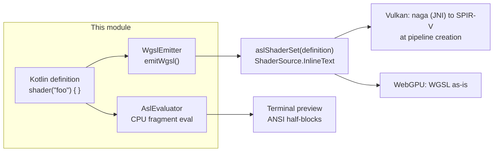

# Awake Shader DSL (ASL)

Procedural shader authoring for Awake: shaders are defined in Kotlin and emitted as WGSL text in
memory. This module is pure text generation, with no GPU backend and no UI dependency.

## Where ASL sits


```mermaid
flowchart LR
    subgraph This module
        DSL["Kotlin definition\nshader(&quot;foo&quot;) { }"] --> EMIT["WgslEmitter\nemitWgsl()"]
        DSL --> EVAL["AslEvaluator\nCPU fragment eval"]
    end
    EMIT --> SET["aslShaderSet(definition)\nShaderSource.InlineText"]
    SET --> VK["Vulkan: naga (JNI) to SPIR-V\nat pipeline creation"]
    SET --> WG["WebGPU: WGSL as-is"]
    EVAL --> PREVIEW["Terminal preview\nANSI half-blocks"]
```

- `aslShaderSet` (in `:awake:asset:shaders`) emits the WGSL once, when the shader set is built,
  and carries it as `ShaderSource.InlineText`. No `.wgsl` or `.spv` is committed or synced.
- Vulkan compiles the text when it creates the pipeline, through `NagaShaderCompiler`
  (`:awake:asset:shader-compiler`). WebGPU takes WGSL directly.
- `PipelineSpec` and both backends see only a `ShaderSet`; they never know ASL exists.

## Usage

```kotlin
val CheckerShader = shader("checker") {
    val uniforms = uniformBlock("Uniforms", group = 0, binding = 0)
    val tiles by uniforms.field(GpuDataShape.Vec4)
    val colorA by uniforms.field(GpuDataShape.Vec4)
    val colorB by uniforms.field(GpuDataShape.Vec4)

    val out = varyings("VertexOutput")
    val uv by out.varying(GpuDataShape.Vec2, location = 0)

    vertex {
        val inPosition by input(GpuDataShape.Vec3, location = 0)
        val inUv by input(GpuDataShape.Vec2, location = 1)
        out.position set vec4(inPosition, 1f.lit)
        uv set inUv
    }

    fragment {
        val cell = let("cell", floor(uv * tiles.x))
        val parity = let("parity", fract((cell.x + cell.y) * 0.5f.lit) * 2f.lit)
        colorOutput(mix(colorA, colorB, parity))
    }
}

CheckerShader.emitWgsl() // -> WGSL text
```

The Kotlin property name *is* the WGSL identifier (`by` delegation), so nothing is spelled
twice. Structural mistakes — duplicate binding/location, a fragment reading a varying the
vertex stage never wrote, constructor arity, shape-mismatched math — throw
`AslDefinitionException` at definition time. Genuine type checking stays naga's job.

## Headless terminal preview

CPU-evaluates the fragment stage per pixel and prints ANSI true-color half-blocks. No window,
no saved file, no GPU:

```bash
./gradlew :awake:asset:shader-dsl:previewShader -Pargs="64 32 --wgsl"
```

`--probe <u> <v>` swaps the image for one pixel's full variable view — every intermediate
`let` plus the final color, the part a GPU capture tool needs pixel-history for:

```bash
./gradlew :awake:asset:shader-dsl:previewShader -Pargs="--probe 0.3 0.1"
```

```
probe 'checker' at uv=(0.3, 0.1)
  let cell = [2.0, 0.0]
  let parity = [0.0]
  color -> [0.9, 0.2, 0.3, 1.0]
```

`AslEvaluator` doubles as the test oracle: the same interpreter that drives the preview pins
the shader math to hand-derived values in `AslEvaluatorTest`, and
`AslEvaluator.traceFragment` gives tests and tools the same per-`let` trace the probe prints.

## Checking a shader and the dev loop

Nothing needs regenerating, because the WGSL is emitted when the app builds its shader sets.

- **Emitted text is pinned** by the golden strings in `WgslEmissionTest`.
- **Real naga validation** runs in `NagaValidationTest` (desktop). It passes emitted WGSL to the
  `naga` CLI when that is on `PATH`, and skips otherwise.
- **The math** is checked on the CPU with `AslEvaluator` and `previewShader` (above).

An edited Kotlin definition takes effect the next time the app starts.

### Replacing a shader in a running app

A definition built at runtime can replace one a running app draws with, with no restart. This is
what a shader editor's live preview does. Vulkan only for now:

```kotlin
val replacement = renderer.capability(ShaderReplacement) ?: return   // null on WebGPU
val old = PackShaderSets.LitShadow.vulkan.program()
val new = aslShaderSet { litShadowShader(it, ambientStrength = 0.6f) }.vulkan.program()
try {
    replacement.replace(old, new)   // every pipeline running `old` now runs `new`
} catch (e: ShaderReplacementException) {
    // did not compile, or binds differently: nothing changed
}
```

- **When to call it.** On the render thread between frames, for example from a system's `update`.
  It waits for the GPU, so it costs a hitch.
- **Chaining.** `new` is what the next call replaces.
- **Bindings.** A replacement must declare the same bindings as the shader it replaces, because the
  pipeline keeps its layout. Changing bindings needs a new pipeline.
- **Limits.** Depth-only and debug-line pipelines are not replaced; the depth pre-pass keeps its
  own shader. Vertex inputs are not checked, so reading an input the vertex format lacks is a
  caller error that validation reports. Pipelines are per vertex format, so replacing the lit
  shader changes every mesh of that format. Kotlin-authored shaders still need a restart.
- **Vulkan only for now.** WebGPU ([#214](https://github.com/awakekt/awake/issues/214)), UI
  pipelines ([#217](https://github.com/awakekt/awake/issues/217)), off-thread compiles
  ([#215](https://github.com/awakekt/awake/issues/215)) and a compile cache
  ([#216](https://github.com/awakekt/awake/issues/216)) are open.

The engine showcase shows it: press L to toggle a brighter-ambient `lit_shadow`, and K to try a
broken variant, which is refused and logged.

## Limitations

- **WGSL feature ceiling, grown shader-by-shader.** Covered today, driven by the engine and pack
  shaders that use ASL: fixed-size array uniform fields, `texture_2d<f32>`/`sampler` bindings
  (implicit and explicit-LOD sampling, derivatives), a read-only storage palette binding,
  module functions, `var`/`if`/`continue`/early-`return`, both `for` forms, local const
  arrays, `vertex_index`/`instance_index` builtins, matrix-column reads, `i32`/`u32`/`bool`,
  and ~30 builtins. Still absent: compute stages, `else`/`break`, comparison samplers,
  mat2/mat3 types, other texture types, and multiple color targets. Each gap waits for a
  real consuming shader, per the plan's no-speculation rule.
- **Shapes, not types.** Expressions carry `GpuDataShape` for structural checks only;
  mismatched math naga would reject is naga's to reject. `UInt4` has no ASL mapping.
- **Comments don't survive.** Emitted WGSL carries no prose; the reasoning lives in the Kotlin
  definition.
- **Evaluator is fragment-only, matrix-free, texture-free.** `AslEvaluator` runs control flow
  and module functions, but matrix ops, vertex-stage evaluation, and texture sampling throw.
  It is not a software rasterizer — the preview samples UV space directly.
- **Preview needs a true-color terminal.** ANSI 24-bit escapes; plain CI logs show escape
  noise instead of an image.
- **Error distance.** A naga error points at the emitted WGSL line, not the Kotlin line that
  produced it. The golden-text tests keep the mapping reviewable, but the gap between the two is
  real.

## Related Modules

- [`:awake:asset:shaders`](../shaders/README.md): the backend-neutral shader contract
  (`ShaderSet`/`ShaderStages`) and `aslShaderSet`, which wraps emitted WGSL for both backends.
- [`:awake:asset:shader-pack`](../shader-pack/): Awake's shader stdlib, written in ASL and
  emitted in memory through `PackShaderSets`.
- [`:awake:asset:shader-compiler`](../shader-compiler/README.md): naga as a native library,
  which Vulkan uses to compile emitted WGSL at runtime.
- [`:awake:core:geometry`](../../core/geometry/) — `GpuDataShape`, the one value-shape enum
  ASL reuses.
