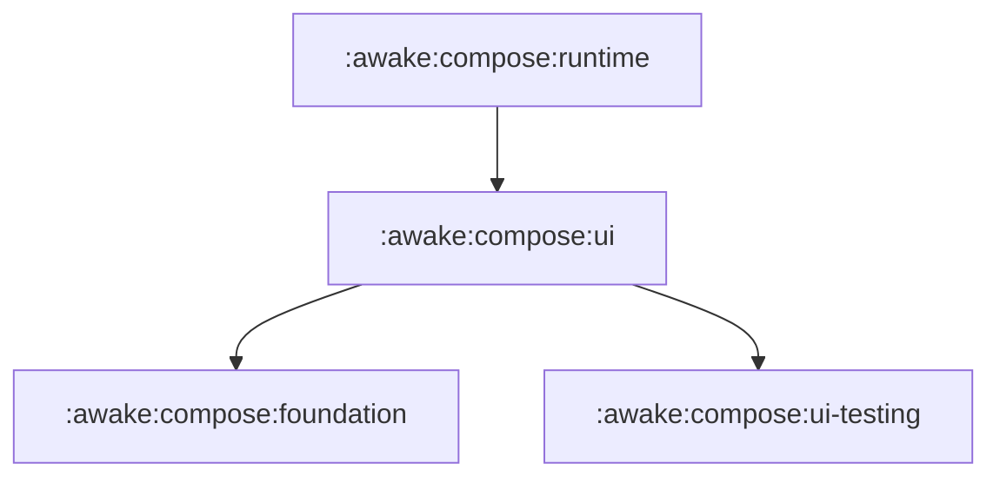

# Awake Compose (`:awake:compose`)

A retained, single-pass UI engine with a Compose-shaped API, built specifically for a game loop that redraws every frame behind a live 3D scene.

---

## Architectural Philosophy

Awake Compose delivers the ergonomic familiarity of declarative Jetpack/Multiplatform Compose while answering to the performance constraints of real-time game engines:

- **Game-Loop Native**: Runs within a hard 16.67 ms (or 8.33 ms) frame budget shared with simulation, rendering, and physics.
- **Zero Steady-State Allocations**: Layout measurement (`Constraints`), draw command emission, modifier chains, and pointer dispatching avoid heap allocations during normal 60/120 fps execution.
- **Compiler-Plugin Free**: Calling conventions use Kotlin context parameters (`context(_: Composer)`). This eliminates version-locked compiler plugin artifacts across Kotlin Multiplatform targets (Desktop JVM, Android, WasmJs, iOS).
- **Synchronous & Predictable**: Runs a single-threaded synchronous frame pump (`ComposeHost.frame`) without multiversion concurrency control, asynchronous snapshot dispatchers, or frame lags. Nothing skips and nothing is observed; a value that must change between frames is read in the phase that consumes it -- measure or draw -- rather than captured at composition.
- **Shared Input Ownership**: Input is shared with gameplay systems. Every frame reports UI claims (`isCaptured`, `isTextInputFocused`, `isScrollConsumed`) rather than assuming the UI owns the device.

---

## Module Hierarchy



### 1. `:awake:compose:runtime`
The core composition and reconciliation engine.
- **`Composer` & Applier**: Retained node hierarchy construction, positional slot identity, and reconciled tree mutations.
- **`remember`**: Value caching across frames keyed on identity or explicit state parameters.
- **`CompositionLocal`**: Ambient dependency propagation down the composition tree (`LocalDensity`, `LocalLayoutDirection`, `LocalViewportSize`).

### 2. `:awake:compose:ui`
The retained node layout, modifier, drawing, and input infrastructure.
- **`LayoutNode`**: Retained layout tree element maintaining measured bounds, absolute positions, and modifier node chains.
- **`Constraints` & `MeasurePolicy`**: Packed 64-bit zero-allocation layout constraints with intrinsic measurement support.
- **`Modifier` & `Modifier.Node`**: Chain composition (`then`, `foldIn`) with segregated node lifecycle (`ModifierNodeElement`, `LayoutModifierNode`, `DrawModifierNode`, `PointerInputNode`, `FocusTargetNode`, `SemanticsModifierNode`).
- **`Painter` & `DrawScope`**: Node-local coordinate painting emitting backend-neutral `UiDrawPrimitive` lists, offscreen `graphicsLayer` frames, `drawWithCache`, and `zIndex` sibling sorting.
- **Input & Focus**: Multi-pass pointer hit-testing (`Initial`, `Main`, `Final`), multi-touch contact tracking, 1D tab ring and 2D spatial focus beam search.

### 3. `:awake:compose:foundation`
Standard UI layout primitives, text, styling, and gestures.
- **Layouts**: `Row`, `Column`, `Box`, `Spacer`, `SubcomposeLayout`, `BoxWithConstraints`, `LazyColumn`, `LazyRow`.
- **Text & Input**: `Text`, `BasicTextField` with caret tracking, text selection, and IME composition bridges.
- **Styling**: `Modifier.styleable`, `background`, `border` (with partial edge support), `clip`, `alpha`, and state rules (`hovered`, `pressed`, `focused`, `disabled`, `selected`, `checked`).
- **Gestures & Scrolling**: `clickable`, `draggable`, `scrollable`, `verticalScroll`, `horizontalScroll`, `transformable`, and `nestedScroll`.

### 4. `:awake:compose:ui-testing`
Headless testing harnesses and validation utilities.
- **`ComposeHost`**: Headless test driver for executing layout frames, simulating pointer events, and verifying emitted draw primitives.
- **Cross-Engine Differ**: Field-level primitive diffing against legacy pipelines to prevent visual drift.

---

## Common Patterns

### 1. Composing a Basic UI
```kotlin
context(Composer)
fun UserProfile(username: String, avatarUrl: String) {
    Row(
        modifier = Modifier
            .fillMaxWidth()
            .padding(16.dp)
            .background(Color(0.1f, 0.1f, 0.1f, 1f), RoundedCornerShape(8.dp)),
        horizontalArrangement = Arrangement.spacedBy(12.dp),
        verticalAlignment = Alignment.CenterVertically,
    ) {
        Box(Modifier.size(40.dp).background(Color(0.3f, 0.3f, 0.3f, 1f), CircleShape))
        Text(text = username, color = Color.White)
    }
}
```

### 2. State Across Frames
```kotlin
// A plain class with plain vars. There is no observable state and no skipping: the whole tree
// composes every frame, so a value only has to survive one -- which is what `remember` does.
private class CounterState { var count = 0 }

context(Composer)
fun Counter() {
    val state = remember { CounterState() }

    Row(horizontalArrangement = Arrangement.spacedBy(8.dp)) {
        Text(text = "Count: ${state.count}")
        Button(onClick = { state.count++ }) {
            Text("+")
        }
    }
}
```

### 3. Custom Drawing with Cache
```kotlin
context(Composer)
fun CustomBadge(color: Color) {
    Box(
        modifier = Modifier
            .size(64.dp)
            .drawWithCache {
                // Computed once upon size/density change, not every 60fps frame
                val path = drawPath {
                    moveTo(0f, 0f)
                    lineTo(size.width, size.height / 2f)
                    lineTo(0f, size.height)
                    close()
                }
                onDrawBehind {
                    drawPath(path, color)
                }
            }
    )
}
```

### 4. Sibling Z-Index Ordering
```kotlin
context(Composer)
fun OverlappingLayers() {
    Box(Modifier.size(100.dp)) {
        // Declared first, but drawn on top and hit-tested first due to higher zIndex
        Box(Modifier.size(80.dp).zIndex(1f).background(Color.Red))
        // Declared second, but drawn underneath
        Box(Modifier.size(100.dp).zIndex(0f).background(Color.Blue))
    }
}
```

---

## Detailed Specifications

For deep-dive architectural decisions, lifecycle rules, and parity ledgers, refer to:

- [Compose Architecture Index](../../docs/reference/compose-engine/README.md)
- [Compose Parity Ledger](../../docs/reference/compose-engine/15-compose-parity.md)
- [Modifier Parity Specification](../../docs/reference/compose-engine/17-modifier-parity.md)
- [Next Stages Roadmap & Register](../../docs/tasks/2026-08-27-compose-next-stages-plan.md)
