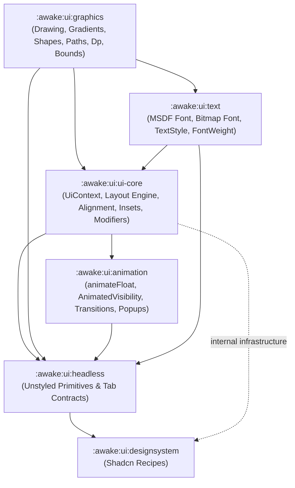

### Awake Graphical User Interface (GUI)

Status: **refactor in progress** — see [docs/audits/2026-08-17-ui-refactor-vs-recreate-audit.md](../../docs/audits/2026-08-17-ui-refactor-vs-recreate-audit.md).

Awake UI is an immediate-mode UI framework for the Awake engine, modeled after modern declarative UI
architecture patterns (Jetpack Compose / Base UI). Placement rules for these modules live in
[docs/reference/ui-ownership.md](../../docs/reference/ui-ownership.md); the same
optional-content-vs-capability principle the render backends follow is documented at
[docs/reference/render-extensibility.md](../../docs/reference/render-extensibility.md).

### Module Architecture

The UI system is decomposed into focused, single-responsibility modules:

```kotlin
include(":awake:ui:graphics")
include(":awake:ui:text")
include(":awake:ui:animation")
include(":awake:ui:ui-core")
include(":awake:ui:headless")
include(":awake:ui:tailwind")
include(":awake:ui:designsystem")
include(":awake:ui:heroicons")
include(":awake:ui:testing")
include(":awake:ui:font-atlas-generator")
include(":awake:ui:tailwind-generator")
```

### Module Descriptions

One line each — the public API and its class names are KDoc'd in the source itself
(generated via Dokka), not duplicated here.

- `awake:ui:graphics` — drawing primitives, shape painters, vector paths, gradients, bounds,
  density, icons.
- `awake:ui:text` — SDF/MSDF font rendering, font atlas integration, typography styles.
- `awake:ui:animation` — frame-clock driven animation, layout transitions, popup positioning,
  shimmer sweep primitives.
- `awake:ui:ui-core` — frame loop, runtime state, layout engine, modifiers, state hooks,
  neutral theme mechanics. No ambient per-component style defaults; recipes pass explicit
  `Style`. (Named `ui-core` to disambiguate from engine root `:awake:core`.)
- `awake:ui:headless` — unstyled, accessible leaf widgets for building custom design systems.
  Public APIs receive generic `Style`; no branded or theme-provider vocabulary.
- `awake:ui:tailwind` — standalone Tailwind CSS design tokens.
- `awake:ui:designsystem` — [shadcn/ui](https://ui.shadcn.com/)-styled component library
  built on `headless` + `tailwind`. Owns named themes and branded recipes.
- `awake:ui:heroicons` — Heroicons icon set integration.
- `awake:ui:testing` — snapshot test runners and interaction-test harnesses for UI components.
- `awake:ui:font-atlas-generator` — SDF/MSDF font atlas generation tooling.
- `awake:ui:tailwind-generator` — Tailwind-pattern style/theme generation tooling.

### Dependency Flow



### Known gaps

Tracked in [docs/reference/ui-validation.md](../../docs/reference/ui-validation.md)'s
component coverage matrix and [docs/reference/ui-status.md](../../docs/reference/ui-status.md),
not duplicated here.
