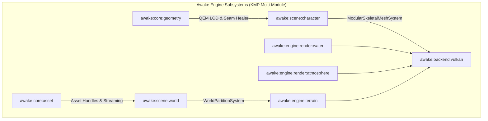

# RFC: Open-World Terrain, Modular Character, and Environment Subsystems
## Standardizing Awake as a Production-Grade 3D Open-World Engine

---

## 1. Summary & Motivation

Awake has established a solid Vulkan-first renderer, entity-component system (ECS), and cross-platform shader architecture. However, building open-world 3D games currently forces game packs to act as imperative engine harnesses—manually managing chunk loading, software texture atlasing, CPU-side decimation, and raw vertex uploads.

This RFC proposes standardizing **first-class open-world subsystems directly within the Awake engine core**:
1. **GPU Multi-Texture Terrain & Virtual Splatting** (`:awake:engine:terrain`)
2. **Spatial World Partitioning & Streaming** (`:awake:scene:world`)
3. **Modular Skeletal Mesh System** (`:awake:scene:character`)
4. **Automated LOD & Seam-Preserving Decimation** (`:awake:core:geometry`)
5. **Water Surface & Atmospheric Environment** (`:awake:engine:render:water` / `atmosphere`)

With these subsystems in place, 3D open-world game packs become purely declarative assets (heightmaps, splat weightmaps, modular glTFs), while Awake's internal engine systems handle streaming, GPU skinning, LOD transitions, and shader passes automatically.

---

## 2. Proposed Engine Subsystems & Architecture



---

### Subsystem 1: GPU Multi-Texture Terrain & Splatting (`:awake:engine:terrain`)

#### Current Problem
Terrain rendering requires game packs to blend multi-layer textures on the CPU into static diffuse bitmaps, causing high memory usage and preventing dynamic multi-texture splatting at runtime.

#### Proposed Solution
- **`TerrainComponent`**: High-level ECS component accepting a heightmap and a `TextureSplatMap`.
- **Vulkan Shader Pipeline (`terrain_splat.vert` / `terrain_splat.frag`)**:
  - Utilizes Vulkan `texture2DArray` (supporting up to 16/32 diffuse + normal layers per pass).
  - 4-channel weightmap blending per pass with tri-planar or UV projection.
  - Geometry Clipmaps / Continuous Distance LOD (CDLOD) to stream multi-kilometer landscapes without CPU mesh re-generation.

---

### Subsystem 2: Spatial World Partitioning & Streaming (`:awake:scene:world`)

#### Current Problem
Game code manually instantiates and destroys world chunk entities based on hardcoded lists without distance rings or background IO streaming.

#### Proposed Solution
- **`WorldPartitionSystem`**:
  ```kotlin
  class WorldPartitionSystem(
      val gridCellSize: Float = 512f,
      val loadingRadius: Float = 1500f,
      val lodRadius: List<Float> = listOf(500f, 1000f, 1500f),
  )
  ```
  - Computes active $(X, Z)$ grid cells around the primary camera.
  - Asynchronously loads cell heightmaps and static placements via Kotlin Coroutines.
  - Automatically transitions far cells into Hierarchical Level of Detail (HLOD) meshes.

---

### Subsystem 3: Modular Skeletal Mesh System (`:awake:scene:character`)

#### Current Problem
Modular characters (e.g. hair, armor, gloves, boots) currently require manual CPU texture atlas building and index concatenation to avoid draw call overhead.

#### Proposed Solution
- **`ModularCharacterComponent`**:
  ```kotlin
  class ModularCharacterComponent {
      val slots = mutableMapOf<String, AssetHandle<GltfMesh>>()
      var skeleton: AssetHandle<Skeleton>? = null
      var animationPlayer: AnimationPlayer? = null
  }
  ```
- **`SkeletalMeshSystem`**:
  - Binds multiple modular submeshes to a single skeleton hierarchy.
  - Uploads a single bone palette uniform/storage buffer per character.
  - Emits draw calls per slot material without requiring CPU software atlasing.

---

### Subsystem 4: Mesh Decimation & Seam Topology (`:awake:core:geometry`)

#### Current Problem
Decimating modular parts in isolation causes perimeter edge mismatches and visible seam cracks between adjacent slots (e.g. waist, neck, ankles). Naive vertex welding collapses UVs and causes texture bleeding.

#### Proposed Solution
- **`MeshSeamHealer`**:
  - Identifies coincident $(X, Y, Z)$ boundary vertices across adjacent submeshes.
  - Snaps coordinates and computes area-weighted smoothed normals across seams.
  - Preserves distinct per-vertex UV texture charts with zero texture bleeding.
- **`MeshLodPipeline`**:
  - Offline / async Quadric Error Metric (QEM) edge collapse with locked or synchronously stitched boundary loops.
  - Generates discrete LOD 0, LOD 1, LOD 2 levels at asset cook time.

---

### Subsystem 5: Water & Atmosphere Environment (`:awake:engine:render:water` & `atmosphere`)

#### Current Problem
Water is represented as flat, unshaded quads with basic sine waves; skies are static skyboxes without atmospheric depth or drifting cloud layers.

#### Proposed Solution
- **`WaterSurfaceComponent`**:
  - Supports Oceans (infinite global plane) and Lakes (contained basins).
  - Depth-buffer sampling in fragment shader for dynamic shoreline foam, caustic blending, and Fresnel reflections.
- **`AtmosphereComponent` & `CloudLayerComponent`**:
  - Procedural Rayleigh/Mie scattering with dynamic directional sun coupling.
  - Dual-layer drifting cloud planes with wind vectors and alpha modulation.

---

## 3. Subsystem Implementation & Migration Matrix

| Subsystem | Target Awake Module | Key Engine Types | Priority |
| :--- | :--- | :--- | :---: |
| **GPU Terrain & Splatting** | `:awake:engine:terrain` | `TerrainComponent`, `TextureSplatMap`, `TerrainClipmapSystem` | **P0** |
| **World Partitioning** | `:awake:scene:world` | `WorldPartitionSystem`, `WorldCellHandle`, `HLODBuilder` | **P0** |
| **Modular Character** | `:awake:scene:character` | `ModularCharacterComponent`, `SkeletalMeshSystem` | **P0** |
| **Geometry & Seams** | `:awake:core:geometry` | `MeshSeamHealer`, `MeshSimplifier`, `MeshLodPipeline` | **P1** |
| **Water Surface** | `:awake:engine:render:water` | `WaterSurfaceComponent`, `WaterRenderPass`, `CausticMap` | **P1** |
| **Atmosphere & Sky** | `:awake:engine:render:atmosphere`| `AtmosphereSystem`, `CloudLayerComponent` | **P2** |
| **Asset Manager** | `:awake:core:asset` | `AssetManager`, `AssetHandle<T>`, `VramBudget` | **P1** |

---

## 4. Architectural Contract

When these subsystems are in place:
1. **No Game Pack Shall Write Low-Level Render Passes**: Game packs only supply component data (`TerrainComponent`, `ModularCharacterComponent`, `WaterSurfaceComponent`).
2. **Deterministic Resource Cleanup**: GPU buffers, descriptor sets, and textures are owned and freed by Awake's asset handle reference counter.
3. **Cross-Platform Parity**: All shaders and streaming systems compile across Desktop (Vulkan), Web (WebGPU), and Mobile targets without game-level branching.
