# Architecture

Awake is a Kotlin Multiplatform game engine library: a Vulkan-first cross-platform renderer
(Android/iOS/desktop, with WebGPU covering wasmJs) evolving toward a full KMP engine with ECS,
a Compose-style scene API, a retained Compose-shaped UI stack, and a desktop editor.

## Read This With

- [docs/mvp-plan.md](mvp-plan.md) for the active roadmap
- [docs/tasks.md](tasks.md) for current work lanes
- [docs/reference/ui-ownership.md](reference/ui-ownership.md)
  for reusable UI boundaries
- [docs/reference/api-layering.md](reference/api-layering.md)
  for core/helper/sugar API classification
- [docs/reference/game-structure.md](reference/game-structure.md)
  for game state categories and folder ownership
- [docs/reference/ai-collaboration.md](reference/ai-collaboration.md)
  for agent-entrypoint and `skills/*` responsibilities

## Module Shape

Arrows point from a module to the modules that depend on it. Only `main`-source Gradle
dependencies are drawn; test-only edges (mostly into `awake:compose:ui-testing`) and the standalone
tooling/benchmark modules are listed in the table instead.

```mermaid
flowchart TD
    core["awake:core"]
    geometry["awake:core:geometry"]
    coreAnim["awake:core:animation"]
    ecs["awake:ecs"]

    subgraph assets["awake:asset"]
        gltf["gltf"]
        terrain["terrain"]
        shaders["shaders"]
    end

    subgraph engine["awake:engine"]
        renderContract["render:contract"]
        renderPasses["render:passes"]
        renderPasses2d["render:passes2d"]
        renderTesting["render:testing"]
        platform["platform"]
        platformAuthoring["platform-authoring"]
    end

    subgraph sceneModules["awake:scene"]
        sceneCore["scene-core"]
        sceneRendering["rendering"]
        scenePhysics["physics"]
        sceneControls["controls"]
        sceneRuntime["runtime"]
        sceneAuthoring["authoring"]
        scene["awake:scene (facade)"]
    end

    subgraph uiModules["awake:compose + awake:ui"]
        composeRuntime["compose:runtime<br/>retained composition"]
        composeUi["compose:ui<br/>layout and drawing"]
        composeFoundation["compose:foundation<br/>neutral controls"]
        composeTesting["compose:ui-testing<br/>verification"]
        uiTailwind["tailwind"]
        uiMaterial3["ui:material3<br/>Material 3 recipes"]
        uiShadcn["ui:shadcn<br/>shadcn recipes + variants"]
    end

    subgraph backends["awake:backend"]
        vkBindings["vulkan:bindings"]
        vkAndroidNative["vulkan:bindings:android-native"]
        vulkan["vulkan"]
        webgpu["webgpu"]
        jolt["jolt"]
    end

    physicsApi["awake:physics:api"]
    samples["samples:*"]

    core --> coreAnim
    core --> gltf
    geometry --> gltf
    coreAnim --> gltf
    core --> terrain
    geometry --> terrain
    core --> shaders
    renderContract --> shaders
    core --> physicsApi
    core --> jolt
    physicsApi --> jolt

    core --> renderContract
    composeUi --> renderContract
    renderContract --> renderPasses
    renderContract --> renderPasses2d
    renderPasses --> renderPasses2d
    renderContract --> renderTesting
    core --> platform
    renderContract --> platform
    composeUi --> platform
    platform --> platformAuthoring

    core --> sceneCore
    ecs --> sceneCore
    sceneCore --> sceneRendering
    renderContract --> sceneRendering
    sceneCore --> sceneControls
    sceneRendering --> sceneControls
    sceneCore --> scenePhysics
    physicsApi --> scenePhysics
    core --> sceneRuntime
    ecs --> sceneRuntime
    sceneCore --> sceneRuntime
    sceneRendering --> sceneRuntime
    renderContract --> sceneRuntime
    platform --> sceneRuntime
    uiCore --> sceneRuntime
    uiHeadless --> sceneRuntime
    sceneCore --> sceneAuthoring
    sceneRendering --> sceneAuthoring
    sceneControls --> sceneAuthoring
    sceneRuntime --> sceneAuthoring
    platformAuthoring --> sceneAuthoring
    uiCore --> sceneAuthoring
    core --> scene
    ecs --> scene
    renderContract --> scene
    physicsApi --> scene
    sceneCore --> scene
    sceneRendering --> scene
    scenePhysics --> scene
    sceneControls --> scene
    sceneRuntime --> scene
    sceneAuthoring --> scene

    core --> uiGraphics
    core --> uiText
    uiGraphics --> uiText
    core --> uiCore
    uiGraphics --> uiCore
    uiText --> uiCore
    core --> uiAnimation
    uiCore --> uiAnimation
    uiGraphics --> uiHeroicons
    uiCore --> uiHeroicons
    core --> uiHeadless
    uiGraphics --> uiHeadless
    uiText --> uiHeadless
    uiCore --> uiHeadless
    uiAnimation --> uiHeadless
    uiHeroicons --> uiHeadless
    core --> uiTailwind
    uiGraphics --> uiTailwind
    uiHeadless --> uiTailwind
    composeFoundation --> uiMaterial3
    composeFoundation --> uiShadcn
    uiHeroicons --> uiShadcn
    uiTailwind --> uiShadcn

    core --> vkBindings
    vkAndroidNative --> vkBindings
    core --> vulkan
    uiCore --> vulkan
    renderContract --> vulkan
    renderPasses --> vulkan
    renderPasses2d --> vulkan
    platform --> vulkan
    shaders --> vulkan
    vkBindings --> vulkan
    core --> webgpu
    uiCore --> webgpu
    renderContract --> webgpu
    renderPasses --> webgpu
    renderPasses2d --> webgpu
    platform --> webgpu
    shaders --> webgpu
    scene --> webgpu

    core --> samples
    coreAnim --> samples
    ecs --> samples
    gltf --> samples
    shaders --> samples
    renderContract --> samples
    platformAuthoring --> samples
    scene --> samples
    sceneAuthoring --> samples
    uiCore --> samples
    uiHeroicons --> samples
    uiMaterial3 --> samples
    uiShadcn --> samples
    vulkan --> samples
    webgpu --> samples
```

## Module Graph

| Module                                          | Purpose                                                                                                                                                                                                                                                                            | Published     |
|-------------------------------------------------|------------------------------------------------------------------------------------------------------------------------------------------------------------------------------------------------------------------------------------------------------------------------------------|---------------|
| `:awake:core`                                   | Dependency-free portable core: math (`Vector`/`Matrix`/`Quat`/`Camera`/`Frustum`/`Aabb`), `Input`, `FrameLoop`/`FixedTimestepLoop`/`EngineConfig`, `WindowLifecycle`, bitmap/resource I/O, `Color`                                                                                | yes           |
| `:awake:core:geometry`                          | Dependency-free mesh geometry utilities: `MeshSimplifier`, `NormalizedInt` vertex packing                                                                                                                                                                                          | yes           |
| `:awake:core:animation`                         | Skeletal animation data and sampling: `AnimationClip`, `AnimationPose`, `AnimationCrossfade`, `Skeleton`, `Skin`                                                                                                                                                                   | yes           |
| `:awake:asset:gltf`                             | glTF/GLB parsing and asset import, split out of `awake:core`                                                                                                                                                                                                                       | yes           |
| `:awake:asset:terrain`                          | Backend-neutral immutable heightmaps and `PositionNormalColor` grid-mesh generation; physics conversion and renderer policy remain with consumers                                                                                                                                    | yes           |
| `:awake:asset:mesh-optimizer`                   | Standalone JVM CLI that pre-simplifies glTF meshes offline via `core:geometry`                                                                                                                                                                                                     | not published |
| `:awake:asset:shaders`                          | Shared engine shader sources plus `ShaderSet`/`ShaderStages` and the engine uniform layouts (`TexturedUniformLayout`, `LitShadowUniformLayout`)                                                                                                                                    | yes           |
| `:awake:ecs`                                    | Sparse-set ECS runtime: entities, stores, queries, systems                                                                                                                                                                                                                         | yes           |
| `:awake:ecs:benchmark`                          | Standalone JVM kotlinx-benchmark harness for ECS/scene/Vulkan hot paths                                                                                                                                                                                                            | not published |
| `:awake:scene`                                  | Published compatibility facade re-exporting the scene leaf modules while scene internals stay split by capability                                                                                                                                                                  | yes           |
| `:awake:scene:scene-core`                       | Scene core components/systems such as `Transform`/`Name`/`TransformSystem`, plus generic entity-rotation `SpinControl`/`SpinSystem`; first internal split behind `awake:scene`                                                                                                     | not published |
| `:awake:scene:physics`                          | Physics-facing scene components and systems: `PhysicsBody`, `PhysicsSystem`                                                                                                                                                                                                        | not published |
| `:awake:scene:rendering`                        | Render-facing scene components and systems: `Camera`, `Light`, `MeshRenderer`, `RenderSystem`                                                                                                                                                                                      | not published |
| `:awake:scene:controls`                         | Reusable camera/movement control components and systems: `CameraComponent` (with its `CameraMode` enum) plus the `ActiveCamera` tag, `MovementControl`, and the `CameraSystem`, `CameraInputSystem`, `MatrixRelativeMovementSystem`, `PlayerInputSystem` systems                   | not published |
| `:awake:scene:runtime`                          | `SceneGameRuntime`/`SceneGameSpec`/`SceneRouterSpec`, the scene document model (`SceneDocument`, `SceneLoader`, `SceneValidator`, `SceneInstantiationAdapter`), and `SceneAssetLibrary` -- moved as one unit since `SceneGameSpec` couples the runtime and document model directly | not published |
| `:awake:scene:authoring`                        | Authored scene DSL (`sceneGame { ... }`, entities/assets/systems) on top of the scene leaf modules (`scene-core`/`rendering`/`controls`/`runtime`) and `engine:bootstrap`, not the `awake:scene` facade                                                                            | not published |
| `:awake:engine:render:contract`                 | Renderer-facing abstractions: `Renderer`, `DrawCall`, `Mesh`/`MeshGeometry`/`VertexFormat`, `Material`, `TextureAsset`/`RenderTarget`/`MipChain`, `SceneLight`, `UniformLayout`, `RenderViewport`                                                                                  | not published |
| `:awake:engine:render:passes`                   | Backend-shared pass and recording pieces built on the contract: `CommandRecorder`, `PreparedDraw`, `SharedOpaqueRenderFeature`                                                                                                                                                     | not published |
| `:awake:engine:render:passes2d`                 | Backend-neutral 2D primitive coalescing, mesh-upload/recording ports, and shared 2D pass algorithms; intentionally UI-framework-free                                                                                                                                               | not published |
| `:awake:engine:render:testing`                  | KMP render diagnostics and test support: `PixelMap`, `FrameCapture`, pixel assertions, and desktop PNG output; used from test source sets, never production APIs                                                                                                                  | not published |
| `:awake:engine:platform`                        | Backend-neutral app/lifecycle glue: the `GraphicsEngine` base class both backends extend, `AppSpec`/`AppModule`/`AppLifecycle`/`AwakeAppLifecycle`, `WindowConfig`, `FrameStats`, and the Android `VulkanView`                                                                     | not published |
| `:awake:engine:bootstrap`                       | Authored `game { ... }` entrypoint (`GameDsl`, `GameModuleDsl`, `GameUiDsl`) assembling an `AppSpec` from `awake:engine:platform` contracts, plus the UI runtime and perf-overlay wiring                                                                                           | not published |
| `:awake:engine:compose`                         | Optional application-level Compose host: input conversion, UI staging, UI-only presentation, and the one-host invariant; depends on Platform and `awake:compose:ui`                                                                                                                 | not published |
| `:awake:editor`                                 | Generic editor state, session-facing contracts, and KMP-safe component/asset/environment/animation/build provider registry; no Studio, renderer, scene-host, or game-policy dependency                                                                                              | not published |
| `:awake:backend:vulkan`                         | Vulkan renderer: `VulkanEngine`, `Renderer`/`RendererDraw3D`/`RendererDrawUi`, pipelines and render features                                                                                                                                                                       | not published |
| `:awake:backend:vulkan:bindings`                | Vulkan KMP API surface plus the JNI (android/desktop) and cinterop (iOS) bridge                                                                                                                                                                                                    | not published |
| `:awake:backend:vulkan:bindings:android-native` | Android CMake/NDK module holding the generated JNI Accessor/Mutator C++; no Kotlin plugin                                                                                                                                                                                          | not published |
| `:awake:backend:vulkan:generator`               | Standalone JVM CLI that generates the Vulkan Kotlin bindings and their JNI Accessor/Mutator C++                                                                                                                                                                                    | not published |
| `:awake:backend:webgpu`                         | WebGPU renderer on wgpu4k (`WebGpuEngine`); wasmJs is its only target                                                                                                                                                                                                              | not published |
| `:awake:physics:api`                            | Backend-agnostic physics contracts: `PhysicsWorld`, `BodyHandle`, `BodyTransform`, `PhysicsShape`, `MotionType`, `RaycastHit`                                                                                                                                                      | not published |
| `:awake:backend:jolt`                           | Jolt Physics binding (JNI on desktop/Android via `jolt-jni`, JoltC cinterop on iOS) implementing `awake:physics:api`                                                                                                                                                               | not published |
| `:awake:ui:graphics`                            | Runtime-free contract values: `Rectangle`, dimensions/units, and color/shape contracts (the "ui-api" role; no separate `ui-api` module exists)                                                                                                                                      | not published |
| `:awake:core:text`                                | Font and text contracts: `UiFont`/`BitmapFont`/`MsdfFont`/`PackedUiFont`, `GlyphAtlasSource`, `TextStyle`, `FontWeight`                                                                                                                                                            | not published |
| `:awake:compose:runtime`                        | Retained composition and invalidation lifecycle                                                                                                                                                                                                                                      | not published |
| `:awake:compose:ui`                             | Compose-shaped layout, drawing, modifiers, text, and UI runtime contracts                                                                                                                                                                                                             | not published |
| `:awake:compose:foundation`                     | Foundation-shaped layout and neutral controls                                                                                                                                                                                                                                        | not published |
| `:awake:ui:animation`                           | UI tween/transition primitives: `UiAnimation`, `UiTransition`, `UiAnimatedVisibility`, `UiPopup`                                                                                                                                                                                   | not published |
| `:awake:heroicons`                           | Generated Heroicons `UiImageVector` icon set                                                                                                                                                                                                                                       | not published |
| `:awake:tailwind`                            | Tailwind token scales (`Tw`, `OklchColor`, `TwLayout`, `TwInsets`, `TwModifiers`) consumed by the design system                                                                                                                                                                    | not published |
| `:awake:ui:shadcn`                        | Branded themes, named variants, and `shadcn*` recipes built on Compose Foundation                                                                                                                                                                                                    | not published |
| `:awake:compose:ui-testing`                     | Frame composition, semantics, rasterization, and UI verification helpers                                                                                                                                                                                                             | not published |
| `:awake:tailwind-generator`                  | Standalone JVM CLI generating the `ui:tailwind` token sources                                                                                                                                                                                                                      | not published |
| `:awake:ui:font-atlas-generator`                | Standalone JVM CLI generating packed font atlases for `ui:text`                                                                                                                                                                                                                    | not published |
| `:awake:ui:benchmark`                           | Standalone JVM kotlinx-benchmark harness for UI layout/draw hot paths                                                                                                                                                                                                              | not published |
| `:samples:ui-showcase`                          | Component gallery sample exercising the design system across Vulkan and WebGPU targets                                                                                                                                                                                             | sample-only   |
| `:samples:studio`                               | Editor-shell sample: scene hierarchy, inspector, viewport docking                                                                                                                                                                                                                  | sample-only   |
| `:samples:server`                               | Standalone JVM Ktor WebSocket debug-control channel for driving a desktop sample deterministically; no engine dependencies                                                                                                                                                         | sample-only   |

## Stable Rules

### Engine Boundaries

- Engine modules do not follow the app-style `:model/:api/:domain/:data/:presenter/:ui`
  clean-architecture split.
- Keep core engine layers API-agnostic: rendering internals stay out of generic runtime
  facades, and sample-only logic stays out of reusable engine modules.
- The common Vulkan API in `awake:backend:vulkan:bindings/src/commonMain` is the single source of
  truth.

### Generated And Native Code

- Do not hand-edit generated JNI Accessor/Mutator C++ files; regenerate them through the
  binding generator.
- Native-resource lifetime must remain symmetric: every create/allocation path needs the
  matching destroy/free path in the correct order.

### Resource Ownership

- A resource identical for every consumer of a backend or engine module belongs in that
  module's own `src/<sourceSet>/resources/`.
- Per-game content such as scenes, game shaders, textures, and authored assets stays in the
  consumer or sample module.
- If a Compose plugin packaging quirk forces a consumer-local duplicate for a backend shader,
  document the exception in a task note and keep the backend copy authoritative.

### Threading Model

- One thread owns every Vulkan call for a running app instance.
- `WindowApplication.update(delta)` is synchronous end-to-end on that owning thread.
- Desktop Vulkan runs on the main thread that created the window.
- Android Vulkan runs on its dedicated render thread, not the UI thread.
- Coroutines may help with IO and parsing, but must not touch Vulkan handles directly.

### Testing Posture

- GPU resource creation is not a useful target for fake-heavy app-style test doubles.
- Push parsing, packing, math, and protocol logic into small pure functions so those parts are
  straightforward to unit test.
- For visual Vulkan desktop paths, prefer headless pixel-baseline coverage when the path is
  testable.

### API Surface

- Never remove or rename public symbols in published modules without a major version bump.
- Public API changes to published modules require a changelog update.
- Keep internals `internal` unless they are intentional public surface.

## Validation Guardrails

- The Android Vulkan sample remains the regression gate for backend work.
- For rendering changes on desktop Vulkan, prefer headless pixel-baseline tests over manual
  screenshot-only verification when the path is testable.
