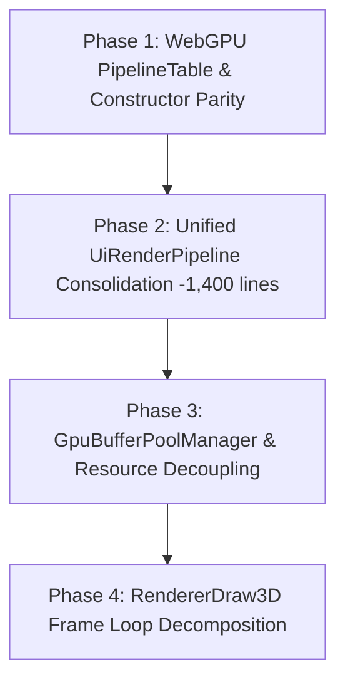

# Vulkan & WebGPU Architecture Audit: God Class Decoupling, Duplication Elimination, Utilization & Commonization

Date: 2026-08-20  
Status: Active Audit & Implementation Blueprint  
Relevant Skills: [`awake-render-pipeline`](../../skills/awake-render-pipeline/SKILL.md), [`awake-render-vulkan`](../../skills/awake-render-vulkan/SKILL.md), [`awake-render-webgpu`](../../skills/awake-render-webgpu/SKILL.md), [`kmp-audit`](../../.agents/skills/kmp-audit/SKILL.md)

---

## 1. Executive Summary & Audit Matrix

Following the landing of **Phase 2 (UI Batch Coalescing - 1,663 lines deleted)** and **Phase 4 (WebGPU Shadow Depth Parity)**, this audit evaluates the entire rendering stack across four primary axes:
1. **God Classes & God Receivers**: Overly broad responsibilities and high coupling across modules.
2. **Duplicates**: Parallel implementations of identical logic across Vulkan and WebGPU.
3. **Utilization & Dead Code**: Underutilized structures, redundant allocations, and uncalled helpers.
4. **Commonization Opportunities**: Capabilities ready to be elevated into `:awake:engine:render:contract` and `:awake:engine:render:passes`.

```
====================================================================================================
                                    RENDERER AUDIT METRICS
====================================================================================================
Area                             Current State                   Target State           Lines Saved
----------------------------------------------------------------------------------------------------
UI Pipelines (Vulkan & WebGPU)   8 separate classes (2,064 L)   2 unified classes (650 L)  ~1,414 L
Renderer God Class & Receivers   1,380 lines across 2 backends   Clean mediator + 3 managers ~500 L
WebGPU PipelineTable             5 flat constructor maps         Unified PipelineTable       ~80 L
Dynamic GPU Mesh & Buffer Pools  Scattered in Renderer           GpuBufferPoolManager       ~250 L
RendererDraw3D Monolith          140-line monolithic loop        3-phase execution pipeline   ~120 L
----------------------------------------------------------------------------------------------------
TOTAL PROJECTED CLEANUP                                                                    ~2,364 L
====================================================================================================
```

---

## 2. Deep-Dive Audit Findings by Category

### Axis A: Duplicates (Copy-Paste / Mirroring Across Backends)

#### 1. 8 Redundant UI Graphics Pipeline Classes (~2,064 lines total)
- **Vulkan**:
  - ``UiRenderPipeline.kt`` (372 lines)
  - ``UiGlyphRenderPipeline.kt`` (336 lines)
  - ``UiTextureRenderPipeline.kt`` (381 lines)
  - ``UiRoundedQuadRenderPipeline.kt`` (287 lines)
- **WebGPU**:
  - `UiRenderPipeline.kt` (160 lines), `UiGlyphRenderPipeline.kt` (193 lines), `UiTextureRenderPipeline.kt` (170 lines), `UiRoundedQuadRenderPipeline.kt` (165 lines).
- **Duplicate Analysis**:
  - In each backend, all 4 classes construct identical pipeline states:
    - Dynamic viewport & scissor states (`VK_DYNAMIC_STATE_VIEWPORT`, `VK_DYNAMIC_STATE_SCISSOR` / `setScissorRect`).
    - Standard pre-multiplied alpha blending (`srcAlpha * srcColor + (1 - srcAlpha) * dstColor`).
    - Disabled depth test & write (`depthTestEnable = false`, `depthWriteEnable = false`).
    - Disabled face culling (`CullMode.None` / `VK_CULL_MODE_NONE`).
  - **The ONLY differences** are the vertex attribute layout (`VertexFormat`) and the shader bytecode/descriptor binding.
- **Remedy**: Unify into a single parameterized `UiRenderPipeline` per backend (`UiRenderPipeline(graphicsDevice, shaderCode, vertexFormat, hasTexture)`) and delete the 6 duplicate classes.

#### 2. Dynamic GPU Buffer Allocation Math & Companion Constants
- **Finding**: Both `DynamicMesh.kt` implementations and `Renderer.kt` companion objects declare duplicate vertex stride constants, index formats, and capacity scaling formulas.
- **Remedy**: Utilize ``UiVertexLayout`` across all dynamic mesh allocations.

---

### Axis B: God Classes & God Receivers

#### 1. `Renderer.kt` as an All-in-One God Class
- **Vulkan**: 774 lines; **WebGPU**: 606 lines.
- **Symptoms**:
  - `Renderer` constructor takes 15–20 flat parameters.
  - Directly manages memory pools (`uiQuadMeshPool`, `uiGlyphMeshPool`, `uiRoundedQuadMeshPool`, `textureQuadMesh`, `lineMesh`).
  - Directly manages dynamic instance buffers (`instanceBufferPool`, `skinnedInstanceBufferPool`, `alphaInstanceBufferPool`, `frameInstanceBufferPool`).
  - Directly tracks texture and render target lifecycles (`createdTextures`, `createdRenderTargets`).
  - Directly manages offscreen staging and screenshot pixel readback.
- **God Receiver Coupling**:
  - 6 extension files (`RendererDraw3D.kt`, `RendererDrawUi.kt`, `RendererSwapchain.kt`, `RendererOpaqueDraws.kt`, `RendererUiPipelines.kt`, `RendererOffscreen.kt`) are extension functions on `Renderer`.
  - Almost every field in `Renderer` is marked `internal` solely so these extensions can access private driver objects and mutable lists.
- **Remedy**:
  - Extract **`GpuBufferPoolManager`**: Encapsulates dynamic UI mesh pools and instance buffer pools, with clear `acquire()` and `destroy()` methods.
  - Extract **`TextureResourceManager`**: Encapsulates texture and render target registry, creation, and teardown.
  - Extract **`UiPipelineSet`**: Encapsulates lazy compilation of the 4 UI pipelines.

---

### Axis C: Utilization & Redundancy

#### 1. Redundant Descriptors & Unused Allocations
- **Finding**: In Vulkan `UiTextureRenderPipeline`, descriptor pools allocate max sets on creation even when zero texture quads are drawn in a frame.
- **Finding**: In WebGPU, `instancedPipelines`, `skinnedInstancedPipelines`, and `particlePipelines` are constructed as individual maps and flat parameters, leading to repetitive lookup branches in `RendererDraw3D.kt`.
- **Remedy**: Adopt `PipelineTable` in WebGPU to match Vulkan, eliminating flat pipeline maps and replacing them with a unified `pipelineFor(format, instanced, skinned)` query.

#### 2. Frame Monolith in `RendererDraw3D.kt`
- **Finding**: `performDraw` in Vulkan (140 lines) executes:
  1. Swapchain image acquisition.
  2. Fence synchronization (`vkWaitForFences`, `vkResetFences`).
  3. Directional shadow depth pre-pass.
  4. 3D opaque geometry pass with draw sorting.
  5. Skybox fullscreen triangle pass.
  6. Debug lines pass.
  7. 2D UI coalesced batch rendering.
  8. Queue submission (`vkQueueSubmit`).
  9. Presentation (`vkQueuePresentKHR`) with out-of-date swapchain recovery.
- **Remedy**: Decompose `performDraw` into 3 cohesive, testable stages:
  - `acquireFrame(currentFrame)`
  - `recordFrameCommands(commandBuffer, imageIndex, ...)`
  - `submitAndPresent(commandBuffer, imageIndex)`

---

### Axis D: Commonization Opportunities

#### 1. Shared `GpuBufferPoolManager` Contract
- Move pool sizing rules (initial capacity: 256 quads, expansion factor: 2x, max capacity: 65,536 quads) to `:awake:engine:render:passes`.
- Sibling backend implementations share the exact same pooling strategy.

#### 2. Shared `PipelineTable` Interface in `render:contract`
- Standardize 3D pipeline resolution across both backends behind a shared interface:
  ```kotlin
  interface PipelineRegistry<P : PipelineHandle> {
      val primary: P
      fun pipelineFor(format: VertexFormat): P?
      fun instancedPipelineFor(format: VertexFormat): P?
      fun skinnedInstancedPipelineFor(format: VertexFormat): P?
      fun wireframePipelineFor(format: VertexFormat): P?
  }
  ```

---

## 3. Phased Implementation Blueprint



### Phase 1: WebGPU `PipelineTable` Alignment
- Implement `PipelineTable` in `:awake:backend:webgpu` matching `:awake:backend:vulkan`.
- Reduce `WebGpuEngine.kt` and `Renderer.kt` constructor parameters from 15 down to 6.

### Phase 2: Unified `UiRenderPipeline` Consolidation
- Refactor Vulkan ``UiRenderPipeline.kt`` to accept arbitrary UI `VertexFormat` + `hasTexture`.
- Refactor WebGPU ``UiRenderPipeline.kt`` identically.
- Delete 6 redundant pipeline files (`UiGlyphRenderPipeline.kt`, `UiTextureRenderPipeline.kt`, `UiRoundedQuadRenderPipeline.kt` in both backends).

### Phase 3: Resource & Buffer Pool Decoupling
- Implement `GpuBufferPoolManager` in Vulkan and WebGPU to own dynamic UI mesh pools and instance buffer pools.
- Decouple texture creation and lifecycle into `TextureResourceManager`.

### Phase 4: `RendererDraw3D.kt` Decomposition
- Refactor `performDraw` into `acquireFrame()`, `recordFrameCommands()`, and `submitAndPresent()`.

---

## 4. Verification & Regression Plan

1. **Automated Unit & Multiplatform Suite**:
   ```bash
   ./gradlew desktopTest compileKotlinWasmJs
   ```
2. **Pixel Baseline & UI Parity**:
   ```bash
   ./gradlew :awake:backend:vulkan:desktopTest :samples:ui-showcase:desktopTest
   ```
3. **Full Agent & Architecture Audit Gate**:
   ```bash
   python3 tools/verify_agent_skills_sync.py
   ```

