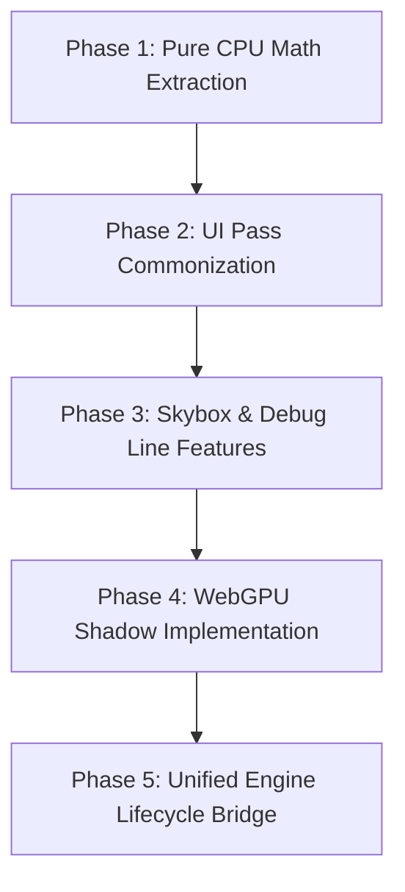

# Vulkan & WebGPU KMP Commonization Audit

Date: 2026-08-20  
Status: Complete (All 4 Phases Landed & Verified)  
Relevant Skills: [`awake-render-pipeline`](../../skills/awake-render-pipeline/SKILL.md), [`awake-render-vulkan`](../../skills/awake-render-vulkan/SKILL.md), [`awake-render-webgpu`](../../skills/awake-render-webgpu/SKILL.md)  
Related Plans: [`2026-08-19-vulkan-webgpu-common-backend-plan.md`](2026-08-19-vulkan-webgpu-common-backend-plan.md), [`2026-08-19-render-feature-strategy-plan.md`](2026-08-19-render-feature-strategy-plan.md)

---

## Executive Summary

Awake targets Vulkan (Desktop/Android/iOS via MoltenVK) and WebGPU (Wasm/Web via wgpu4k/Dawn).  
While the public engine API [`Renderer`](../../awake/engine/render/contract/src/commonMain/kotlin/io/github/awakelab/awake/render/renderer/Renderer.kt) and scene runtime are backend-agnostic, substantial rendering pipeline logic, staging algorithms, and data packing remain duplicated across `:awake:backend:vulkan` and `:awake:backend:webgpu`.

This audit catalogs every rendering component into:
1. **Already Commonized in KMP** (shared contracts and abstractions in `:awake:engine:render:contract` and `:awake:engine:render:passes`).
2. **Duplicated / Un-Commonized Logic** (pure CPU algorithms, math, and staging currently copied in both backends).
3. **Inherently Backend-Specific Layers** (GPU driver bindings, memory allocation, swapchains, native handles).

---

## Commonization Scorecard

| Subsystem | Commonization Status | Shared Location | Duplication / Gap |
|---|---|---|---|
| **Render Contracts** | ✅ 95% Common | `:awake:engine:render:contract` | `Renderer`, `Material`, `Mesh`, `VertexFormat`, `CullMode`, `RenderTarget` |
| **Opaque 3D Pass** | ✅ 90% Common | `:awake:engine:render:passes` | `SharedOpaqueRenderFeature` handles sorted draw recording via `CommandRecorder` |
| **UI Vertex Writers** | ❌ 0% Common (100% Duplicate) | *None (copied in both backends)* | `writeVertex`, `writeGlyphVertex`, `writeRoundedQuadVertex`, `writeLineVertex` |
| **UI Primitive Staging** | ❌ 10% Common | *Partially in `ui-core`* | `RendererDrawUi.kt` duplicated (~1,800 lines total): run coalescing, scissor math, mesh splitting |
| **Dynamic Mesh Buffers** | ❌ 20% Common | *None* | `DynamicMesh.kt` lifecycle (stride, vertex/index limits, quad count) duplicated |
| **Debug Lines & Geometry** | 🟡 50% Common | `:awake:engine:render:contract` | `LineSegment` & `DebugGeometry` common; line vertex staging duplicated in `RendererDraw3D.kt` |
| **Skybox Render Pass** | 🟡 40% Common | `:awake:engine:render:contract` | `SkyboxUniforms` common; pipeline creation and draw execution separate |
| **Shadow Depth Pass** | ❌ 20% Common | `:awake:engine:render:contract` | `DirectionalShadowBox` common; Vulkan has full cascade/bias pass, WebGPU has 0 shadow implementation |
| **Uniform Packing** | 🟡 50% Common | `:awake:engine:render:contract` | `LitShadowUniformLayout` common; PBR material, skinning joint palette, fog packing duplicated |
| **Application Host** | 🟡 40% Common | `:awake:engine:app` | `AppLifecycle`, `AppDefinition` common; `VulkanEngine` vs `WebGpuEngine` structure duplicate |

---

## Detailed Breakdown of Un-Commonized Areas

### 1. UI Vertex Buffer Packing (`RendererVertexWriters.kt`)
- **Vulkan**: `awake/backend/vulkan/src/commonMain/kotlin/io/github/awakelab/awake/vulkan/renderer/RendererVertexWriters.kt` (100 lines)
- **WebGPU**: `awake/backend/webgpu/src/wasmJsMain/kotlin/io/github/awakelab/awake/webgpu/renderer/RendererVertexWriters.kt` (99 lines)
- **Finding**: These functions are 100% pure CPU float-packing math into `FloatArray`. They contain 0 GPU calls and 0 backend-specific imports.
- **Drift Detected**: Vulkan supports `smoothing: Float` on rounded quads (16 floats/vert), while WebGPU omits smoothing (15 floats/vert).
- **Target**: Extract into `awake:engine:render:passes` (`io.github.awakelab.awake.render.passes.ui.RendererVertexWriters.kt`).

### 2. UI Mesh Staging & Batch Coalescing (`RendererDrawUi.kt`)
- **Vulkan**: 1,023 lines in `vulkan/renderer/RendererDrawUi.kt`
- **WebGPU**: 800 lines in `webgpu/renderer/RendererDrawUi.kt`
- **Finding**:
  - `performDrawUi` walks `List<UiDrawPrimitive>`, coalesces contiguous same-type runs (`QuadRun`, `RoundedQuadRun`, `GlyphRun`, `TextureRun`, `ClipRun`), clips against the scissor stack, tessellates anti-aliased paths, and splits meshes when vertex count exceeds capacity.
  - 85% of this code is CPU data transformation with zero driver calls.
- **Target**:
  - Extract `UiRunCoalescer` / `UiRenderFeature` into `awake:engine:render:passes`.
  - The shared feature generates `UiDrawBatch` items that `CommandRecorder` executes via standard `bindPipeline`, `bindVertexBuffer`, `setScissor`, `drawIndexed`.

### 3. Dynamic Mesh GPU Allocation (`DynamicMesh.kt`)
- **Vulkan**: `vulkan/ui/DynamicMesh.kt` (196 lines)
- **WebGPU**: `webgpu/ui/DynamicMesh.kt` (92 lines)
- **Finding**: Both define identical companion constants (`FLOATS_PER_VERTEX`, `GLYPH_FLOATS_PER_VERTEX`, `VERTICES_PER_QUAD = 4`, `INDICES_PER_QUAD = 6`) and identical update semantics.
- **Target**:
  - Define `DynamicGpuMesh` interface in `render:contract` or `render:passes`.
  - Share layout constants and chunk-sizing logic.

### 4. Skybox & Debug Line Render Passes
- **Vulkan**: `SkyboxRenderPipeline.kt`, `LineRenderPipeline.kt`, `recordCommandBuffer` branches.
- **WebGPU**: `SkyboxRenderPipeline.kt`, `LineRenderPipeline.kt`, `performDrawDebugLines`.
- **Finding**:
  - Skybox uniforms are already shared (`SkyboxUniforms.kt`).
  - The draw dispatch for skybox (cube mesh draw with depth-test LEQUAL) and debug lines (dynamic line vertex upload and line-strip draw) is identical.
- **Target**:
  - Create `SharedSkyboxRenderFeature` and `SharedLineRenderFeature` in `awake:engine:render:passes` following the `SharedOpaqueRenderFeature` strategy.

### 5. Uniform Packing Math
- **Finding**:
  - `pbrTexturedMaterialFloats(material)`: builds 16-float or 32-float uniform buffer containing base color, roughness, metallic, emissive, UV transforms.
  - `skinnedJointPaletteFloats(jointMatrices)`: flattens `Array<Mat4>` into uniform float array.
  - `fogUniformFloats(fogColor, near, far, density)`: packs fog parameters.
- **Target**:
  - Extract pure uniform packing functions into `awake:engine:render:passes` under `io.github.awakelab.awake.render.passes.uniforms`.

### 6. Shadow Map Pipeline & Capabilities
- **Current State**:
  - Vulkan has complete directional shadow mapping (`ShadowMap.kt`, `ShadowRenderPipeline.kt`, `DirectionalShadowBox.kt`, 2048x2048 depth pass).
  - WebGPU currently ignores `shadowsEnabled = true` and has no shadow pass.
- **Target**:
  - Commonize shadow camera and light-space matrix math in `render:passes`.
  - Implement WebGPU depth-texture render pass and shadow sampler pipeline.

---

## What Must Remain Backend-Specific

The following components are inherently native/platform-specific and should NOT be force-abstracted beyond clean interfaces:

1. **Hardware Device & Context**:
   - Vulkan: `VkInstance`, `VkPhysicalDevice`, `VkDevice`, `VkQueue`, JNI/MoltenVK function pointers.
   - WebGPU: `GPUAdapter`, `GPUDevice`, `GPUQueue`, WASM JS wrappers.
2. **Swapchain & Presentation**:
   - Vulkan: `VkSwapchainKHR`, `VkSurfaceKHR`, surface formats, present modes, double/triple buffering fences and semaphores.
   - WebGPU: `GPUCanvasContext`, `context.configure(device, format)`.
3. **Memory Allocation**:
   - Vulkan: `VkDeviceMemory`, memory type bitmasks (`HOST_VISIBLE`, `DEVICE_LOCAL`), memory alignment rules.
   - WebGPU: Managed browser buffers (`device.createBuffer`, `queue.writeBuffer`).
4. **Low-Level Pipeline Creation**:
   - Vulkan: `VkGraphicsPipelineCreateInfo`, `VkPipelineLayout`, SPIR-V `VkShaderModule`, descriptor set layouts.
   - WebGPU: `GPURenderPipelineDescriptor`, `GPUPipelineLayout`, WGSL `GPUShaderModule`, bind group layouts.

---

## Actionable Phased Implementation Roadmap

### Phase 1: Pure CPU Math & Writer Extraction (Immediate, Low Risk)
- Move `RendererVertexWriters.kt` to `awake:engine:render:passes`.
- Move uniform packing math (`MaterialUniforms.kt`, `JointPaletteUniforms.kt`) to `awake:engine:render:passes`.
- Standardize vertex stride constants across Vulkan and WebGPU.

### Phase 2: UI Pass Commonization (Medium Impact)
- Extract `UiRunCoalescer` to process `List<UiDrawPrimitive>` into backend-agnostic draw lists.
- Implement `SharedUiRenderFeature` in `render:passes`.
- Update `VulkanCommandRecorder` and `WebGpuCommandRecorder` with `setScissor(x, y, w, h)`.

### Phase 3: Skybox & Line Render Features (Clean Polish)
- Implement `SharedSkyboxRenderFeature` and `SharedLineRenderFeature`.
- Eliminate duplicate draw branches in `RendererDraw3D.kt` across both backends.

### Phase 4: WebGPU Shadow Parity (Feature Parity)
- Bring WebGPU backend to parity with Vulkan shadow depth rendering using shared light-projection matrices.
