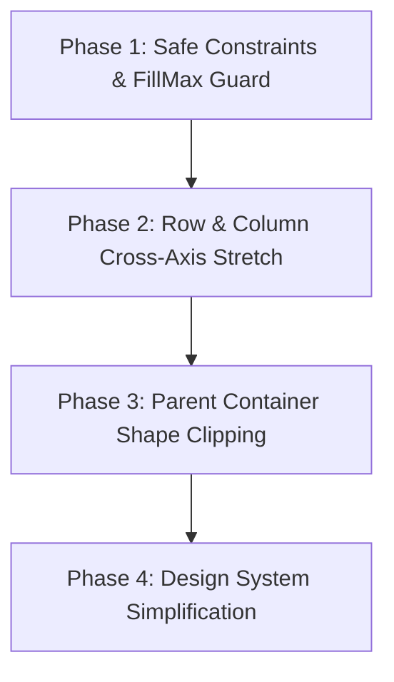

# Jetpack Compose vs Awake UI: Layout & Modifier Parity Plan

## Executive Summary

Awake UI is an immediate-mode UI framework designed for high-performance 60–120 FPS games and tooling. While it provides declarative DSL syntax (`Row`, `Column`, `Modifier`, `Style`, `Surface`), its underlying layout resolution diverged in critical ways, leading to fragile recipe workarounds:

1. **Unbounded `Dimension.FillMax` Fallback**: `FillMax` without a bounded parent falls back to `frameBounds` (entire window), causing screen blowouts.
2. **Missing Cross-Axis `Stretch`**: Containers cannot stretch children to their cross-axis height/width without forcing `FillMax` on the child.
3. **No Native Content Shape Clipping**: Recipes attempt manual per-child corner-radius math (`cornerShape(index)`) instead of parent container clipping (`Modifier.clip(shape)` / `Surface(clipContent = true)`).
4. **Ad-Hoc Intrinsic Passes**: Using `isWrapContentPassInternal()` for stateful counting fails on fixed-size containers.

---

## 1. Architectural Comparison Matrix

| Layout Concept | Jetpack Compose | Awake UI (Current) | Awake Parity Target |
|---|---|---|---|
| **Constraint Model** | `Constraints(minW, maxW, minH, maxH)` passed top-down | `Dimension` enum (`Fixed`, `FillMax`, `WrapContent`) | `UiConstraints` with bounded/unbounded axis flags |
| **Unbounded Fill Handling** | `fillMaxWidth()` in unconstrained parent hugs intrinsic size | `Dimension.FillMax` falls back to full window/frame bounds | `FillMax` in unconstrained parent resolves to intrinsic content |
| **Cross-Axis Alignment** | `Alignment.Vertical` / `Alignment.Horizontal` + cross-axis stretch | `Top`, `Center`, `Bottom` (no stretch) | Add `UiAlignment.Vertical.Stretch` & `UiAlignment.Horizontal.Stretch` |
| **Two-Phase Weight Layout** | Measure unweighted children $\to$ divide remaining space by weight sum | Heuristic pre-measure pass mixed with cursor slots | Strict 2-phase layout: unweighted first $\to$ remaining $\times$ weight |
| **Container Clipping** | `Modifier.clip(shape)` clips all descendant drawing | Manual corner math in child recipes (`cornerShape`) | `Surface(clipContent = true)` / `Modifier.clip(shape)` GPU clipping |
| **Intrinsic Measurement** | `IntrinsicSize.Min` / `IntrinsicSize.Max` querying | Ad-hoc `withIntrinsicLabelWidth` inside trial passes | Centralized `IntrinsicMeasurable` contract |

---

## 2. Parity Architecture & Roadmap



---

### Phase 1: Safe Constraints & FillMax Fallback (`awake:ui:ui-core`)

#### Goal
Prevent `Modifier.fillMaxWidth()` and `Modifier.fillMaxHeight()` from ever expanding to the full window/viewport when inside an unconstrained (wrap-content) ancestor.

#### Implementation
1. **Bounded Axis Tracking**:
   - In `UiScope`, `hasBoundedWidth: Boolean` and `hasBoundedHeight: Boolean` indicate whether the current container has an explicit parent bound.
2. **Safe `Dimension.resolve`**:
   ```kotlin
   fun Dimension.resolve(available: Float?, bounded: Boolean, intrinsic: Float): Float = when (this) {
       is Dimension.Fixed -> dp.toPx()
       Dimension.WrapContent -> intrinsic
       Dimension.FillMax -> if (bounded && available != null) available else intrinsic
   }
   ```
   *If an axis is unbounded, `FillMax` automatically falls back to the child's natural intrinsic size instead of blowing out to the viewport.*

---

### Phase 2: Cross-Axis `Stretch` for `Row` and `Column` (`awake:ui:ui-core`)

#### Goal
Allow containers to stretch their children across the secondary axis automatically without child recipes needing manual `fillMaxWidth()` / `fillMaxHeight()`.

#### Implementation
1. **Add `Stretch` Alignment**:
   ```kotlin
   sealed interface UiAlignment {
       enum class Vertical : UiAlignment { Top, Center, Bottom, Stretch }
       enum class Horizontal : UiAlignment { Start, Center, End, Stretch }
   }
   ```
2. **Layout Engine Integration**:
   - When `Row(verticalAlignment = UiAlignment.Vertical.Stretch)`:
     - Each child's slot height is set to `rowSlot.height` automatically during placement.
   - When `Column(horizontalAlignment = UiAlignment.Horizontal.Stretch)`:
     - Each child's slot width is set to `columnSlot.width` automatically.

---

### Phase 3: Parent Container Shape Clipping (`awake:ui:ui-core` & `awake:ui:graphics`)

#### Goal
Eliminate per-child corner-index tracking (`ShadcnButtonGroupContext.cornerShape`, `registerMember`, `isWrapContentPass`) by clipping all child drawing at the container boundary.

#### Implementation
1. **Container Shape Masking**:
   - `surface(shape = UiShape.md, clipContent = true)` pushes a shape clip mask.
   - Child buttons inside simply paint rectangular or flat backgrounds; the parent's corner radius automatically curves the outer corners of the first/last children.
2. **Shared Hairline Dividers**:
   - Dividers (`shadcnButtonGroupSeparator`) render as clean 1px lines between children without overlapping child geometry.

---

### Phase 4: Design System Recipe Simplification (`awake:ui:designsystem`)

#### Goal
Delete all fragile modifier workarounds across recipes (`ShadcnButtonGroup`, `ShadcnCard`, `ShadcnSelect`, `ShadcnInputOTP`).

#### Implementation
1. **Simplify `shadcnButtonGroup`**:
   ```kotlin
   fun UiScope.shadcnButtonGroup(
       id: String,
       modifier: UiModifier = Modifier,
       orientation: ShadcnButtonGroupOrientation = ShadcnButtonGroupOrientation.Horizontal,
       content: UiScope.() -> Unit,
   ): Rectangle = surface(
       id = id,
       modifier = modifier,
       clipContent = true,
       style = Style {
           border(1f.dp, themeValues.colors.border)
           shape(themeValues.shapes.md)
           contentPadding(0f.dp)
       }
   ) {
       when (orientation) {
           ShadcnButtonGroupOrientation.Horizontal -> row(
               verticalAlignment = UiAlignment.Vertical.Stretch,
               horizontalArrangement = Arrangement.spacedBy(0f.dp),
           ) { content() }
           ShadcnButtonGroupOrientation.Vertical -> column(
               horizontalAlignment = UiAlignment.Horizontal.Stretch,
               verticalArrangement = Arrangement.spacedBy(0f.dp),
           ) { content() }
       }
   }
   ```
2. **Delete `ShadcnButtonGroupContext` and `cornerStyle`**:
   - No runtime member counting, no trial pass reliance, 0 allocations per frame.

---

## 3. Verification & Acceptance Criteria

1. **Geometry Parity**:
   - Horizontal & vertical button groups render identical bounding boxes to reference screenshots.
   - Buttons stretch to 40dp/60dp/80dp without blowing out to window dimensions.
2. **Zero Allocation Contract**:
   - 0 objects allocated per frame in steady state.
3. **Comprehensive Test Coverage**:
   - Fixed size, wrap content, weighted members, single child, multi-child, dynamic add/remove child.
