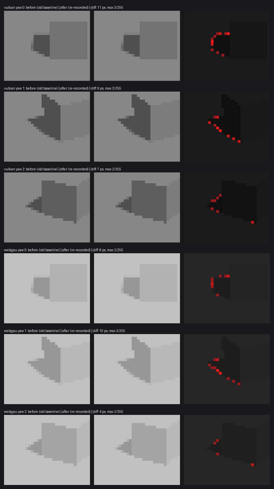
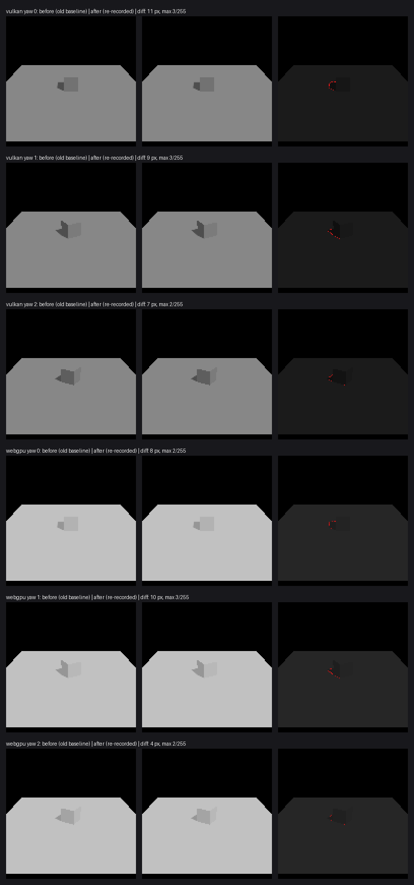

# Parity shadow baselines: re-record audit (2026-09-27)

`SceneShadowBaselineTest` (`:awake:engine:render:parity`) failed on `main`. The failures were Vulkan yaw 0 and 1, and WebGPU yaw 1, each off by 2 pixels at 3/255. The six studio-cube baselines were recorded at `c39340838` (2026-09-12). CI does not run the parity module, so three later shadow-sampling changes went unrecorded. This audit shows the moved pixels are exactly what those changes predict, and nothing else. Only then are the baselines re-recorded.

## Method

At nine commits, from the baseline commit to `main`, a probe recorded each of these without looking at pixels first:

- The CPU-side shadow inputs for this scene: `shadowCascadeUniforms(...)`, `matrixFloats()`, `depthScaleFloats()`.
- The generated WGSL for `lit_shadow` and `shadow_depth`.
- All six frames (2 backends × 3 yaws).
- The same six frames rendered with `EnvironmentUniforms(shadowsEnabled = false)`.

Re-rendering at `c39340838` reproduces the committed baselines byte for byte, so this machine is a valid oracle.

## Rule

1. **Frame level:** a frame moves between two commits iff the shadow inputs that reach its pixels change.
2. **Pixel level:** only shadow-edge pixels move. A fully lit pixel (identical to the shadows-off frame) never moves, and neither does a pixel deep inside a shadow (no fully lit pixel within 1 px).

## Result

| Step | Cascade inputs | Shader | Frames moved | Pixels moved (max /255) | In full light | Deep in shadow | Shadows-off frames moved |
|---|---|---|---|---|---|---|---|
| #34 texel snapping (`bb9932cd0`) | changed | — | 6 / 6 | 50 (4) | 0 | 0 | 0 |
| #43 rotation stability (`1a0c0d882`) | changed | `lit_shadow` | 6 / 6 | 52 (6) | 0 | 0 | 0 |
| #53 cascade blending (`e99a184e1`) | — | `lit_shadow` | 0 / 6 | 0 | — | — | 0 |
| #55 cascade transitions (`4465fa48f`) | changed | `lit_shadow` | 6 / 6 | 57 (4) | 0 | 0 | 0 |
| every other commit | — | — | 0 / 6 | 0 | — | — | 0 |

All 159 moved pixels are on a shadow edge. Across every step, no shadows-off frame moved, so lighting, geometry and camera never changed; only shadow sampling did.

The positive control is 24 to 57 shadowed pixels per frame against its shadows-off render, so the masks are not vacuous.

**#53, the one input change that moved nothing.** Its blend only fires past 0.8 of the way to a cascade's edge in NDC. Projected through #53's own cascade-0 matrix, the cube and its whole shadow region reach at most 0.231. So the blend cannot touch a shadowed pixel in this scene, and the rest of the diff is a behaviour-neutral extraction into `sampleSingleCascade`.

Net change from old to new baselines: 4 to 11 pixels per frame, max 3/255. Vulkan yaw 2 moved 4/255 at #34 but was pulled back to 2/255 by the later steps. That is inside the test's ±2 tolerance, which is why it passed on `main` while its neighbours failed.

## Side finding

On Vulkan, a shadows-off frame rendered before any shadowed frame leaves every shadow-map layer in `UNDEFINED` while the scene pass still binds the array. The validation layer then reports VUID-vkCmdDraw-None-09600. This is not related to these baselines.
