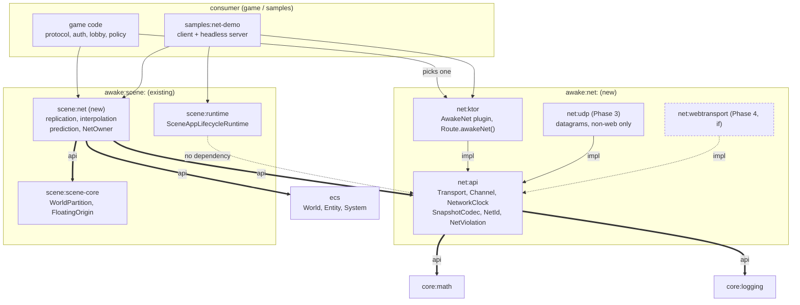

# Network Plan — Transport, Replication, Smoothing

Where networking lives in Awake, which transport and wire format to pick, and the order to
build the four layers in.

Scope: a new `:awake:net:*` module family, its seam into `:awake:ecs` / `:awake:scene:*`, and
the boundary against a consuming game. Accounts, lobby policy, matchmaking, persistence and
game protocol are explicitly **not** in scope — see
[framework-game-boundary.md](../reference/framework-game-boundary.md).

## Recommendation

Build **Phase 0 and 1 only, and stop there until a real game asks for more.**

Concretely: server-authoritative over Ktor WebSocket with WSS, one `Transport` port shaped
around datagrams, a hand-rolled binary tick codec, snapshot interpolation for remote entities.
Prototype it inside `samples:net-demo`; extract `:awake:net:api` + `:awake:net:ktor` only when
a second consumer needs it.

That is the whole recommendation. It reaches all five targets including browser, and
interpolation alone removes most of the visible jitter — which is the bulk of what players
notice.

Everything after it is conditional, not scheduled:

- **UDP (Phase 3)** when measured latency, not intuition, says WebSocket head-of-line
  blocking hurts. It costs a reliability layer, a datagram encryption decision, and a second
  transport to keep working forever.
- **Prediction and reconciliation (Phase 3)** when a player controls something that must feel
  input-immediate. Skip it for coop, strategy, or anything camera-driven.
- **WebTransport (Phase 4)** when Ktor ships QUIC. Do not build toward it beyond keeping the
  port datagram-shaped.
- **Lag compensation** only for hitscan.

Two things are *not* optional and must land inside Phase 1–2, because retrofitting them means
rewriting the codec and the server loop: **world-absolute positions** (constraint 3) and
**`NetOwner` enforcement plus bounded decode**
([Security](#security-cheating-and-the-trust-boundary)).

## Constraints that decide the design

These are properties of *this* repo, not general netcode advice. Each one kills an option
that would otherwise be the obvious pick.

1. **wasmJs is a first-class target.** Browsers have no UDP. Anything in `commonMain` that
   assumes datagrams is a lie. `ktor-network` raw sockets compile for all targets since Ktor
   3.1, but UDP on JS/Wasm is Node-only at best.
2. **Physics is four different backends.** desktop/Android on jolt-jni, iOS on JoltC cinterop,
   wasmJs on JoltPhysics.js
   ([physics-open-world.md](physics-open-world.md)). Bit-identical cross-platform simulation
   is not available. **Deterministic lockstep is off the table.** Server-authoritative state
   replication is the only correct model here.
3. **`FloatingOriginSystem` shifts the world.** Every replicated position must be
   world-absolute (or explicitly cell-relative), never render-space. A snapshot encoded after
   an origin shift and applied before one on the peer is silently wrong by kilometres.
4. **Per-frame allocation is a tracked engine cost** (`awake-core-math`, `awake-ui-performance`).
   Snapshot decode runs every tick. A codec that allocates per field is a GC source in the
   frame loop, not a library detail.
5. **Framework boundary rule 3** puts protocol messages, auth and sessions in the consuming
   game. An engine network module may expose transport and replication *mechanism* only.

## Module placement

Mirror the physics split, which already solved exactly this shape (neutral contract + swappable
backend + ECS bridge):

| Module | Contains | Depends on |
| --- | --- | --- |
| `:awake:net:api` | `Transport`, `Channel`, `ConnectionState`, `NetworkClock`, `SnapshotCodec`, `NetId`. Pure Kotlin. | `:awake:core:math`, kotlinx-coroutines. **No Ktor.** |
| `:awake:net:ktor` | Ktor WebSocket client/server transport. | `:awake:net:api`, ktor |
| `:awake:net:udp` (later) | `ktor-network` datagram transport, non-web targets only. | `:awake:net:api` |
| `:awake:scene:net` | ECS systems: replication apply, interpolation buffer, prediction/reconciliation, `NetTransform`/`NetOwner` components. | `:awake:net:api`, `:awake:ecs`, `:awake:scene:scene-core` |



Read the graph for what is *absent*: no arrow enters `ecs`, `scene:runtime` or any render
module from `net:*`. `scene:net` is the only bridge, and it is opt-in exactly like
`scene:physics`. Transport backends fan in to `net:api` and never to each other — swapping
WebSocket for UDP is one edge, no game-code change.

Rules that keep this honest:

- `:awake:ecs`, `:awake:scene:runtime` and every render module gain **zero** dependency on
  `:awake:net:*`. `:awake:scene:net` is opt-in, like `:awake:scene:physics`.
- Game message types live in the consumer. `:awake:net:api` moves opaque payloads plus a
  small set of engine-owned frames (tick, ack, snapshot envelope).
- `samples:server` stays what it is — the debug-control server. The multiplayer sample gets a
  new `samples:net-demo` (client + headless server main) so the engine modules have a real
  second consumer before anything is called stable.

**Gate:** per boundary rule 2, build Phase 0 inside `samples:` first. Promote to
`:awake:net:api` only once the demo and one other consumer need the same contract. Record the
promotion as a `docs/decisions/D31-*.md` with the usual exit criteria.

## Transport: what to use when

| Option | Verdict |
| --- | --- |
| **Ktor WebSocket** | **v1 default.** Only option that reaches all five targets including browser. Ordered + reliable = head-of-line blocking; a dropped packet stalls every later snapshot. Acceptable at ≤20 Hz for coop / small-scale / non-competitive. |
| **UDP via `ktor-network`** | Phase 3, second transport behind the same port. Desktop/Android/iOS only. Needed the moment latency compensation matters more than browser reach. Experimental API, POSIX-backed on native. |
| **WebTransport / HTTP-3** | The correct long-term answer: unreliable datagrams *and* browser support (Baseline since Safari 26.4, March 2026). **Ktor has no QUIC** — KTOR-6008 and KTOR-7938 are still open. Do not wait for it; shape the port around datagrams so adopting it later is one new module. |
| **kotlinx-rpc (kRPC)** | Use for request/response only — lobby join, character list, config fetch. Never in the per-tick path: it is 0.x with preview labels and breaking releases, and its Ktor integration is WebSocket-backed anyway, so it buys nothing the raw socket doesn't. |
| **RSocket / gRPC** | Skip. Both drag a stream/backpressure model that a fixed-tick loop doesn't want. |

The port is therefore datagram-shaped, and WebSocket is implemented *as* a datagram transport
(one message = one packet), not as a stream:

```
interface Transport {
    val state: StateFlow<ConnectionState>
    suspend fun send(channel: Channel, packet: ByteArray)   // Channel: Unreliable | Reliable
    fun receive(): ReceiveChannel<ByteArray>
}
```

`Channel.Reliable` over WebSocket is free; `Channel.Unreliable` over WebSocket degrades to
reliable. Over UDP/WebTransport it's the reverse: unreliable is free, reliable needs a
sequence + ack + resend layer. That asymmetry is the whole reason the enum exists.

### Running WebSocket and UDP together

Both ship, and both stay shipped — UDP does not replace WebSocket. Reasons: browser has no
UDP at all, and on native targets corporate networks and mobile carriers block arbitrary UDP
often enough that a WebSocket fallback is a connectivity feature, not a legacy path.

Shape:

- Server listens on both. One `Session` identity spans whichever transport carried the
  connection; game code above `:awake:scene:net` never learns which one it got.
- Client picks at connect: try UDP, fall back to WebSocket on timeout. Never mid-session
  switching — that is a reconnect, not a migration.
- The cost of dual-stack is a discipline, and a useful one: game code may never assume a
  packet arrived, because on the WebSocket leg it always does and on the UDP leg it often
  doesn't. Test the unreliable path first; the reliable one can't expose the bug.
- Do **not** run both at once for one session (WebSocket control + UDP state). Two sockets
  means two failure modes, two heartbeats and an ordering seam between them, for a saving
  that `Channel` already provides inside one socket.

## Ktor plugin shape

One correction up front, because it decides the whole design: a Ktor application plugin's
hooks (`onCall`, `onCallReceive`, `onCallRespond`) are **HTTP-call oriented and never see
WebSocket frames**. The frame loop cannot live in the plugin. So the plugin owns
configuration, shared state and lifecycle; a `Route` extension owns the socket.

Two artifacts in `:awake:net:ktor`:

**1. The plugin — config, session registry, shutdown.**

```kotlin
class AwakeNetConfig {
    var tickRate: Int = 20
    var maxPacketBytes: Int = 1400          // bound the decoder before it allocates
    var maxInputsPerTick: Int = 4           // speedhack clamp
    var maxConnections: Int = 64
}

val AwakeNet = createApplicationPlugin("AwakeNet", ::AwakeNetConfig) {
    val sessions = SessionRegistry(pluginConfig)
    application.attributes.put(SessionsKey, sessions)

    on(MonitoringEvent(ApplicationStopping)) { sessions.closeAll() }
}
```

`pluginConfig` is how the builder reads config; state is a captured value, so it must be
thread-safe — many WebSocket coroutines touch the registry at once.

**2. The route extension — the actual frame loop.**

```kotlin
fun Route.awakeNet(path: String = "/net", world: World) {
    val sessions = application.attributes[SessionsKey]
    webSocket(path) {
        val session = sessions.open(this) ?: return@webSocket   // maxConnections
        try {
            for (frame in incoming) {
                val bytes = (frame as? Frame.Binary)?.data ?: continue
                if (bytes.size > sessions.config.maxPacketBytes) { session.close(TooLarge); return@webSocket }
                session.onPacket(bytes)     // decode, NetOwner check, enqueue input
            }
        } finally { sessions.close(session) }
    }
}
```

Consumer wiring stays three lines, and the game never names Ktor types:

```kotlin
install(WebSockets)          // Ktor's own, required
install(AwakeNet) { tickRate = 20 }
routing { awakeNet(world = serverWorld) }
```

Rules that keep this from rotting:

- **The plugin does not own the tick.** The simulation runs on
  `SceneAppLifecycleRuntime`'s fixed-update loop, exactly as `samples:server` already does
  headless. The plugin drains input queues and hands snapshots back — it never becomes a
  second game loop.
- **The plugin implements `Transport`, it does not replace it.** `:awake:scene:net` talks to
  the port from [Transport: what to use when](#transport-what-to-use-when). Swapping in the
  UDP transport must not touch a line of game or ECS code.
- **Client side is `createClientPlugin`** with the same config type, or — simpler — just a
  `HttpClient` holding `WebSockets`, since a client has one connection and no registry. Take
  the simpler one until a second client-side concern appears.
- **Route-scoped (`createRouteScopedPlugin`) is the wrong tool here**: two `route` blocks each
  installing it means only the second installation handles calls. Application-scoped plugin +
  route extension avoids that trap entirely.

## Lobby, and the handoff to the tick loop

The lobby lives in the **consumer**, not in `:awake:net:*` (boundary rule 3: rooms, accounts,
matchmaking and protocol are game policy). It is shown here only because the seam between it
and the engine transport is an engine concern — and because it is the one place kRPC earns its
keep.

Start with the boring version. Ktor and kotlinx JSON are already dependencies; a lobby is a
handful of request/response calls at human speed:

```kotlin
// samples:net-demo, server side
@Serializable data class RoomInfo(val id: String, val name: String, val players: Int, val max: Int)
@Serializable data class JoinRequest(val roomId: String, val displayName: String)
@Serializable data class JoinGranted(val ticket: String, val endpoint: String, val netId: Long)

fun Route.lobby(rooms: RoomRegistry) {
    get("/rooms") { call.respond(rooms.list()) }

    post("/rooms/{id}/join") {
        val req = call.receive<JoinRequest>()
        val room = rooms.find(req.roomId) ?: return@post call.respond(NotFound)
        if (room.isFull) return@post call.respond(Conflict, "room full")
        val grant = rooms.reserveSlot(room, req.displayName)   // issues the ticket
        call.respond(JoinGranted(grant.ticket, grant.endpoint, grant.netId.value))
    }
}
```

Client then hands the ticket to the game transport — this is the whole seam:

```kotlin
val grant: JoinGranted = lobbyClient.join(roomId, name)
val transport = KtorWebSocketTransport(grant.endpoint)
transport.connect(ticket = grant.ticket)     // first frame on the socket is the ticket
```

### Ticket rules

The ticket is what keeps auth out of the tick loop, so it has to be tight:

1. **Short-lived and single-use.** Seconds, not minutes; consumed on first use. A leaked ticket
   should already be dead.
2. **Server-issued, opaque, unguessable.** Random bytes from a CSPRNG. Not a player id, not a
   room id, not anything derived from them.
3. **The tick transport validates the ticket and nothing else.** It never re-runs
   authentication and never accepts credentials on the game socket. One redemption maps the
   connection to a `SessionId` + `NetId`, and from there
   [`NetOwner`](#engine-side-mechanism-belongs-in-awakenet) is the only authority.
4. **Redeem over TLS.** The ticket is a bearer token; the WSS requirement from Phase 1 is not
   optional once tickets exist.
5. **Slot reservation is part of issuing.** Otherwise ten clients pass a `isFull` check
   simultaneously and eleven join. Reserve on grant, release on ticket expiry.

### When kRPC instead

Swap the routes for a typed service once the lobby grows past a few calls — live room lists
and player-ready state are `Flow`-shaped, which is exactly what kRPC does well:

```kotlin
@Rpc interface LobbyService {
    suspend fun join(request: JoinRequest): JoinGranted
    fun rooms(): Flow<List<RoomInfo>>          // pushes updates, no polling
}
```

Cost of that swap: a Gradle plugin, generated code, and a 0.x dependency with preview labels
and breaking releases. Worth it for a live lobby UI, not worth it for "list rooms, join one".
Either way it stays on the control plane — kRPC never touches the tick path.

## Wire format: three channels, three formats

Do not pick one. Pick per channel — this is the single highest-leverage decision.

- **Handshake / lobby / debug → JSON.** kotlinx-serialization JSON. Readable in browser
  devtools, versionable, ~never hot. Keep it.
- **Control plane (non-tick: spawn manifests, config, chat) → kotlinx ProtoBuf.** Compact and
  schema-ish. Note it is `@ExperimentalSerializationApi`, its polymorphic encoding writes a
  **string** `serialName` discriminator per message, and reported decode performance is at
  best JSON-parity with allocation-heavy hotspots. Fine off the tick path, wrong on it.
- **Per-tick snapshots + input → hand-rolled binary.** One-byte opcode dispatch, quantized
  floats (position to cm, quaternion smallest-three at 10 bits/component), bitmask for
  changed fields, delta against last-acked baseline. No general format does quantization or
  delta, and those two are where the bytes actually are. Implement as a plain writer over a
  reusable `kotlinx-io` `Buffer` (or a pooled `ByteArray` + cursor); a custom `BinaryFormat`
  is an option but the reflection-free hand path is smaller and allocation-free.

Cross-check before committing: benchmark one representative snapshot with
`:awake:ecs:benchmark`'s kotlinx-benchmark setup, measuring **allocation rate** alongside
throughput. Bytes-per-tick and GC per tick are the numbers, not ops/sec.

## The four layers, bottom-up

Your draft order is right as a list, wrong as a build order — build it inverted.

### 1. Transport and connection layer
`:awake:net:api` + `:awake:net:ktor`. Connect / reconnect / disconnect state machine,
heartbeat, packet framing, `Channel` split, MTU-aware fragmentation for the UDP path later.
Also here: a `NetworkClock` — server tick number is the only shared time base; wall clocks
drift and `Date`-style time is unusable.

### 2. Core multiplayer architecture
Server-authoritative, client-predicted. One `NetRole` (Server | Client | ListenServer) chosen
at startup. The server runs the same `SceneAppLifecycleRuntime` fixed-update loop headless
(this already exists — `samples:server` proves the headless path). Clients send inputs, never
state. `NetId` is a stable network identity for an ECS `Entity`, assigned by the server and
mapped per-client; entity generation/index is a local detail and must not go on the wire.

Interest management belongs here, and `WorldPartitionSystem` already gives it for free: the
server replicates only entities in cells near a client. That's the difference between 30
players and 3.

### 3. State synchronization and replication
`NetTransform`, `NetOwner`, `NetTag` components; a `ReplicationSystem` on the server that
diffs against per-client baselines, and an apply system on the client. Snapshot at 10–20 Hz,
render at frame rate. Encode positions in **world-absolute** coordinates (constraint 3) and
assert it in a test that shifts the origin mid-stream.

### 4. Latency and smoothing systems
Last, because every one of these is meaningless without 1–3 measurable.
- **Interpolation** for remote entities: render ~100 ms in the past from a two-snapshot
  buffer. Fixes 90% of visible jitter on its own.
- **Client-side prediction** for the local player: apply input immediately, keep an input
  ring buffer keyed by tick.
- **Reconciliation**: on snapshot, rewind the local player to the server state and replay
  unacked inputs. Given constraint 2, replay uses the *character controller*, not full
  rigid-body physics — kinematic movement is reproducible across backends, Jolt dynamics are
  not.
- **Lag compensation** (server rewinds hitboxes) only if the game needs hitscan. Skip until
  then.

## Security, cheating and the trust boundary

Assume the client is fully compromised. Every mitigation below is a server-side check or it is
not a mitigation.

### What the architecture already buys

Server-authoritative + clients-send-inputs-never-state (layer 2) is the anti-cheat foundation,
not a performance choice. It removes the entire class of "client asserts its own position/
health/score". Interest management (layer 2) is equally a **security** feature: an entity never
sent is an entity that cannot be wallhacked. Both are already in the plan; they need to be
named as security requirements so nobody "optimizes" them away.

### Engine-side mechanism (belongs in `:awake:net:*`)

| Threat | Server-side check |
| --- | --- |
| Input spoofing for another player's entity | `NetOwner` check on every input packet. Reject any input addressing an entity the connection does not own. Most common exploit in naive implementations. |
| Speedhack (flood inputs / forged tick numbers) | Clamp inputs accepted per tick window. Reject tick numbers outside a bounded window around server tick. |
| Teleport / noclip | Validate movement delta against max speed and the collision result of the server's own character controller. Server simulates the move; client input is a *request*. |
| Malformed / oversized packets | Hard cap packet size before decode. The binary codec decodes attacker-controlled bytes — every length prefix and array count needs a bound check, not an allocation. |
| Connection flood, packet flood | Per-connection rate limit and connection cap in the transport layer. |
| Replay / session hijack | Sequence numbers with a replay window; a per-connection session token bound at handshake. |

Aimbot and memory editing are **not** solvable from the engine. Say so out loud rather than
shipping a mitigation that pretends otherwise.

### Encryption

- **Phase 0–2 (WebSocket):** WSS/TLS, with one engine constraint found the hard way: **the Ktor
  CIO *server* engine does not support HTTPS** — any `sslConnector` throws
  `"CIO Engine does not currently support HTTPS"` at startup. The server runs on Netty instead,
  for plaintext as well as TLS, so the mode you develop against is the mode you ship. The CIO
  *client* engine is unaffected. `ktor-network-tls-certificates` generates the dev certificate.
- **Certificates:** a self-signed certificate proves traffic is encrypted and nothing about who
  is on the other end. It is dev scaffolding; a deployment needs a CA-issued one. Two rules the
  demo already follows: the client trusts that specific certificate rather than installing a
  trust-all manager, and the TLS server exposes no plaintext connector beside it — offering both
  lets the client pick the unencrypted path, and that is the server's decision to make.
- **Browsers cannot be told to trust a certificate.** There is no page-level API; trust belongs
  to the OS and the user. Against a self-signed certificate a `wss://` connection fails in a way
  indistinguishable from the server being down, so the user has to accept it at
  `https://host:port` once, or use mkcert. Budget that as a real onboarding step.
- **Phase 3 (UDP):** TLS does not apply to datagrams, and there is no mature KMP DTLS. Ship
  both modes and negotiate at handshake: an encrypted datagram channel (Noise/libsodium-style
  handshake over expect/actual platform crypto) where the platform provides the primitives,
  and a plaintext tick channel elsewhere. Two hard rules, or this becomes the vulnerability
  instead of the mitigation:
  1. **The server chooses.** The mode is server policy. A client may state what it supports;
     it may never request the weaker one. Otherwise an attacker downgrades every session.
  2. **Plaintext mode carries tick state only.** Auth, session tokens and anything
     player-identifying stay on the TLS control channel regardless of mode.
- **Phase 4 (WebTransport):** encryption comes with QUIC. Another argument for that end state.

### Detection reporting: one choke point, not an interceptor chain

Every check in the table above already runs in one place — `session.onPacket`, before the
input reaches the world. That is the interception point. Do not build a pluggable interceptor
pipeline around it; there is exactly one producer, and a chain would only add indirection plus
a per-packet allocation on the hot path.

The shape is a sealed result and one sink:

```kotlin
sealed interface NetViolation {
    val tick: Long
    data class NotOwner(val tick: Long, val target: NetId) : NetViolation
    data class InputFlood(val tick: Long, val count: Int) : NetViolation
    data class MoveTooFar(val tick: Long, val meters: Float) : NetViolation
    data class MalformedPacket(val tick: Long, val bytes: Int, val reason: String) : NetViolation
    data class TickOutOfWindow(val tick: Long, val serverTick: Long) : NetViolation
}

fun interface ViolationSink {
    fun report(session: SessionId, violation: NetViolation)
}
```

`:awake:net:api` owns the type and calls the sink. It does **not** decide what happens next —
kick, ban, shadow-flag, telemetry and thresholds are game policy (boundary rule 3). Default
sink writes to `:awake:core:logging` and nothing else.

Four rules, each of which is a real failure if ignored:

1. **Detect and enforce are separate switches.** Ship Phase 1–2 in observe-only mode: run
   every check, report, act on none. A movement-delta bound that is 5% too tight kicks legit
   players on jittery mobile networks, and you cannot tune the threshold without first seeing
   the distribution on real traffic. Turn enforcement on per check, after the data.
2. **Never log per violation.** Unbounded logging *is* the DoS — an attacker sends garbage
   packets as fast as the socket allows and your disk and log pipeline are the target.
   Aggregate: per-session counters keyed by violation type, plus a small sampled detail
   (first N per type per minute), flushed on session close.
3. **Never echo attacker bytes into the log.** Report sizes, offsets and reasons. A raw
   payload dump is a log-injection vector and, once player state is in it, a privacy problem.
4. **Server-side only.** A client-side detector reports whatever a patched client wants it to.
   There is no client telemetry worth trusting in this design.

Aggregated counters are also the honest way to answer "is anyone actually cheating?" before
building anything further — the answer for most projects is no, and that is a valid reason to
stop at observe-only permanently.

### Obfuscation

Low value, do not budget for it. wasmJs is trivially inspectable, desktop JVM decompiles, and
R8 on Android only raises the effort bar by hours. Apply the project's existing
`kmp-proguard-r8` / `kmp-security` practice for release builds and spend nothing further.
Obfuscation is not a substitute for a single server-side check.

### Boundary

Accounts, authentication, ban lists, trust scoring and live-ops moderation are consumer game
concerns (boundary rule 3). The engine supplies mechanism only: ownership enforcement, rate
limits, bounded decode, and a validation hook the game fills with its own movement/ability
rules.

## Why `:awake:scene:net` does not exist yet

Phase 2's capabilities are built and its exit criteria are met, but they live in
`samples:net-demo` rather than in an engine module. Two reasons, both of which the plan itself
argues for elsewhere:

1. **Nothing consumes an ECS bridge.** `:awake:scene:net` would carry `NetTransform` /
   `NetOwner` components and systems that read an ECS `World`. The demo server owns a plain map
   of players, not a world — so building the module now means inventing its only consumer to
   justify it, which is the shape boundary rule 2 exists to prevent.
2. **Interest management needs a partitioned world to be interesting.** `WorldPartitionSystem`
   already streams cells by proximity; replicating only nearby entities is a handful of lines
   *once entities live in cells*. Against 16 players standing in one grid it measures nothing.
   The bandwidth number below is what makes the case concrete: full snapshots are O(players²)
   in total bytes, so interest management is the fix at 200 players and pure ceremony at 16.

What exists instead, and where:

| Capability | Lives in | Why there |
| --- | --- | --- |
| `NetViolation`, `ViolationSink`, `CountingViolationSink` | `:awake:net:api` | Transport-level mechanism, no ECS involved |
| Ownership check, tick window, input-rate cap | `samples:net-demo` server | Enforcement needs the game's own notion of who owns what |
| `SnapshotInterpolator` | `samples:net-demo` (common) | Operates on the demo's snapshot shape |
| Interest management | **not built** | Waits for entities in a partitioned world |

The measured Phase 2 numbers: **994 B/s per client at 16 clients, 20 Hz** (`BandwidthTest`),
and violation detail retained under a 500-packet flood stays bounded at ≤25 objects
(`ViolationEnforcementTest`).

Promote to `:awake:scene:net` when a game puts replicated entities in an ECS world. That is the
second consumer the gate is waiting for, and it will also be the thing that makes interest
management measurable.

## Out of scope: asset delivery

Asset streaming is a different problem wearing the same word, and putting it in this plan
makes both worse.

**Why it must not share the game socket.** Tick traffic is small, hot, ordered and worthless
one second later. Asset traffic is bulk, cold, cacheable and idempotent. Push a 20 MB pack down
the WebSocket that carries snapshots and every snapshot behind it head-of-line blocks — the
exact failure the `Channel` split exists to avoid, reintroduced at a scale no priority scheme
recovers from. Separate connection, always.

**What to use instead: plain HTTP.** Content-addressed URLs (`/assets/<sha256>.dat`) served by
a CDN or a static host. That buys range requests, resume, ETag revalidation, browser cache on
wasmJs and CDN edge for free — all things a custom socket protocol would have to reimplement
badly. `HttpClient` is already a dependency.

**Where "streaming on demand" actually belongs.** In `:awake:asset:*`, behind an asset-source
port, not in `:awake:net:*`. The on-demand machinery already exists —
`WorldPartitionSystem` + `AsyncWorldCellStream` stream cells by proximity today
([physics-open-world.md](physics-open-world.md)); they read from a source. Make that source
pluggable (local file, packed `.dat`, HTTP) and network delivery is a source implementation,
not a network feature. That is a separate plan.

**Encryption of asset packs: don't.** Encrypting client-side assets is DRM, and it loses for
the same reason obfuscation does — the key ships with the client. It stops casual ripping and
nothing more. Two things are worth doing, and neither is DRM:

- **TLS in transit.** Free, already required.
- **A signed manifest of content hashes.** This is integrity, not secrecy: it detects tampered
  or corrupted packs, validates caches, and gives a cheap version check. Real value; do this
  one.

**The single coupling this plan does owe assets.** Spawn messages must reference assets by
stable content id, never by local path or index. A client missing an asset then fetches it and
delays the spawn locally, rather than desyncing or stalling the tick loop. Asset fetch is never
allowed to block the fixed-update loop — that rule belongs in Phase 2's replication code.

## Phases and exit criteria

| Phase | Deliverable | Exit criterion |
| --- | --- | --- |
| 0 | Prototype entirely inside `samples:net-demo` (WebSocket, JSON, no prediction) | Two desktop clients see each other's cube move. Latency ugly, correctness proven. |
| 1 | Extract `:awake:net:api` + `:awake:net:ktor`; binary snapshot codec; WSS | Browser client joins a desktop server over TLS. Codec benchmark shows zero allocation per decoded snapshot, and a fuzz test of malformed packets neither crashes nor over-allocates the decoder. |
| 2 | Replication + interpolation; ownership enforcement, rate limits, `ViolationSink` in observe-only mode | 16 simulated clients, 20 Hz, under X KB/s each; origin-shift test green. A client forging input for another entity, or flooding inputs, is rejected in test. Violation counters survive a packet flood without unbounded log growth. |
| 3 | Prediction + reconciliation; `:awake:net:udp` + its datagram encryption decision | Local player feels input-immediate at 150 ms simulated RTT; correction visible but not jarring. Movement-delta validation rejects a scripted teleport client. |
| 4 | WebTransport transport, *if* Ktor ships QUIC or a KMP QUIC binding matures | Browser client on unreliable datagrams, same `Transport` interface, no changes above the port. |

## Open questions, answered

**Transports — WebSocket or UDP?** Both, permanently. See
[Running WebSocket and UDP together](#running-websocket-and-udp-together). Browser has no UDP,
and native networks block it often enough that WebSocket is a connectivity path rather than a
legacy one. One transport per session, chosen at connect; never both at once.

**Wire format — Proto or JSON?** Both, plus a third. Per channel, not per project: JSON
handshake/debug, ProtoBuf control plane, hand-rolled binary per tick. Only the tick codec is
performance-sensitive, and no off-the-shelf format does quantization or delta.

**Datagram encryption — handshake crypto or plaintext tick channel?** Both, negotiated, under
the two rules in [Encryption](#encryption): the server chooses the mode, and plaintext mode
never carries anything but tick state. Still to assign: who owns the crypto expect/actual, and
whether Phase 3 ships the encrypted mode on all native targets or starts with one.

**Authoritative simulation server or relay?** Both, because the relay is a cheaper
configuration of the same thing rather than a second architecture: same `NetRole`, same session
and transport stack, with server-side world simulation and Phase 2's replication diff disabled
and packets forwarded to the interest set. Build authoritative first — a relay derived from it
is a deletion, whereas an authoritative server grown out of a relay is a rewrite. Accept what
relay mode gives up: with no server simulation there is nothing to validate against, so every
check in [Security](#security-cheating-and-the-trust-boundary) except rate limits and
ownership stops working. Relay is for trusted or coop sessions only, and no competitive mode
may select it.

**Peer-to-peer and host migration?** No. Listen-server (one player hosts authoritatively) is in
scope and already covered by `NetRole.ListenServer`; a true p2p mesh and host migration are
not. Migration means transferring authoritative world state plus every live session mid-flight,
and it makes the security table unenforceable — the host is a player. Revisit only against a
concrete consumer requirement.

## Sources

- [kotlinx-rpc releases](https://github.com/Kotlin/kotlinx-rpc/releases) ·
  [kotlinx.rpc docs](https://kotlin.github.io/kotlinx-rpc/get-started.html) ·
  [Ktor kRPC tutorial](https://ktor.io/docs/tutorial-first-steps-with-kotlin-rpc.html)
- [KTOR-6008 Support QUIC](https://youtrack.jetbrains.com/issue/KTOR-6008/Support-QUIC-protocol) ·
  [Ktor QUIC discussion](https://github.com/ktorio/ktor/discussions/4862) ·
  [MDN WebTransport](https://developer.mozilla.org/en-US/docs/Web/API/WebTransport_API)
- [Ktor sockets](https://ktor.io/docs/server-sockets.html) ·
  [custom server plugins](https://ktor.io/docs/server-custom-plugins.html) ·
  [server WebSockets](https://ktor.io/docs/server-websockets.html) ·
  [application monitoring](https://ktor.io/docs/server-events.html)
- [kotlinx.serialization ProtoBuf](https://kotlinlang.org/api/kotlinx.serialization/kotlinx-serialization-protobuf/kotlinx.serialization.protobuf/-proto-buf/) ·
  [formats.md](https://github.com/Kotlin/kotlinx.serialization/blob/master/docs/formats.md) ·
  [protobuf decode perf issue](https://github.com/Kotlin/kotlinx.serialization/issues/2332)
