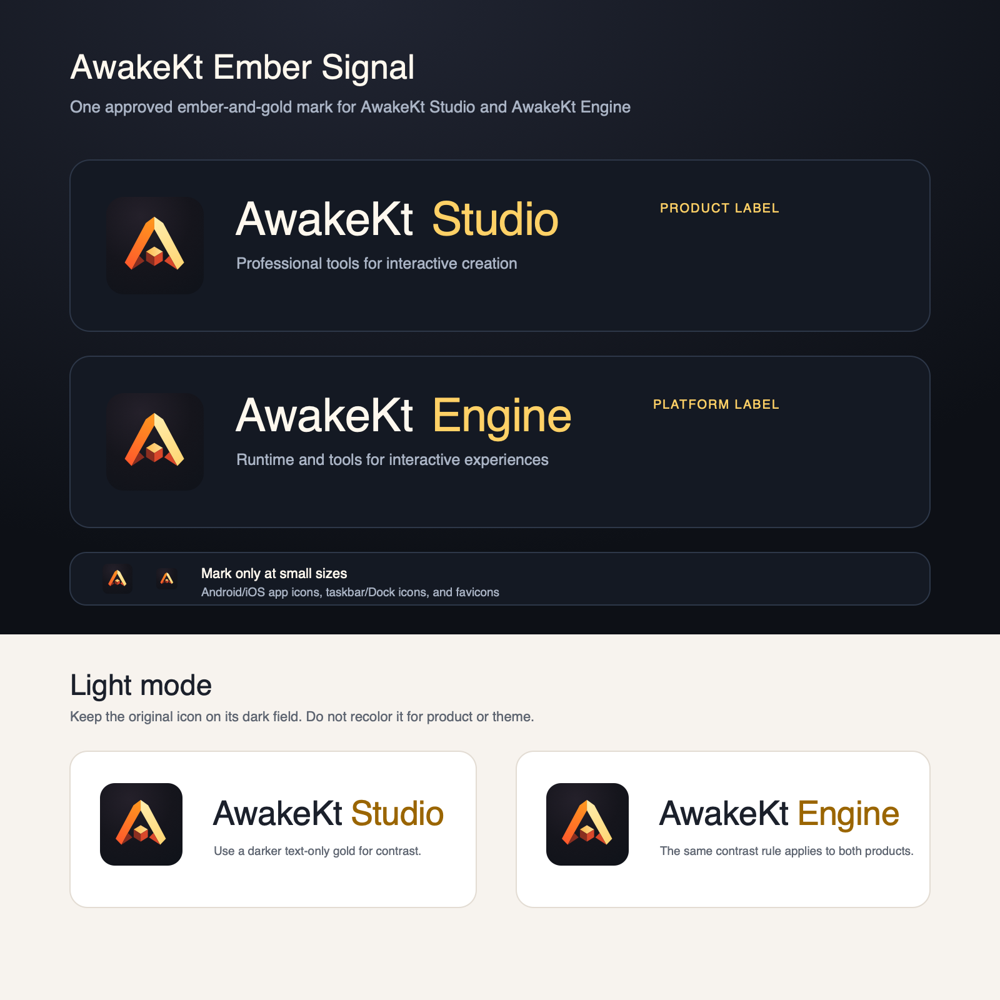

# AwakeKt brand system

**Status:** Stable. This is the canonical visual-identity record for the AwakeKt and Awake names
and the Ember Signal mark. It records the approved assets, their repository history, and their
allowed product uses. It is not a replacement for the [trademark notice](../../TRADEMARKS.md).

## Decision

AwakeKt owns and controls one unmodified Ember Signal mark across AwakeKt Engine and AwakeKt Studio.
The mark is always ember orange and warm gold on its dark field. Product names distinguish the
products; product-specific recolors do not.

| Product or surface | Visible name | Mark treatment |
| --- | --- | --- |
| Project and organization | `AwakeKt` | Project name; no separate icon treatment |
| AwakeKt Engine | `AwakeKt Engine` | Approved original mark |
| AwakeKt Studio | `AwakeKt Studio` | Approved original mark |
| Engine Showcase | `AwakeKt Engine Showcase` | Approved original mark |
| Android/iOS launchers, Desktop taskbar/Dock, Web favicon | Platform display name | Mark only; never a wordmark |

`Awake Core` is an architecture term, not a customer-facing product name.

## Approved assets

The Engine Showcase owns the runtime copies that platform hosts consume:

| Asset | Purpose |
| --- | --- |
| [`awake-mark.svg`](../../samples/engine-showcase/src/commonMain/resources/brand/awake-mark.svg) | Editable 1024×1024 source master |
| [`awake-mark.png`](../../samples/engine-showcase/src/commonMain/resources/brand/awake-mark.png) | Baked 1024×1024 sRGB app-icon raster |
| [`ic_launcher.xml`](../../samples/engine-showcase/androidApp/src/main/res/mipmap-anydpi-v26/ic_launcher.xml) | Android adaptive launcher entry point |
| [`AppIcon.appiconset`](../../samples/engine-showcase/iosApp/iosApp/Assets.xcassets/AppIcon.appiconset/Contents.json) | iOS AppIcon size catalog |
| [`index.html`](../../samples/engine-showcase/src/wasmJsMain/resources/index.html) | Web SVG favicon reference |

The visual reference above is explanatory artwork. It is not a separate master and must stay in
sync with the SVG master.

## Palette and geometry

The source master defines the geometry, folded side faces, and every color stop. Preserve all of
them when creating a new platform asset.

| Element | Approved color |
| --- | --- |
| Dark field | `#24202A` → `#15151C` → `#10131A` |
| Left A-beam | `#FF4D2E` → `#FF9F1C` |
| Right A-beam | `#FFF0B3` → `#FFD166` |
| Cube top | `#FFB84A` → `#FFE29A` |
| Cube left | `#8A2E20` |
| Cube right | `#D9482B` |
| Supporting accent | `#FF6B35` |

Do not recolor the mark for Studio, Engine, light mode, seasonal campaigns, or a product feature.
On a light surface, retain the icon's dark field. Text-only accents may use the darker gold
`#9A6500` to meet a 4.96:1 contrast ratio against white; this is not a different logo palette.

## Name and type rules

Use product names as ordinary interface text until an approved wordmark asset exists. A UI may use
its own licensed type system; it must not present a text treatment as a new official wordmark. The
normal text separator is one space: `AwakeKt Studio` and `AwakeKt Engine`.

- Use `AwakeKt Studio` for the commercial authoring application.
- Use `AwakeKt Engine` for the public engine platform.
- Use `AwakeKt Engine Showcase` for the sample app's visible label.
- At icon sizes, remove every label and use the mark alone.
- Do not add a slogan, framework claim, or implementation-language claim to the mark.

## Platform rules

| Context | Required treatment |
| --- | --- |
| Android | Adaptive foreground/background layers; use the existing monochrome vector for themed launchers. |
| iOS | Full-bleed 1024px source; allow the system to apply corner masking. |
| Desktop | Use the 1024px PNG for taskbar/Dock identity; do not add text to the OS icon. |
| Web | Use the SVG mark as the favicon; do not create a wordmark favicon. |
| In-app splash, About, headers, and documentation | A mark may appear alongside ordinary product text at a readable size. |

## Provenance record

The visual direction and acceptance criteria were recorded in [issue #66](https://github.com/awakekt/awake/issues/66)
on 2026-09-22. The original asset master and platform integration landed in [PR #73](https://github.com/awakekt/awake/pull/73),
merged as [`1a3644d`](https://github.com/awakekt/awake/commit/1a3644d4b381ef491f2587b888dca88dffcd77f7)
on 2026-09-26.

This dated, versioned record helps reviewers trace the asset's origin and approved form. It does
not by itself determine legal ownership. Preserve the issue, source files, commits, release tags,
and the [trademark notice](../../TRADEMARKS.md) when distributing or enforcing the AwakeKt brand.

The source-provenance registry records third-party code and assets. The Ember Signal mark is a
project-authored brand asset, so it has no external provenance-registry entry.

## Review checklist

- [ ] The asset was derived from the approved SVG master, not redrawn.
- [ ] The icon has no wordmark or small text.
- [ ] The original ember-and-gold palette and dark field are intact.
- [ ] Android adaptive safe-area and monochrome behavior are preserved.
- [ ] Light-mode usage keeps the mark unchanged.
- [ ] Any use of the name or mark follows [TRADEMARKS.md](../../TRADEMARKS.md).
