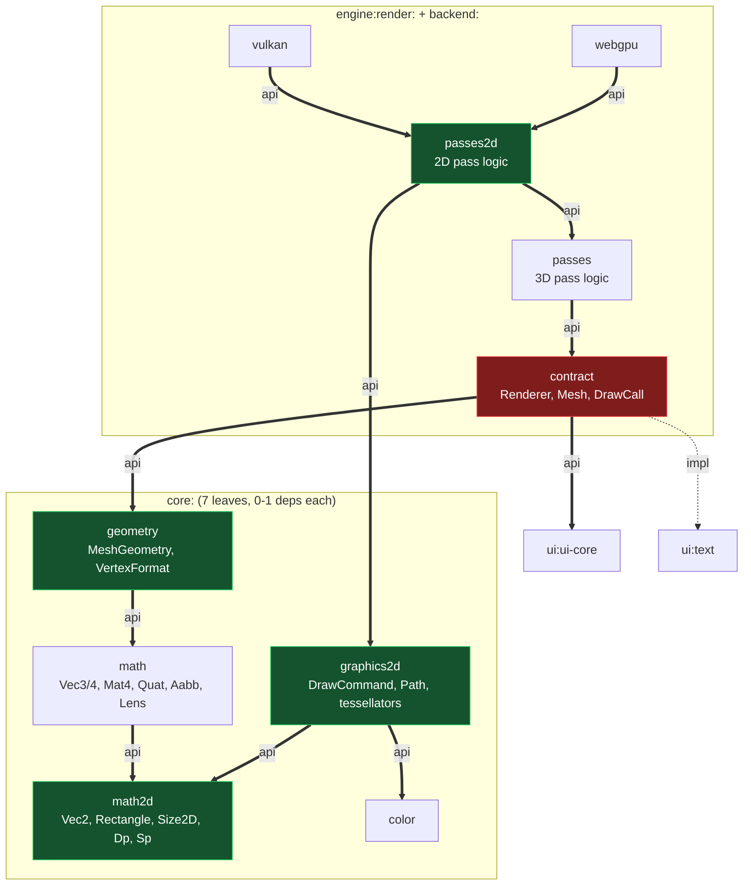

# Module Architecture

How Awake's 44 modules are grouped, why, and how to decide where a new one goes.

Supersedes `docs/tasks/archive/2026-08-17-awake-core-module-split-proposal.md`, which covered only
`awake:core` and recommended an ordering that later measurement contradicted.

Status of each decision is marked: **Done**, **Decided** (agreed, not yet built), or **Open**.

---

## The rule: group by subsystem, not by layer

A top-level group names *what a thing is*, never *where it sits in the stack*. The dependency
edge already records the layer; the module path should not repeat it.

Most groups already follow this — `core`, `ecs`, `scene`, `ui`, `asset`, `physics`. Two do not:

| Group | Problem |
|---|---|
| `engine:` | Every module in this repo is the engine. It does not distinguish its 5 members from the other 39, and those 5 are two unrelated things: rendering (`render:contract`, `render:passes`) and application lifecycle (`platform`, `bootstrap`, `app`). |
| `backend:` | A layer name. It holds the *implementations* of two subsystems whose *contracts* live elsewhere. |

The cost is that two subsystems are split across two namespaces:

- **render** — contract and passes under `engine:`, Vulkan and WebGPU under `backend:`
- **physics** — api under `physics:`, Jolt under `backend:`

Same subsystem, different top-level group, purely because one half is an interface. That is a
distinction the module *name* does not need to carry.

## Target grouping — **Decided**

```
awake:core        math, geometry, animation
awake:ecs
awake:render      contract, passes, vulkan, webgpu
awake:physics     api, jolt
awake:scene       scene-core, rendering, controls, runtime, authoring
awake:ui          graphics, text, ui-core, headless, designsystem, animation, heroicons, ...
awake:asset       gltf, shaders, shader-pack, mesh-optimizer
awake:app         platform, bootstrap, runtime
awake:editor      scene, physics
```

`awake:editor` is not in the regroup — it was named for its subsystem from the start and its
sub-modules already follow the rule. Listed so the target is the whole graph rather than only the
part that changes.

`engine:` and `backend:` both disappear. `:awake:engine:render:contract` becomes
`:awake:render:contract` — one segment shorter, and rendering stops being two groups.

**Sequence this behind the extraction below.** High churn, zero behaviour change, fixes no bug.

### What it actually costs — measured 2026-08-31

"Every import path" was the pessimistic guess and it is wrong for most of the work. Counted
against the tree rather than estimated, the regroup is **two jobs with different risk**, and the
cheap one is the larger.

**A. Seven modules move without a single Kotlin edit.**

| Module | → | Files | Package rename |
|---|---|---|---|
| `engine:render:contract` | `render:contract` | 53 | none |
| `engine:render:passes` | `render:passes` | 31 | none |
| `engine:render:passes2d` | `render:passes2d` | 13 | none |
| `engine:render:testing` | `render:testing` | 11 | none |
| `backend:vulkan` | `render:vulkan` | 463 | none |
| `backend:webgpu` | `render:webgpu` | 55 | none |
| `backend:jolt` | `physics:jolt` | 20 | none |

646 files, and none of their contents change: these packages are already `awake.render.*` and
`awake.physics.jolt`, with no layer word in them. The move is `git mv`, `settings.gradle.kts`,
`project(...)` references and Android namespaces — and Gradle fails loudly on a wrong path, so the
build checks nearly all of it.

**B. Three modules also need a Kotlin package rename.** `engine:platform`, `engine:bootstrap` and
`engine:compose` own eight packages containing `.engine.`, referenced by **150 imports across 64
files**. That is a symbol rename, so it belongs in the IDE per `kmp-refactor`, not a textual sweep.

### The part that is not mechanical

Two moving modules **contain git submodules**:

```
awake/backend/vulkan/bindings/ios-native/MoltenVK
awake/backend/jolt/ios-native/JoltC
```

A submodule does not move with `git mv`. It needs `.gitmodules` rewritten, `git submodule sync`,
and `.git/modules` fixed up. Their paths are also hardcoded in CI — the `ios-native` composite
action, three `actions/checkout` steps, and the natives artifact path in `build-and-publish.yml`.
A wrong one fails during MoltenVK's build, tens of minutes into a run.

Beyond that, **348 Gradle-path references across 89 files**, including `.agents/skills/*.md`,
`README.md` and both workflows. Docs do not fail the build, so those rot silently.

### Recommended sequence

1. **`backend:jolt` → `physics:jolt` first.** 20 files, one submodule, one subsystem — the whole
   job in miniature. If the submodule move is clean there, the pattern is proven before touching
   vulkan's 463 files.
2. **The render regroup** (contract, passes, passes2d, testing, vulkan, webgpu) as one commit.
   Half-migrated is worse than either end state.
3. **`engine:` → `app:`** separately, in the IDE.

Wants a quiet tree: it touches every `settings.gradle.kts` line, so it conflicts with anything
else in flight. **Deferred until after the current release** — 2026-08-31.


## The graph

Main-source-set edges only. Solid = `api` (transitive, becomes every consumer's dependency),
dashed = `implementation` (private). Trimmed to the spine -- `ecs`, `scene`, `asset` and the
`ui` interior are omitted.



What the picture shows now:

- **The 2D path is UI-free.** `passes2d` and `passes` reach no `ui:*` module; the vocabulary they
  consume lives in `core:graphics2d`, which both UI engines also produce into. That was the point
  of #7.
- **`render:contract` (red) is the last choke point.** Its `api` edge to `ui-core` is down to one
  file's worth of need (`UiFont`, plus `LineSegment`), but it is still `api`, so everything
  downstream inherits it. This is the remaining work.
- **`core:` is seven leaves**, six with zero dependencies. `core:math` depends on `core:math2d`
  and not the reverse, because projections return a `Vec2`.

---

## 1. Move the CPU data into `core:geometry` — **Done** (`922c47d85`, `4b8e35816`)

The one change motivated by a measured problem rather than tidiness. **No new module** — the
right home already exists.

`engine:render:contract` mixes CPU data with GPU handles:

| | Contents | Nature |
|---|---|---|
| CPU data | `MeshGeometry` + generators, `VertexFormat`, `VertexAttribute`, `GpuDataShape`, `VertexSemantic` | plain arrays and layout descriptions. Zero imports outside `core.math` |
| GPU handles | `Mesh` (`bind(commandBuffer: Long)`, `draw(...)`), `Renderer`, `DrawCall`, `Material`, `LineSegment` | resource handles and the frame API |

Only `Renderer.kt` and `LineSegment.kt` touch `awake.ui`, but that edge is `api`, so it is
transitive. Measured over main source sets only (test-scoped edges excluded -- counting those
inflates the figure and implies a cycle that does not exist):

```
:awake:engine:render:contract   4 transitive deps, 3 of them UI
    ui-core, ui-graphics, ui-text
```

It cascades: `scene:rendering`, `render:passes` and both backends each inherit the same 3.

**Two modules pay for it, the same way.** Both need the CPU data, both refuse a UI dependency,
both re-derive what they cannot see:

- `asset:gltf` (3 deps, zero UI) hand-copies four vertex layouts -- `GltfMesh`'s
  `VERTEX_STRIDE_COMPONENTS = 8`, `NORMAL_... = 9`, `TEXTURED_... = 11`, `SKINNED_... = 17` --
  each duplicating a `VertexFormat`.
- `core:geometry` (zero deps) takes `MeshSimplifier.simplify(positions: FloatArray, indices:
  IntArray, ...)` and hardcodes `positions.size / 3`, because the type describing "vertices,
  indices, and their layout" is one module away.

A glTF parser and a mesh decimator both reasonably decline to depend on a UI framework. The
module graph left neither any other option.

Target -- the CPU half joins the module that already owns mesh data:

```
core:geometry     MeshGeometry, VertexFormat, VertexAttribute, GpuDataShape, VertexSemantic,
                  MeshSimplifier, NormalizedInt                              (zero deps)

render:contract   Renderer, Mesh, DrawCall, Material, LineSegment, uniform layouts
                  -> core:geometry, -> ui-core
```

`Mesh` **stays** in the contract. It is a GPU handle taking a raw `commandBuffer: Long`, not
data, and belongs beside `Renderer`.

Falls out of the move:

- `asset:gltf` derives its four layouts and stays UI-free -- it already depended on
  `core:geometry`, so it needed no build change at all.

  **It did not remove ~90 `MagicNumber` findings, as an earlier draft of this section claimed.**
  It removed one; 539 repo-wide before and after. Those four strides were already *named*
  constants, so detekt never flagged them -- what it flags is the `+ 1`/`+ 2` element indices and
  `+ 3`/`+ 4`/`+ 5` write offsets inside the interleaving loops. Stride drift and `MagicNumber`
  are different problems that happened to live in the same file.
- `MeshSimplifier` taking a `MeshGeometry` -- **retracted, do not do this.** See below.
- `scene:rendering` drops from 7 transitive deps toward ~4, and to zero UI if it needs only
  mesh descriptions.
- The repo-wide `MagicNumber` decision becomes answerable -- see below.

**Why not a new `render:mesh` module.** An earlier draft of this document proposed one. It was
wrong twice: it included `Mesh`, which is a GPU handle and should not move, and a ~5-file module
is exactly the shape already rejected for `core:input`/`core:time` in
[Withdrawn](#withdrawn--decided-do-not-revisit-without-new-evidence). `core:geometry` is already
the zero-dependency home for mesh data; adding a fourth sibling beside it would have been the
boundary costing more than the coupling it removes.

### `MeshSimplifier` should keep taking loose arrays

An earlier revision of this section listed "`MeshSimplifier` can now take a `MeshGeometry`" as a
consequence of the move. It is co-located with the type now, so it *could*. It should not.

They are different shapes on purpose:

| | Shape |
|---|---|
| `MeshGeometry` | **interleaved** vertices (`pos,color,uv, pos,color,uv, ...`) plus a `VertexFormat` |
| `MeshSimplifier.simplify(positions, indices)` | **de-interleaved**, position-only |

Passing a `MeshGeometry` would mean de-interleaving in and re-interleaving out, and would
discard the reason `Result.vertexRemap` exists: the caller downsamples its *own* parallel
per-vertex arrays (normals, UVs, colors) by that map, choosing its own representative per
surviving vertex. A `MeshGeometry` in/out API takes that choice away.

**And the `3`s in that file are two different constants.** A sweep that "derives" them all would
be wrong in a way that stays wrong:

| Expression | Meaning | Derivable |
|---|---|---|
| `positions.size / 3`, `p[i * 3 + 1]` | xyz per position | yes -- `GpuDataShape.Vec3.componentCount` |
| `indices.size / 3`, `triangleVertices[t * 3]` | vertices per **triangle** | no -- topology, not a vertex format |

Same value, different meaning. Replacing the second with a `Vec3` component count compiles,
passes, and is a lie.

The file now spells the two apart -- `POSITION_COMPONENTS` (derived from
`GpuDataShape.Vec3.componentCount`) and `VERTICES_PER_TRIANGLE` (a plain `3`, topology) -- so
a future sweep has to pick one and the wrong pick reads wrong at the call site.

**Do not** fix this by changing `api` to `implementation` on the UI edge. `Renderer.drawUi`'s
parameter types are part of its public signature; consumers genuinely need them. `api` is
correct. The split between CPU data and GPU handles is what is missing.

The one judgement call: is a *GPU* vertex layout `core`? Yes -- `GpuDataShape` is
`componentCount` and `bytesPerComponent`, pure arithmetic. The backend-specific mappings
(`toVkFormat()`, `toGpuVertexFormat()`) are already extensions living in the backends.

## 2. `GltfMesh` derives its layouts — **Done**

All four strides now read from the format instead of restating it:

```kotlin
val VERTEX_STRIDE_COMPONENTS = VertexFormat.PositionColorUv.strideFloats
val NORMAL_VERTEX_STRIDE_COMPONENTS = VertexFormat.PositionNormalColor.strideFloats
val TEXTURED_VERTEX_STRIDE_COMPONENTS = VertexFormat.PositionNormalColorUv.strideFloats
val SKINNED_VERTEX_STRIDE_COMPONENTS = VertexFormat.PositionNormalColorSkin.strideFloats
```

Was blocked on #1 only. Same defect class as the rounded-quad stride drift, where WebGPU hardcoded
`15` against a shared truth of `16` and the mismatch surfaced only as a misleading capacity
error above ~240 quads.

## 3. `MagicNumber` — **Done** (disabled repo-wide)

Was 539 of 719 findings and the reason detekt was red in 27 modules, so every rule added on top
inherited a permanently-red signal.

Settled by classifying all 109 findings in `core:math` by hand -- the most arithmetic-dense
module here, so the rule's best case:

| Count | What it was |
|---|---|
| 54 | matrix element indices -- `data[15]`, `data[col * 4 + row]`, `FloatArray(16)` |
| 9 | the 4 of 4x4 -- `for (i in 0 until 4)` |
| 5 | NDC-to-pixel remap -- `0.5f * (ndcX + 1f) * screenWidth` |
| 3 | a box's 12-edge table -- `0 to 1, 1 to 2, 2 to 3, 3 to 0` |
| 2 | clip-space depth convention |

Not one threshold, capacity, or tunable value -- the entire category the rule exists for.
`data[15]` is m33; `FloatArray(16)` is what `Mat4` means.

The rule was also silent where the defects actually were: `GltfMesh`'s four duplicated vertex
strides went unflagged *because* they were already named constants, and `MeshSimplifier` held two
incompatible meanings of `3` that it never told apart.

Config tuning cannot fix this -- the problem is array subscripting, and there is no
"ignore array indices" option. Padding `ignoreNumbers` to 0..16 leaves the rule nominally on
while removing what it checks.

Findings 719 -> 192, red modules 27 -> 24. The backlog underneath is now visible and is the real
signal: `LongParameterList` 34, `LongMethod` 34, `CyclomaticComplexMethod` 20, `ReturnCount` 19.

## 4. `core:math` extraction — **Done**

13 source + 20 test files. `core/math` imported nothing from the rest of `core`, and the rest of
`core` imported nothing from `math` — zero coupling in both directions, so the move itself was
mechanical. What was left behind is 9 files: `application`, `colors`, `graphics`, `input`,
`utils`.

Deliberately no compatibility re-export. `core` does not use math, so an `api` edge purely to
keep old dependency declarations working would have been a convenience lie, and it would have
hidden exactly what the split was for. All 18 modules that import `core.math` now declare it.

The narrowing is what paid. Two modules turned out to be reaching `core` through someone else's
`api` edge, and only the compiler knew:

| Module | Was getting `core` via | Now |
|---|---|---|
| `scene:rendering` | `scene-core`'s `api(core)` | declares `core` |
| `scene:controls` | `scene-core` + `rendering` | declares `core` and `core:math` |

`scene:controls` never declared `:awake:core` at all, which is why a survey of modules that
*declare* the dependency could not have found it. Both were latent: correct only for as long as
nobody narrowed an upstream `api`.

**One straggler the move nearly missed:** `MatrixTest.kt` lived in `core/` rather than
`core/math/`, so a directory-scoped move skipped it and it failed to compile against types that
had left. Location is not membership — grep the imports, not the path.

Detekt: `core:math` reports 118 findings (109 `MagicNumber`), the same ones those files produced
inside `core`. Nothing new — `core`'s own detekt was already failing before this and still is
(12 findings in the remaining 9 files), and 27 modules were already red. See #3, still open.

---

## 5. `core` audit — **Open**, found while doing #4

### "Geometry" means two different things

| Sense | Contents | Lives in |
|---|---|---|
| Mathematical -- shapes and intersections | `Aabb`, `Plane`, `Ray`, `Frustum` | `core:math` |
| This repo's module -- CPU mesh data | `MeshGeometry`, `VertexFormat`, `GpuDataShape` | `core:geometry` |

There is a file named `Geometry.kt` inside `core:math`. The collision is real and it invites a
reasonable wrong guess: that `Aabb` belongs in `core:geometry`.

**It does not.** `Aabb` is `data class Aabb(min: Vec3, max: Vec3)` importing only `kotlin.math`,
and it is consumed by `core:geometry`, `render:contract`, `scene:rendering`, and `studio`. Moving
it would force two rendering modules to depend on a *CPU mesh-data* module to hold a culling
volume. It is a math primitive used for culling as much as for mesh bounds. Same shape of trap as
the two meanings of `3` in `MeshSimplifier` -- one word, two referents.

### No in-repo consumer

Only dev tags exist (`v0.1.0-dev.5`), so none of this is frozen API.

| Declaration | Internal uses | Tests | Consumers |
|---|---|---|---|
| `Grid` (45 lines) | 0 | `GridTest.kt` | **none** |
| `Mat4.normalMatrix` | 0 | 0 | **none** |
| `Mat4.transformToPosition` | 0 | 1 | none |
| `boundingCenter` | 1 | 13 | none |

`Grid`'s doc names three modules that no longer exist: `awake-base`, `awake-engine-render-api`,
`sample-hello-cube`.

Not on this list: `determinant` (4 internal uses) and `Angle` (7 internal, 12 tests). A first
pass called both unused because it excluded the module's own directory when grepping.

### `ClipSpace` is in the wrong module, and cannot simply move

`ClipSpace` describes a *backend convention* -- Vulkan vs WebGPU depth range and Y-flip -- not
math. It sits in `core:math` and is consumed by both backends, `render:contract`, and
`bootstrap`. It cannot be relocated as-is because `Mat4.orthographic(...)`/`perspective(...)` take
a `ClipSpace`, so math depends on it. Untangling means changing the projection signatures to
return a convention-neutral matrix and applying the flip at the call site. Recorded, not
scheduled.

### `ui:text` is not the outlier it looks like

Worth writing down because a size ranking says otherwise: `ui:text` is 10,041 lines, the largest
module in the repo -- and 8,800 of them are one embedded font-data file. Hand-written code is
~1,200 lines. It is not a split candidate. Rank modules by hand-written source, not by `wc -l`.

## 6. Retire `awake:core` — **Done**

`awake:core` was five packages that shared a module name and nothing else. Cross-package
coupling inside it was a single file (`WindowLifecycle` -> `input`), which moved out.

| New module | Contents | Consumers |
|---|---|---|
| `core:color` | `Color` | **17** |
| `core:input` | `Input` + 3 Android IME bridges | **13** |
| `core:image` | `Bitmap` (4 actuals), `BitmapRgba8` | 3 |
| `core:host` | `FrameLoop` (3 actuals), `FixedTimestepLoop`, `Resource` (4 actuals) | 7 |

Also: `WindowLifecycle` -> `engine:platform` (its only consumer, and the one thing coupling
two of these packages), `AwakeLogger.kt` deleted (an empty file -- licence header and a package
line), `awake:core` itself gone.

### `core:runtime` was the first name, and it was wrong three times over

`runtime` collides with `scene:runtime` and `compose:runtime` today, and with `app:runtime` in
the target grouping above. It is also a layer word, which this document's own first rule forbids.
`core:host` names what the module is: services the host platform provides.

One honest wrinkle: `FixedTimestepLoop` is pure logic with no platform actual, so it is the one
non-host thing in `core:host`.

### `core:image`, not `core:graphics` -- and the reason was not the one first given

The stated reason was avoiding a clash with `ui:graphics`. That reason was wrong: **`ui:graphics`
declares no `ui.graphics` package at all** (it owns `ui`, `ui.api`, `ui.api.layout`). The package
`awake.ui.graphics` is owned by `ui:ui-core` (5 files) and `ui:animation` (3 files) -- two modules
that are not the one named for it. There was no clash to avoid. `image` is right because
`Bitmap`/`BitmapRgba8` are raster imagery, which is narrower and truer than "graphics".

### A module was claiming another module's package

`engine:platform`'s `VulkanView.kt` declared `package awake.core.graphics` while living in
`engine:platform`. Harmless-looking until `core.graphics` became its own module, at which point
two Gradle modules contribute to one package -- which quietly breaks `internal`, since `internal`
is per-module but every reader assumes per-package. Moved to `awake.engine.platform`.

This is not isolated. Seven packages in the `ui` group are split across two or more modules, the
bare `ui` package across **five**, and `ui:heroicons` publishes under
`io.github.awakelab.ui.*` -- missing the `awake` segment entirely, on a coordinate that is
already published. Recorded here; not fixed in this pass.

## Withdrawn — **Decided, do not revisit without new evidence**

Carried forward from the superseded proposal.

- **`core:input`, `core:time`** — `input` (188 lines) + `utils` (21) + `application` (70) +
  `graphics` (68) + `colors` (69) = 416 lines total. Four modules averaging ~105 lines each,
  forcing dependency edits across 27 consumers. The boundary would cost more than the coupling
  it removes. libGDX is direct precedent for keeping subsystems together.
- **Further splitting of the rump `awake:core`** — same reasoning.

## Naming

Two collisions were resolved 2026-08-21; a third is deliberate.

| Was | Now | Why |
|---|---|---|
| `core.math.Camera` | `Lens` | Its own doc: "describes a lens -- eye, target, up, field of view, near/far -- and nothing else". Removed 54 `CoreCamera` aliases across 12 files. |
| `Camera.camera` | `Camera.lens` | 21 `camera.camera` stutters. |
| `scene.controls.CameraComponent` | `CameraRig` | Read as "the camera's ECS component" but is not -- `Camera` is. It is the orbit/follow mount. |

Kept deliberately: `scene:runtime`'s `Camera as SceneCameraComponent` aliases disambiguate the
component from `SceneCamera`, the JSON DTO -- a different collision.

`Renderer` / `Material` / `Mesh` / `BufferHandle` appearing in both the contract and each
backend is **intentional** — contract declares, backend implements. Backends alias
(`RenderMaterial`, `RenderMesh`, `RenderRenderer`) where they need both.

### Dimensional suffixes (`2D` / `3D`) — surveyed 2026-08-22

Four major engines follow three incompatible rules, so "what does everyone do" has no answer.

| Engine | Rule | Example |
|---|---|---|
| Godot 4 | suffix **both** sides, always | `Sprite2D` / `Sprite3D` |
| Unity | suffix only the newcomer; 3D unmarked | `Rigidbody` / `Rigidbody2D` |
| Bevy | split by crate, suffix paired types, shared vocabulary bare | `bevy_sprite` / `bevy_pbr`; `Transform` |
| three.js | digit is **component count**, not world | `Vector2` / `Vector3`, `Box2` / `Box3` |

Two of those are worth knowing precisely:

- **Godot tried the nuanced rule and reversed it.** The original proposal
  ([godot#30736](https://github.com/godotengine/godot/issues/30736)) suffixed only where both
  forms exist and neither dominates, explicitly exempting `Sprite` ("mainly a 2D node") and
  `MeshInstance` ("meshes are mainly used for 3D"). Godot 4 shipped `Sprite2D` *and* `Sprite3D`,
  `MeshInstance2D` *and* `MeshInstance3D`. Stated reason: "a mistake in code could make it hard
  to realize whether you're using the 3D or 2D version." Half-measures did not hold.
- **Unity's asymmetry is chronology, not design.** 2D physics landed in 4.3 (late 2013), eight
  years after launch, when `Rigidbody` was taken and baked into every project. Do not cite it as
  precedent.

**Two axes get conflated.** A digit can mean *component count* (`Vec3`, `Mat4` -- a fact about
arity) or *which world* (`Node3D`, `Camera2d` -- a fact about domain). They are different rules
and this repo needs both answered separately.

The rules here:

1. **Component-count digits stay.** `Vec2`/`Vec3`/`Vec4`, `Mat3`/`Mat4` already match three.js.
   Load-bearing there for a reason worth copying: their `Vector` interface is documented as not
   type-safe, so the name is the only thing stopping a `Vector2` reaching a `Vector3` parameter.
2. **A "which world" digit needs both worlds to exist for that concept**, and a reader who could
   plausibly reach for the wrong one. Suffix both sides or neither -- see Godot.
3. **When the counterpart is a purpose rather than a dimension, name both by purpose.** This
   repo's "2D" is UI, not 2D-games: `awake/ui` contains zero references to `Vec2` or `Vec3`, it
   speaks `Dp`/`Rectangle` while scene speaks `Vec3`/`Mat4`. They are two subsystems, not two
   dimensions of one. Bevy is the model -- `bevy_sprite`/`bevy_pbr` name the domain.
4. **Shared vocabulary stays unsuffixed.** Bevy keeps `Transform`, `Camera`, `Visibility` bare
   because they span both. `Vec3`, `Aabb`, `Color` are that category here.

**Outstanding under rule 3:** `RendererDraw3D` pairs with `RendererDrawUi`, not `RendererDraw2D`
-- the two halves are named on different axes. `RendererDrawScene` would pair cleanly. 24
references across both backends; not yet done.

### The 2D/3D vocabulary, by role

What each side calls the same idea. Built to find gaps, and it found three -- the **Status**
column is the point of the table, not the names.

| Role | 2D | 3D | Status |
|---|---|---|---|
| Scalar units | `Dp`, `Sp`, `Density` | — | 2D-only, correct |
| Primitives | `Vec2`, `Rectangle`, `Size2D` | `Vec3/4`, `Aabb`, `Plane`, `Ray` | balanced |
| Geometry data | `DrawPath`, `PathContour`, `PathCommand`, `DrawPoint`, `PathBuilder` | `MeshGeometry`, `MeshGenerateScope` | balanced |
| Shape descriptors | `DrawShape`, `FillRule` | — | 2D-only, correct |
| Style | `DrawStroke`, `StrokeCap`, `StrokeJoin`, `LinearGradient` | `Material`, `PbrTextureSet` | **gap 3** |
| Tessellated output | `TriangleMesh`, `ColoredVertex`, `ColoredTriangleMesh`, `TexturedVertex`, `TexturedTriangleMesh` | `MeshGeometry` | **gap 2** |
| Vertex layout | `VertexLayout2D` | `VertexFormat`, `VertexAttribute`, `GpuDataShape`, `VertexSemantic` | **gap 1** |
| Draw command | `DrawCommand` + 9 variants | `DrawCall` | balanced |
| Command transform | `DrawTransform` | `Mat4` | balanced |
| Pass port | `Pass2D` | `SkyboxPass`, `LinePass` | balanced |
| Feature | `RenderFeature2D`, `SharedRenderFeature2D` | `OpaqueRenderFeature`, `SharedOpaqueRenderFeature`, `SkyboxRenderFeature`, `SharedSkyboxRenderFeature` | balanced |
| Run batching | `DrawRun`, `StagedDrawRun`, `DrawRunCoalescer`, `DrawRunRecorder` | `PreparedDraw`, `InstancePacker` | balanced |
| Upload | `DrawMeshUploader` | `GpuResourcePool`, `BufferHandle` | balanced |
| Pipeline id | `PipelineKind2D` | `PipelineHandle`, `PipelineTable` | balanced |

**Gap 1 -- 2D has one vertex-layout type where 3D has four.** `VertexLayout2D` is a hand-written
layout object; 3D composes `VertexFormat` from `VertexAttribute`s, each carrying a `GpuDataShape`
and a `VertexSemantic`. `VertexLayout2D` may simply *be* a `VertexFormat`. This is the same defect
as `GltfMesh`'s four hand-copied strides in #1, from the other direction.

**Gap 2 -- five mesh types where 3D has one.** `TriangleMesh`/`ColoredTriangleMesh`/
`TexturedTriangleMesh` plus two vertex types are a hand-rolled product of (has colour) x (has UV),
which is exactly what `VertexFormat` exists to express generically. Same root cause as gap 1.

**Gap 3 -- no 2D `Material`.** 3D has `Material`/`PbrTextureSet`; 2D carries style inline on each
`DrawCommand` variant. Probably right for immediate-mode 2D, but it leaves `DrawStroke` and
`LinearGradient` with no owning concept.

Names above are the *target* set; the `Ui` prefix is still on most of them in code. The rename is
mechanical but must run longest-name-first -- `UiRun` is a prefix of four others, `UiPath` of
three -- and same-package references carry no import, so only the compiler can find them.

## 7. "Graphics" means two different things — **Done**

Same shape as the `Geometry` collision above: one word, two referents, and the wrong guess is the
reasonable one. Resolved by naming both halves for their dimension and moving the 2D one out of
the UI stack.

| Sense | Contents | Now lives in |
|---|---|---|
| 3D — what a scene draws | `Mesh`, `VertexFormat`, `RenderPipeline`, `Renderer` | `render:contract` |
| 2D — what a UI draws | `UiDrawPrimitive`, `UiPath`, `UiGradient` | **`core:graphics2d`** |

### `core:`, not `render:`

The first proposal was `render:draw2d`. It is wrong for the reason the compose-engine doc already
gave against `compose:`: whichever side owns the contract, the other has to depend on it. This
repo has **two** UI engines producing the primitive list (`ui:*` today, `compose:*` next) and two
backends consuming it. In `core:` neither side depends on the other.

The name follows the sibling that already existed -- `render:passes` split into `passes`/`passes2d`
in the same pass, so `graphics2d` reads against `graphics` the way `passes2d` reads against
`passes`.

`canvas` was rejected: `ui-core` has `Canvas.kt`/`CanvasScope` and `compose:ui` has `DrawScope`,
which are the surface you call draw methods *on* -- the opposite end of the pipe from the commands
it emits. Godot uses `canvas` for this subsystem, but a module named `canvas` containing no
`Canvas` invites the same wrong guess this item is about.

### `Dp` moved, and that is what made it possible

`UiDrawPrimitive` references `UiPath`, and `UiPath` uses `Dp` -- so the clean move looked blocked
behind splitting a 1646-line file around `UiStroke` and `UiShapeSpec`.

`Dp` looked UI-only: no backend imports it, and by this document's own rule ("if a render backend
needs the type, it is not a UI type") it should have stayed. It moved because `backend:webgpu`'s
`WebGpuCanvasHost` sets `UiDensity.scale` from the browser window in production `wasmJsMain`. The
dependency was one level of indirection away, and a direct-import grep missed it.

`Dp`, `Sp` and `UiDensity` are now in `core:math2d`. `UiStroke` and `UiShapeSpec` -- the authoring
types that *carry* a `Dp` -- stayed in `ui:graphics`.

A second apparent blocker dissolved the same way: `backend:vulkan` seemed to need `UiStroke` and
`UiShapeSpec`, but every one of those references is in `desktopTest`.

### The render side is now UI-free

Because `Dp` moved, `UiPath.kt` moved whole -- `UiStroke` and `UiShapeSpec` included -- so the one
UI edge this item expected to leave behind never materialised. `render:passes2d` references no
`awake.ui` type, and `render:passes` was found to be in the same position and dropped three `api`
edges: `ui:graphics`, `ui:text`, `ui:ui-core`. Those were transitive, so everything downstream of
`render:passes` lost them too.

`ui:graphics` is down to four files: `UiImageVector`, `PopupContracts`, `UiEasing`, `UiIcon`.

What remains is outside the 2D path and is real: `render:contract` uses `UiFont` in one file,
`backend:vulkan` uses `UiContext`/`LocalTheme`/`UiCursor` in five, `backend:webgpu` uses `UiFont`
in four.

`UiBounds` did not move to `draw2d`, as an early draft proposed. It is the layout rect, used in 16
files across `ui-core`; putting it in a render module would force every layout module to depend on
render to hold a rectangle. It went to `core:math2d` and was renamed `Rectangle` -- see #8.

### Do not merge 2D and 3D

They share a subsystem, a device and `Color`. They do not share a vocabulary: meshes, materials
and pipelines on one side; quads, glyphs and clip rects on the other. Nothing consumes both halves
except the backends, and those consume them in *separate passes*.

Grouping them under a common prefix is the organisation. Merging them into one module would be a
grab-bag — the `awake:core` mistake this document already recorded in #6, repeated one level down.

`Color` needs no change: 7 non-UI modules use it, so `core:color` was always right. Keep it beside
these rather than inside either — a material colour is not a 2D-draw concept.

## 8. `Rectangle`, `Size2D`, and the `core:math2d` split — **Done**

`UiBounds` moved to `core:math2d` and was renamed `Rectangle`: the `Ui` prefix stopped being true
once the type left the UI stack, and 8 of its consumers are backends, render modules and samples.
1708 occurrences, 218 files. `UiShapeSpec.Rectangle` already existed but is written qualified at
every call site, so nothing became ambiguous.

`core:math2d` exists because no UI module imported `core:math` at all before this — a 2D consumer
was being handed 2072 lines of quaternions, view frustums and camera lenses to get a rectangle.
libGDX keeps `Rectangle` beside `Matrix4` in one `math` package deliberately, and that was the
argument against splitting; it ships one jar and has no module boundary to pay for.

`core:math` now `api`-depends on `core:math2d`, not the reverse — `Vec4.pixelCoords` and
`Lens.projectToViewport` both return a `Vec2`.

`Size2D` is new: a width/height with no origin, kept separate from `Rectangle` because a measured
extent and a placed rect are different facts.

## Adding a new module

1. **Name it for the subsystem**, never the layer. If the name is `engine`, `backend`, `common`,
   `shared`, `impl` or `util`, it is a layer name — pick again.
2. **Measure the transitive cost.** A module whose job is to describe data should have a
   dependency closure near zero. If it does not, something upstream is over-`api`'d.
3. **Prefer `implementation` over `api`.** Use `api` only when a type appears in the module's
   own public signatures — and know that it becomes every downstream consumer's dependency.
4. **Justify the boundary against the withdrawn list.** ~100-line modules that force edits
   across dozens of consumers were already rejected once.
   Two justifications that do hold, both narrow:
   - **It joins two modules that must not depend on each other.** `awake:editor:physics` exists
     because `awake:editor:scene` must not pull in the physics backend and `awake:scene:physics`
     must not depend on an editor. Something has to name both types, and it cannot be either of
     them. Size is irrelevant here — the module is ~70 lines and the boundary is still forced.
   - **It must ship separately**, which for now means an editor plugin. Note that this is a
     *build-time* split: `EditorPlugin` deliberately excludes dynamic loading because
     Kotlin/Native and wasmJs cannot load code, so a marketplace would be a desktop host above
     that contract rather than a property of the module graph.
5. **Give it a README** and update [`awake/README.md`](../../awake/README.md)'s map in the same
   commit.

## Packages inside a module

**Rule 1 applies one level down: name a package for the subsystem, not the layer.** A feature's
components, systems and configuration belong in one package together. `components/` and `systems/`
are layer names by the same test that rejects `impl` and `util` — they group by what a type *is*
rather than by what it is *for*, so one feature ends up split across two folders and neither folder
describes anything.

`:awake:scene` currently runs both conventions at once, which is what motivated writing this down:

| Package | Convention |
|---|---|
| `scene/world/` — `WorldPartitionSystem`, `StreamObserver`, `WorldCellCoord`, `WorldPartitionConfig` | subsystem ✅ |
| `scene/navigation/`, `scene/ai/` | subsystem ✅ |
| `scene/core/components/` + `scene/core/systems/` | layer ❌ |
| `scene/controls/`, `scene/physics/`, `scene/rendering/` — each split `components/` / `systems/` | layer ❌ |

The visible symptoms: `StreamObserver` is a component that lives in no `components/` folder,
`TerrainComponent` and `TerrainClipmapSystem` are one feature in two folders, and `scene-core`
contains a package named `core`.

**This is not a mandate to repackage.** Converting ~50 files at once would collide with everything
in flight and prove nothing. New features use subsystem packages; existing ones convert when they
are being touched for another reason anyway. `Transform` and `Name` are genuinely cross-cutting and
have no subsystem to move to — a shared package for types every feature uses is the exception, and
it should be named for what it holds rather than for its layer.

## Related

- [`awake/README.md`](../../awake/README.md) — the module map
- [api-layering.md](api-layering.md) — core / helpers / sugar within a module's public surface
- [library-api-boundaries.md](library-api-boundaries.md) — DSL sugar versus runtime contracts
- [framework-game-boundary.md](framework-game-boundary.md) — what belongs in Awake at all
- [kmp-architecture-stance.md](kmp-architecture-stance.md) — why this is not idiomatic KMP layering
