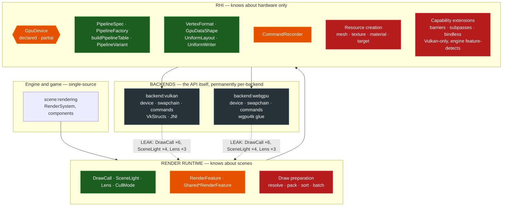

# The Render Hardware Interface (`GpuDevice`)

Awake's rendering boundary: one backend-neutral API that engine code targets, implemented once
per backend. Unreal calls this an RHI, Godot a `RenderingDevice`, and bgfx/wgpu/Dawn are
standalone versions of the same idea.

Read with [backend-commonisation.md](backend-commonisation.md), which measures how much
duplication exists today and ranks what to migrate next.

## Why

Historically, two backends were hand-authored side by side (Vulkan and WebGPU). Without a named boundary, each
one independently decides *what* to render as well as *how*, and the two drift. The worked
example: WebGPU shipped with no alpha-blended pipeline at all for as long as Vulkan had one,
because "which pipelines exist" was answered twice. Nothing failed — transparent draws just
silently rendered opaque.

An RHI makes that class of bug unrepresentable. Above the line there is one answer; below it,
each backend only translates.

## The name

**`GpuDevice`** — the facade in `awake:engine:render:contract`.

- `Gpu*` is already this repo's prefix for backend-neutral GPU vocabulary (`GpuDataShape`,
  `GpuResourcePool`). `GpuDevice` extends a convention rather than starting one.
- **Not** `RenderDevice` or `RenderingDevice`: `GraphicsDevice` already exists as the *concrete
  per-backend* type in both backends (59 files). A shared `RenderDevice` sitting one letter away
  from a per-backend `GraphicsDevice` is a naming trap.
- **Not** `Rhi`/`AwakeRhi`: "RHI" is the right word for the *concept* and the right word to use
  in conversation and in this document. It is a poor identifier — an initialism that means
  nothing at a call site.

Use "RHI" for the idea. Use `GpuDevice` for the type.

## Backend roles — read this before the shape rule

**Vulkan is the primary backend. WebGPU exists because browsers cannot run Vulkan.** It is a
compatibility target, not a co-equal one. Effort, feature depth and performance work go to
Vulkan first; WebGPU is expected to lag, and already does — it has no shadow pass at all.

This asymmetry is what the capability tiers below exist to express. Without them, the
compatibility backend would cap the primary one, which is backwards.

## The shape rule — the one that decides whether this can be finished

Two tiers, and the distinction is the whole design:

**Core tier — the intersection of both backends. Shaped like WebGPU, unavoidably.**

Not a preference. WebGPU is a capability *subset* of Vulkan, so the intersection of the two
simply is WebGPU-shaped; "model the core on WebGPU" is "the core is the intersection" restated.
A WebGPU-shaped API is always implementable on Vulkan — Dawn and wgpu are the proof — while the
reverse is false, because WebGPU never hands back the explicit control a Vulkan-shaped API
assumes. Put an explicit barrier, subpass or descriptor-set index in the core and the WebGPU
implementation has no way to satisfy it; the abstraction can then only be abandoned.

**Extension tier — Vulkan-only capability, behind an optional interface.**

Explicit barriers, subpasses, bindless descriptors, multi-queue, timeline semaphores: real
Vulkan advantages with no WebGPU equivalent. These do **not** get flattened into the core and
they do **not** get skipped. They go behind capability interfaces that engine code queries and
never requires:

```kotlin
interface GpuDevice {
    // core: every backend implements all of it
    fun createPipeline(spec: PipelineSpec): GpuPipeline

    // extensions: null on a backend that lacks the capability
    fun <T : GpuCapability> capability(kind: GpuCapabilityKind<T>): T?
}

// engine code feature-detects; web degrades rather than breaking
device.capability(Bindless)?.let { renderWithBindless(it) } ?: renderPerDrawBindings()
```

The rule is therefore **not** "never use Vulkan features". It is: **the core may never *require*
what WebGPU cannot do.** Vulkan is free to exceed the core through extensions; web takes the
fallback path or the feature is simply absent there.

Shorthand for the common case, where a concept exists on both sides but is spelled differently —
take the WebGPU spelling and let Vulkan translate:

| Concept | Vulkan | WebGPU | `GpuDevice` takes |
|---|---|---|---|
| Wireframe | `VK_POLYGON_MODE_LINE` | `LineList` topology | `wireframe: Boolean` |
| Cull mode | `VkCullModeFlagBits` | `GPUCullMode` | the contract's own `CullMode` |
| Shader stages | two `.spv` files | one `.wgsl` | resource paths + entry points |
| Resource binding | descriptor sets/pools | bind groups | bind-group shaped |

The first two already work this way — see `PipelineSpec`.

## The boundary

**Above the line (shared, single-source).** What to draw, in what order, with what state, with
which uniforms: draw-call preparation, sorting, batching, uniform packing, pass and feature
orchestration, pipeline and vertex-layout *decisions*.

**Below the line (per-backend).** Device and swapchain creation, memory allocation, command
buffer/encoder mechanics, descriptor set and bind group caching, native struct construction,
JNI and wgpu4k glue.

**The acceptance test for any addition to `GpuDevice`:** *could a third backend implement this
without changing shared code?* If not, the concept is below the line and does not belong in the
facade.

### Neither side may name content

The above/below split says where a *decision* lives. A second, independent rule says what the
vocabulary may be: **a graphics backend knows hardware only.** Pipelines, buffers, textures,
samplers, command recording. It must never know what a skybox or a shadow *is*.

This is not the same rule as the one above, and it is easy to satisfy one while breaking the
other. `SkyboxRenderPipeline` is genuinely below the line -- it is real driver work -- and still
violates this, because a backend that declares it has become a game: a fourth content feature then
costs an edit to both backends. Enforced by `verifyBackendLayering` on `check`.

The facade itself is not exempt, and currently fails: `Renderer.showEnvironment`, `horizonColor`
and `zenithColor` are sky vocabulary sitting on the hardware interface. A horizon colour is not a
capability -- it is uniform data owned by the skybox feature. Tracked in
[2026-08-23-backend-content-split-plan.md](../tasks/2026-08-23-backend-content-split-plan.md).

## What already exists



Green is done and shared. Amber is started but partly migrated. Red is remaining work. The facade
exists, but still mixes runtime and RHI vocabulary while draw preparation is migrated. Slate is
permanent.

**The dotted arrows are the real finding.** Both backends today reach past the facade and consume
runtime vocabulary directly — `DrawCall` in six files each, `SceneLight` in four, `Lens` in three.
A backend has no business knowing what a scene light is; it should receive pipelines, buffers and
recorded commands. Every one of those imports is a place where the two backends independently
re-interpret a scene-level concept, which is exactly how they drift.

## HAL vs Render Graph — the complete vocabulary boundary

> **D31**: `GpuDevice`/`Renderer` is a pure hardware interface. The types below are the
> binding record for that decision. See `docs/reference/decision-log.md` D31 for rationale.

### Classification test

> *Could a third backend implement this type unchanged, without knowing what scene content it
> serves?* If **yes** → HAL (`render:contract`). If **no** → Render Graph (`render:passes`
> or `scene:rendering`).

### True HAL vocabulary — lives in `render:contract` ✅

| Type / file | Why |
|---|---|
| `GpuDevice`, `Renderer` | Hardware device facade |
| `RenderViewport` | Scissor rect — a hardware concept |
| `RenderTarget` | Framebuffer attachment — hardware |
| `TextureAsset`, `MipChain` | Texture data shapes |
| `Material` | Descriptor set + UBO handle |
| `Mesh` | Vertex / index buffer handle |
| `PipelineSpec`, `PipelineTable`, `PipelineRegistry`, `PipelineVariant` | Pipeline objects |
| `ShaderSource`, `BindingLayout`, `GroupBindings` | Shader / binding descriptors |
| `UiPipelineDescriptor`, `UiTargetCompositeMode` | UI pass descriptor |
| `CullMode` | Rasterizer state enum |
| `FrameCapture`, `PixelMap` | Raw pixel readback |
| `UiFontSamplingInfo` | Font texture sampling hint |
| `UniformLayout`, `UniformWriter`, `UniformField`, `UniformFields` | GPU buffer packing — needed by both the passes layer and backends |
| `LineSegment` | Geometry for `drawDebugLines` — feeds a hardware capability, not content |
| `ShadowsEnabled` flag | App-facing toggle the backend only reads — does not require knowing what a shadow is |

### Scene / content vocabulary — must NOT live in `render:contract` ❌

**Group A — scene shading / lighting (highest priority debt)**

| Type | Problem | Target home |
|---|---|---|
| `SceneLight`, `PointLight`, `MAX_POINT_LIGHTS`, `SceneLight.shadowCascades()` | A light is a scene object, not a GPU primitive | `render:passes/uniforms/` |
| `EnvironmentUniforms` | Sky colour, fog, shadows — scene authoring choices | `render:passes/uniforms/` |
| `ScenePassDescriptor` | Bundles `SceneLight + EnvironmentUniforms + Lens + DrawCalls` | `render:passes/` |
| `DrawCall` | One scene object to draw — render-graph input, not a GPU primitive | `render:passes/` |
| `Lens` | Scene camera — frustum, projection, view — belongs to the render graph | `render:passes/` |
| `Renderer.DEFAULT_SCENE_LIGHT`, `DEFAULT_HORIZON_COLOR`, `DEFAULT_ZENITH_COLOR`, `DEFAULT_FOG_COLOR` | Scene defaults on the hardware interface | `render:passes/uniforms/` |
| `Renderer.draw(camera: Lens, drawCalls: List<DrawCall>, light: SceneLight)` | Primary abstract method takes scene objects — root cause of all backend leaks | Replace with `draw(frame: GpuSceneFrame)` in Phase 2 |
| `Renderer.showEnvironment`, `horizonColor`, `zenithColor`, `fogColor`, `fogDensity` | Scene properties on the GPU device | Delete in Phase 2 |

**Group B — shadow / depth pass data (tracked debt)**

| Type | Problem | Target home |
|---|---|---|
| `ShadowCascades` — `cascadeSplitDistances`, `cascadeShadowBoxes`, all `DEFAULT_*` cascade constants | Shadow cascade math — a scene algorithm | `render:passes/` |
| `DirectionalShadowBox`, `directionalShadowBox()`, shadow geometry constants | Shadow frustum geometry — render graph computation | `render:passes/` |
| `ShadowCascadeUniforms`, `shadowCascadeUniforms()`, `UNSHADOWED_CASCADES`, `CascadePassUniformLayout`, `SHADOW_CASCADE_PASS_GROUP` | Shadow map uniform data | `render:passes/uniforms/` |

**Group C — content-specific uniform layouts (tracked debt)**

| Type | Problem | Target home |
|---|---|---|
| `SkyboxUniforms`, `SkyboxFields`, `SUN_DISC_COLOR`, `MOON_DISC_COLOR`, `skyboxUniformFloats()` | Skybox is content | `asset:shader-pack` (alongside `SkyboxContentFeature`) |
| `DepthFogFields`, `DepthFogUniformLayout` | Fog is a scene effect | `asset:shader-pack` (alongside `DepthFogContentFeature`) |
| `ParticleUniforms`, `ParticleExtraUniformLayout`, `ParticleUniformLayout`, `InstancedUniformLayout` | Particle system is content | `render:passes/uniforms/` or `asset:shader-pack` |
| `InfiniteGridFields`, `InfiniteGridUniformLayout` | Editor debug grid — content feature | `asset:shader-pack` |
| `SkinnedUniformLayout`, `MAX_JOINTS` | `MAX_JOINTS` is a WGSL array-size constant shared with shader pack — borderline; keep in `render:contract` with explicit rationale, do not replicate | — |

**Group D — scene-aware debug geometry (tracked debt)**

| Type | Problem | Target home |
|---|---|---|
| `DebugGeometry` — `frustumDebugLines(camera: Lens, ...)`, `lightGizmoLines(...)`, `boundsDebugLines(...)`, `objectAuraLines(...)` | Takes `Lens` (a scene camera) — the HAL should not know what a frustum debug line or light gizmo is | `render:passes` or `scene:rendering` |

### Why the boundary fails today — the root import chain

All Group A–D imports in the backends exist because `Renderer.draw()` passes scene objects,
and `RenderFrameContext` in `render:passes` exposes `val light: SceneLight` and `val environment: EnvironmentUniforms`:

```
Renderer.draw(camera: Lens, drawCalls: List<DrawCall>, light: SceneLight)
```

Both backends must import `Lens`, `DrawCall`, and `SceneLight` to implement this one method,
and `DepthPrePassFeature` imports `ShadowCascadeUniforms` to record light shadow passes.
Fix the signatures (Phase 2), generalize shadow passes into generic `GpuSubPass` instances,
and every backend import of those types disappears by necessity. The exempt-file ledger in
`verifyBackendLayering` then shrinks to zero without a manual import-cleanup pass — the *test*
that Phase 2 is finished is:
`grep -rl 'DrawCall\|SceneLight\|Lens\|EnvironmentUniforms\|ShadowCascade' awake/backend/` returns nothing.

### The target shape (Phase 2 outcome)

```kotlin
// In render:contract — pure hardware primitives
data class GpuDrawCommand(
    val mesh: Mesh,
    val material: Material,
    val transform: Mat4,
    val instances: Int = 1,
    val instanceVertexBuffer: BufferHandle? = null,
    val jointPaletteBinding: MaterialBinding? = null,
    val instanceColorBuffer: BufferHandle? = null,
    val instanceFrameBuffer: BufferHandle? = null,
)

data class GpuSubPass(
    val target: RenderTarget?,
    val targetLayer: Int = 0,
    val viewProjection: Mat4,
    val viewport: RenderViewport? = null,
    val draws: List<GpuDrawCommand> = emptyList(),
    val passUniforms: FloatArray = FloatArray(0),
    val depthBiasConstant: Float = 0f,
    val depthBiasSlope: Float = 0f,
)

data class GpuPassInput(
    val prePasses: List<GpuSubPass> = emptyList(),
    val viewProjection: Mat4,
    val cameraEye: Vec3f,
    val opaqueDraws: List<GpuDrawCommand>,
    val transparentDraws: List<GpuDrawCommand>,
    val passUniforms: FloatArray,
)

// In render:contract — pure hardware
interface Renderer : GpuDevice {
    fun draw(input: GpuPassInput)
    fun renderToTexture(target: RenderTarget, input: GpuPassInput)
    // ... no SceneLight, no Lens, no DrawCall, no EnvironmentUniforms
}
```

`RenderSystem` (`scene:rendering`) compiles `GpuSceneFrame` from ECS scene state and calls
`draw`. No scene type ever crosses the HAL boundary. See decision D31.

## Runtime and RHI are two layers, not one


The split above is deliberate and matches Unreal's `Runtime/RHI` versus `Runtime/Renderer`:

- **Render runtime** — knows about scenes. `DrawCall`, `SceneLight`, `Lens`, render features,
  draw preparation. Decides *what* to draw and in what order.
- **RHI (`GpuDevice`)** — knows about hardware only. Pipelines, buffers, textures, vertex
  layouts, command recording. Knows nothing about lights, cameras or scenes.

`render:contract` currently holds **both**, which is why the leak is possible: a backend that
depends on the contract module gets scene vocabulary handed to it for free.

**Sequencing matters here.** Do not split the module first. Until draw preparation moves above
the line (Phase 2), a freshly-carved `render:rhi` module would still have to depend on `DrawCall`
to compile — you would have paid for a module boundary and bought nothing. The split becomes
real as the *outcome* of Phase 2, and the honest test that Phase 2 is finished is: **`grep -rl
DrawCall awake/backend/` returns nothing.**

That test is better than the percentage. It is binary and it cannot be argued with -- and it is
now enforced rather than remembered: `verifyBackendLayering` (applied to both backends, wired
into `check`) fails the build on such an import outside a 9-file exemption ledger. The phase is
done when the ledger is empty.

Note what the check does NOT ban: a doc comment naming `MeshRenderer` to explain why a pipeline
exists is useful and stays legal. The rule is about compile-time dependencies, not prose.

`GpuDevice` is not new work from zero — roughly two-thirds of it is in place, unnamed:

| Piece | Where | Status |
|---|---|---|
| `CommandRecorder` | `render:contract` | recording port, in use |
| `RenderFeature` + `Shared*RenderFeature` | `render:passes` | shared pass bodies |
| `PipelineSpec` / `PipelineFactory` / `buildPipelineTable` | `render:contract` | pipeline creation, done |
| `PipelineVariant` / `PipelineTable` | `render:contract` | pipeline state and registry |
| `VertexFormat` / `GpuDataShape` | `core:geometry` | vertex layout vocabulary |
| `UniformLayout` / `UniformWriter` | `render:contract` | uniform packing |
| Resource creation (mesh, texture, material, render target) | per-backend | **not yet behind the facade** |

The remaining work is to name the boundary, finish `renderer/` (the largest duplicated
subsystem), and move resource creation behind it. See
[the migration plan](../tasks/2026-08-23-rhi-gpudevice-plan.md).

## Not `expect`/`actual`

`expect`/`actual` looks like the KMP-native answer and is the wrong tool for a backend boundary:

- It enforces matching *signatures* while both bodies stay hand-written. It makes duplication
  mandatory and compiler-checked rather than removing it.
- It resolves per KMP **target**, not per **backend**. The two nearly coincide today (Vulkan on
  desktop/Android, WebGPU on wasmJs) but that is a fact about current wiring, not a property to
  encode in the type system — a second desktop backend would have nowhere to go.
- The compile-time guarantee it buys is available more cheaply from an interface a backend must
  implement.

`expect`/`actual` stays where this repo already uses it correctly: platform primitives with
one-line bodies (`readResourceBytes` and friends).

## What each phase is worth

Cumulative commonised percentage as each phase lands. `-Vk`/`-Wgpu` are the duplicated lines
each phase removes from that backend; the shared layer grows by roughly one implementation's
worth of what it absorbs.

| Phase | -Vk | -Wgpu | commonised | gain |
|---|---:|---:|---:|---:|
| today (pipeline pass merged) | — | — | **22.0%** | — |
| 1 · declare `GpuDevice` | 0 | 0 | 22.4% | +0.4 |
| 2 · `renderer/` draw preparation | 1,220 | 877 | 31.4% | **+9.0** |
| 3 · resource creation surface | 215 | 70 | 32.7% | +1.3 |
| 4 · `debug/` pipelines | 401 | 165 | 35.4% | +2.7 |
| 5 · `mesh/` packing | 388 | 217 | 38.4% | +3.0 |
| 6 · `ui/` backend halves | 360 | 155 | 41.1% | +2.7 |
| 7 · `application/` wiring | 194 | 272 | **43.6%** | +2.5 |

Phase 2 is worth more than phases 3–7 combined. If only one phase ever ships, it is that one.

**Assumptions, so they can be argued with.** Each phase assumes a shareable fraction of its
subsystem — 60% of `renderer/`, 55% of `debug/`, 50% of `mesh/` and `ui/`, 40% of
`application/`, 20% of texture/material creation — with the remainder being genuine API calls.
The shared replacement is costed at the average of the two implementations it replaces. These
are estimates, not measurements; re-measure after each phase and correct the table rather than
restating the projection. The pipeline pass already ran 0.7 points under its own projection and
*grew* WebGPU by 46 lines against a predicted shrink.

## Ceiling

**~44%, not the 55–65% stated earlier in this document's history.** The phase modelling above
corrects it: after every planned phase, ~7,400 lines remain per-backend, well above the
3,000–3,500 "floor" that estimate assumed. The gap is real code — texture upload, buffer
allocation, native struct construction, command encoding — that is API surface rather than
duplicated logic.

100% is not reachable by abstraction at all. The last ~7,400 lines *are* Vulkan and WebGPU;
sharing them means having one backend rather than two, which is option C in the plan (delete
the hand-written Vulkan backend, run wgpu4k everywhere) — a different project with different
trade-offs, not a further refactor.

So the honest framing: **abstraction buys ~44%; the remaining 56% is a strategic choice about
how many backends to own.**
