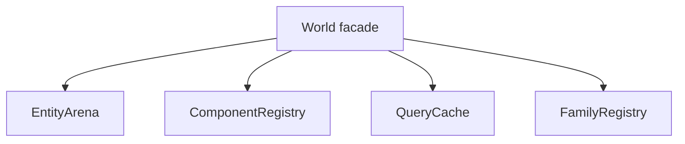

# 2026-07-09: Decouple World

## Goal

Split `World` into smaller internal managers without losing the benchmark gains already in
place.

## Current State

- `EntityArena`, `ComponentRegistry`, and `QueryCache` are now extracted.
- `World` delegates lifecycle, component storage/pooling, and query cache state to those
  helpers.
- `:awake:ecs:allTests` and `:awake:scene:desktopTest` both pass after the split.
- The churn benchmark was rerun on JDK 17; Awake is still a little behind Fleks at both
  10k and 100k, so the scorecard stays untouched for now.

## Why This Matters

`World` currently owns:

- entity creation, destruction, generations, alive flags, and signatures
- component type ids, store allocation, and store lookup
- pooling and recycle routing
- query caching and invalidation
- family registry coordination

That is still understandable, but it is now the main place where every ECS concern lands.
The next step is to keep `World` as the public facade and move the implementation details
behind narrower internal collaborators.

## Proposed Split

### 1. EntityArena

Own:

- `create()`
- `destroy()`
- `isAlive()`
- entity generations, alive bits, signatures, and recycled ids

Keep `World` methods as thin delegates so the public API stays stable.

### 2. ComponentRegistry

Own:

- `typeId()`
- store allocation and lookup
- pool registration and fast pool lookup
- `componentCount()`
- store iteration needed during destroy/clear

This is the natural home for the dense arrays already used for stores and pool lookup.

### 3. QueryCache

Own:

- `queryCache`
- `queryVersion`
- `hasQueryCache`
- `collectQuery()`
- empty-query and typed-query invalidation rules

This keeps query-specific state separate from entity and component bookkeeping.

### 4. FamilyRegistry Stays Separate

`FamilyRegistry` is already a useful boundary. It should remain focused on maintained
families only, rather than absorbing more `World` responsibilities.

## Suggested Order

1. Review whether `collectQuery()` should move out of `World` too.
2. Consider whether any more of the family/query orchestration deserves a home outside the
   facade.
3. Re-run the hot-path tests and the churn benchmark before touching the scorecard again.

## Guardrails

- Do not add extra allocation on add/remove/query hot paths.
- Preserve the type-id fast path for benchmarked churn scenarios.
- Keep pool behavior and recycle semantics identical.
- Do not move scene components back into `awake-ecs`; the module boundary is already
  correct.

## Validation

- `:awake:ecs:allTests`
- `:awake:scene:desktopTest`
- `:awake:ecs:benchmark:mainBenchmark` filtered to the family churn cases

## Done When

- `World` reads as a thin facade instead of the central bucket for every ECS concern.
- The public behavior stays the same.
- The benchmark scorecard is refreshed from a verified run after the split.
