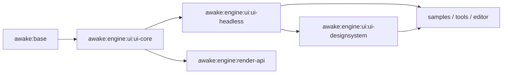

# 2026-07-14: UI Module Split and Shape Plan

## Goal

Split Awake's UI stack into clearer ownership layers so:

- the immediate-mode core stays small and reusable
- generic widgets do not carry branded design-system concerns
- shape/vector work has a natural home
- future clipping and icon work do not further bloat one module

## Recommendation

Do not treat "first-class component styles" and "custom design system" as the same thing.

Recommended ownership:

- core owns the styling mechanism
- generic widget modules own typed component-style wrappers
- a design-system module owns brand tokens, variants, and visual opinion

That means things like `Style`, `StyleState`, `UiInsets`, `UiPath`, and generic
`ButtonStyle`/`PanelStyle` wrappers are engine concerns.

Things like:

- `PrimaryButton`
- `DangerButton`
- `EditorPanel`
- custom icon packs
- brand spacing/typography/radius tokens

should live outside the core engine layer.

## Target Module Graph

## Proposed Modules

### `:awake:engine:ui:ui-core`

Owns the runtime and rendering-neutral UI foundation.

Contents:

- `Dp`, density, spacing/insets primitives
- `Dimension`, structural `UiModifier`
- `UiSlot`
- layout scopes and `UiContext`
- `UiScope`
- `WidgetState`
- `Style`, `StyleScope`, `ResolvedStyle`, `StyleState`
- clip contracts
- `UiDrawPrimitive`
- bitmap font primitives if they remain renderer-neutral
- future path/vector types:
  - `UiPath`
  - `UiPathCommand`
  - `UiShapeSpec`
  - `UiStroke`
  - `UiFillRule`

Rules:

- no branded tokens
- no named product variants
- no sample/editor-specific widgets
- no backend implementation details

### `:awake:engine:ui:ui-headless`

Owns Awake's generic widget library built on `ui-core`.

Contents:

- `button`
- `toggle`
- `checkbox`
- `slider`
- `dropdown`
- `panel`
- `text`
- generic paint helpers
- generic container helpers
- generic `UiTheme` / `UiColorTokens`
- generic `UiComponentStyles`
- typed wrappers for component-facing style ergonomics:
  - `ButtonStyle`
  - `CheckboxStyle`
  - `SliderStyle`
  - `DropdownStyle`
  - `PanelStyle`
  - `TextStyle`

Rules:

- may expose neutral defaults
- may expose typed component-style wrappers over `Style`
- must stay brandless
- must not assume editor/game-specific semantics

### `:awake:engine:ui:ui-designsystem`

Owns branded or product-opinionated composition.

Contents:

- design tokens
- typography scales
- spacing/radius presets
- named variants
- icon packs built from vector paths
- composite components for editor/game HUD/menu/tooling use

Examples:

- `AwakeEditorTheme`
- `AwakeHudTheme`
- `PrimaryButtonStyle`
- `DangerButtonStyle`
- `InspectorSection`
- `ToolbarButton`

Rules:

- depends on `ui-headless`
- can be opinionated
- can evolve faster than engine core

### Transitional Note: keep `:awake:engine:ui` as a facade first

To avoid a large one-shot break, the first split should keep `:awake:engine:ui` as a
compatibility facade that re-exports `ui-core` and `ui-headless`.

Recommended migration shape:

1. create `ui-core`
2. move core/runtime files there
3. create `ui-headless`
4. move built-in widgets/theme there
5. keep `awake:engine:ui` as thin forwarding module
6. later deprecate direct use once downstream code is moved

## Ownership Boundary

### What belongs in core

- generic style mechanism
- generic state-driven visual rules
- generic path/vector model
- generic clip API
- generic layout/runtime APIs
- renderer-neutral primitives

### What belongs in widgets

- generic widgets
- generic widget defaults
- typed widget-style wrappers
- generic neutral theme

### What belongs in a design system

- brand tokens
- app/editor-specific recipes
- icon libraries
- named variants and semantic aliases
- higher-order composite components

## First-Class Component Style Answer

Question:

Should first-class component style be a custom design system, not part of core?

Answer:

- full custom design system: no, not core
- typed component-style API surface: yes, but not in `ui-core`

Recommended placement:

- `Style` lives in `ui-core`
- `ButtonStyle`/`PanelStyle`-style wrappers live in `ui-headless`
- branded `PrimaryButtonStyle`/`EditorPanelStyle` live in `ui-designsystem`

That gives us:

- a stable style engine
- ergonomic generic widget APIs
- no product opinion leaking into engine core

## Shape and Vector Plan

The shape plan should be treated as a first-class architecture lane, not a widget tweak.

### Phase 1: shape/path model in `ui-core`

Add:

- `UiShapeSpec`
- `UiPath`
- path commands
- fill/stroke data
- shape-to-path builders for:
  - rect
  - rounded rect
  - circle
  - pill
  - cut-corner

Keep current radius-based rounded quad support as a fast path while this lands.

### Phase 2: vector asset layer in `ui-core`

Add a renderer-neutral vector asset model, likely something like:

- `UiImageVector`
- `UiVectorGroup`
- `UiVectorPath`

This should be shape/path-driven, not bitmap-driven.

Use cases:

- icons
- masks
- reusable decorative shapes
- shape-authored widget chrome

### Phase 3: drawing support

Extend `UiDrawPrimitive` with path/vector primitives, for example:

- filled path
- stroked path
- vector instance

Backends can initially triangulate or shader-draw these, but the contract belongs in
the core UI layer.

### Phase 4: advanced clipping

Today clipping is rect/scissor based.

Add optional shape/path clipping for:

- rounded panel content clipping
- circular avatars/minimaps
- vector-mask components

Important rule:

- rect clip remains the default fast path
- path clip is opt-in for components that need it

Likely backend implementation choices:

- stencil clip
- mask texture clip
- SDF/path shader clip

### Phase 5: widget adoption

Once path/vector exists:

- evolve `style.shape(radius)` toward `style.shape(shapeSpec)`
- allow `panel`, `button`, and future image widgets to share one shape model
- allow vector icons and shape clips to come from the same source model

## Recommended File Migration

### Move first to `ui-core`

- `Dp.kt`
- `Layout.kt`
- `UiContext.kt`
- `UiDrawPrimitive.kt`
- `UiModifier.kt`
- `UiScope.kt`
- `UiShape.kt`
- `WidgetState.kt`
- `Style.kt`
- `font/BitmapFont.kt` if it stays renderer-neutral

### Move next to `ui-headless`

- `UiTheme.kt`
- `UiButtonVariant.kt`
- `Buttons.kt`
- `SelectionWidgets.kt`
- `InputWidgets.kt`
- `InspectorWidgets.kt`
- `Containers.kt`
- `Paint.kt`
- `TextWidgets.kt`
- `Interaction.kt`

## Render API Follow-Up

Today `:awake:engine:render-api` exposes `Renderer.drawUi(primitives: List<UiDrawPrimitive>)`
and therefore depends on the current UI module.

After the split:

- `render-api` should depend on `ui-core`
- `render-api` should not depend on `ui-headless`
- backend renderers should only need core UI primitives, not widget recipes

This is one of the strongest reasons to put `UiDrawPrimitive` and future path/vector
primitives in `ui-core`.

## Migration Order

1. Update docs and lock the ownership rules.
2. Create `:awake:engine:ui:ui-core`.
3. Move runtime/style/layout primitives into `ui-core`.
4. Point `render-api` at `ui-core`.
5. Create `:awake:engine:ui:ui-headless`.
6. Move built-in widgets and generic theme there.
7. Keep `:awake:engine:ui` as a compatibility facade.
8. Add shape/path primitives in `ui-core`.
9. Add vector draw primitives and backend support.
10. Add optional shape clipping.
11. Create `:awake:engine:ui:ui-designsystem` only when branded/editor-facing recipes are ready.

## Non-Goals

- Do not move editor- or sample-specific components into `ui-core`.
- Do not force a branded design system into the engine module tree too early.
- Do not replace rect clipping everywhere before shape clipping is proven in backends.
- Do not introduce a second styling mechanism alongside `Style`.

## Definition of Done

This split is successful when:

- `render-api` depends only on `ui-core`
- built-in widgets live outside `ui-core`
- branded styles live outside engine core
- shape/vector APIs have a clear home
- clipping can grow beyond rectangles without bloating widget code
