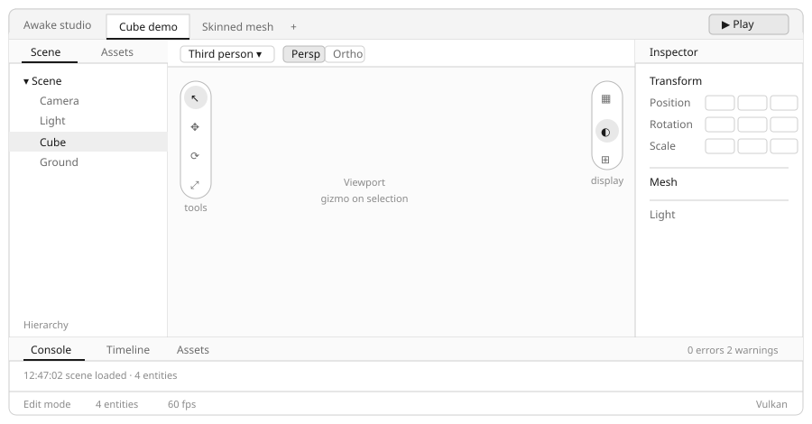

# Studio layout -- proposed design

Companion to `2026-08-11-studio-layout-audit.md`, which found three inert controls and a left
dock occupied by a demo picker. This proposes the target layout and maps every region to
components that already exist in `ui-designsystem`.

## Target

    +------------------------------------------------------------------------------+
    | Awake studio | [Cube demo] Skinned mesh  +                          [> Play]  |
    +--------------------+-------------------------------------+-------------------+
    | [Scene] [Assets]   | Third person v | Persp Ortho | Wire Shadows |            |
    |                    +-------------------------------------+ INSPECTOR         |
    |  v Scene           |(S)|                                 | Transform         |
    |    Camera          |(M)|                                 |   Position _ _ _  |
    |   [Cube]           |(R)|          VIEWPORT               |   Rotation _ _ _  |
    |    Ground          |(S)|     (gizmo on selection)        |   Scale    _ _ _  |
    |                    +---+                                 | Mesh              |
    | Hierarchy          |                                     | Light             |
    +--------------------+-------------------------------------+-------------------+
    | [Console] Timeline  Assets                      0 errors   2 warnings         |
    | 12:47:02 scene loaded (4 entities)                                            |
    +------------------------------------------------------------------------------+
    | Edit mode | 4 entities | 60 fps                                    [Vulkan]   |
    +------------------------------------------------------------------------------+

Four docks around a viewport, which is the arrangement Unity, Godot, Unreal and Blender all
converge on. Differences from today:

- the left dock holds the scene, not the demo list -- the demo list becomes the tab strip
- scenes are TABS, with Play anchoring the right edge (Godot's shape)
- the viewport gains a HEADER for camera mode, projection, wireframe and shadows
- the tool pill keeps its place at the viewport edge but gains real transform tools
- the bottom dock is TABBED: console, timeline, assets

The SVG above is the reference; the sketch below it is a text fallback. If they ever disagree,
the SVG wins -- an earlier revision of this document kept an ASCII sketch that still showed a
centred Play button and wireframe toggles in the top bar, three decisions after both had moved.

## Region by region

### Top bar -- `drawStudioTopBar`

| Element | Component | Notes |
|---|---|---|
| Title | `shadcnText` | unchanged |
| Scene tabs | `shadcnTabs` + `+` button | open scenes, Godot's shape; `+` picks from `StudioExamples` |
| Play | `shadcnToggle` | anchors the RIGHT edge; a MODE, not a transport -- see below |

Layout is two populated zones -- tabs left, play right -- with nothing centred. Centring only
reads as deliberate when both sides are flanked, and an earlier draft centred Play in a bar whose
right side was empty, which read as floating. The scene control also sat directly against the
title, so it looked like branding rather than a control.

Scene tabs imply a concept studio does not have yet: OPEN scenes, plural. The model that fits
what already exists is `StudioExamples` as the AVAILABLE set, tabs as the OPEN set, and `+`
opening a picker over the available ones. That also settles where the demo list goes -- it stops
being a left-dock panel and becomes the tab strip's source, which is what frees the left dock for
the hierarchy.

Until multi-scene exists, a single tab looks like a mistake. Ship the strip only when a second
scene can be opened; before that, a labelled dropdown showing the CURRENT scene name (not the
word "Scene") in the same left position is the honest interim.

Nothing viewport-scoped goes here. Transform tools, camera mode, projection, wireframe and
shadows all move to the viewport -- see below. Wireframe and shadows sat in the top bar in an
earlier draft, which was the same scoping mistake as the tools: they govern how ONE VIEWPORT
displays, not the document.

#### Edit mode vs play mode

Today's Play button re-dispatches `SelectExample`, i.e. it reloads. That is not a transport, and
three always-enabled transport buttons imply a timeline that does not exist.

Edit and play are MODES: in edit mode gameplay systems do not tick, in play mode they do. The
status bar already renders `Edit mode` as a literal, so the concept was intended and never built.
Pause and step are meaningful only INSIDE play mode, so they appear when it is entered rather
than sitting disabled. Unity additionally tints the editor while in play mode; worth copying,
since the failure mode is editing a scene that is about to be discarded on exit.

### Left dock -- new `HierarchyPanel`

`shadcnTabs` with two tabs:

- **Scene** -- the entity tree, driven by `world.queryEach<Name>`
- **Assets** -- placeholder now; the eventual content browser

Rows are `shadcnContextMenu` triggers. Clicking dispatches the `SelectEntity` intent that
already exists and is currently discarded.

Context menus, by target:

| Target | Actions |
|---|---|
| Hierarchy row | Rename, Duplicate, Focus, Delete |
| Viewport, over an entity | Focus, Duplicate, Delete |
| Viewport, empty space | Add entity, Frame all |
| Inspector component header | Reset, Remove component |
| Console | Copy, Clear |

Right-click currently opens the CAMERA menu (`viewportCameraMenu`), which squats on the gesture:
right-click on a viewport conventionally acts on whatever is under the cursor, it does not open
settings. Moving camera mode into the viewport header is therefore not only a discoverability
fix -- it is what frees right-click to do its actual job.

Nesting: there is no tree component in `ui-designsystem`. Two options, in preference order:

1. Flat list first. Scenes here are small, `Transform` has no parent link today, so a tree would
   be decorative. Ship flat, add nesting when parenting exists.
2. `shadcnCollapsible` per node if nesting is wanted sooner -- it composes, but indentation and
   keyboard traversal would be hand-rolled.

### Viewport

Gains a header strip, and keeps its left pill. The split follows Blender (the `T` toolbar holds
only tools; the header along the top holds shading, overlays and view) and Unity (tools top-left,
display toolbar beside them).

Controls are split by INTERACTION MODEL, not by topic -- two pills framing the viewport plus a
header:

| Control | Home | Component | Interaction |
|---|---|---|---|
| Select / Move / Rotate / Scale | left pill | `shadcnToggleGroup` | modal, mutually exclusive |
| Wireframe, Shadows, (Grid, Overlays) | right pill | `shadcnToggle` each | independent booleans |
| Camera mode | header | `shadcnSelect` | picker, 4 options, needs labels |
| Perspective / Ortho | header | `shadcnToggleGroup` | 2-way modal |

Wireframe and shadows sat in the header in an earlier draft. Two reasons they moved:
`shadcnToggleGroup`'s single-select semantics fit modal tools and nothing else, so mixing
independent booleans into either the tool pill or a shared strip muddles both; and the header was
already carrying four controls with grid, gizmo visibility and overlays all queued behind them.
The display pill gives that family somewhere to grow.

Blender splits the same way -- the `T` toolbar holds tools, shading and overlay toggles float at
the viewport's top right -- and two pills frame the viewport symmetrically.

This also fixes a discoverability problem in the current build: camera mode lives in a
right-click menu (`viewportCameraMenu`), so it is invisible until you know it exists. A header
puts it on screen.

Two further additions once selection works:

- click-to-select, hit-testing against entity bounds
- a transform gizmo reflecting the active tool

The floating vertical pill **stays**, with its contents replaced by real transform tools --
Select / Move / Rotate / Scale, backed by `shadcnToggleGroup` for single-select and a pressed
state, which is the semantics the current rail hand-rolls and never uses.

An earlier draft of this document moved them to the top bar. That was wrong, and contradicted
this design's own audit, which had already found the placement conventional and only the wiring
broken. Reasons the pill is the right home:

- It is the convention. Blender's toolbar is a vertical strip at viewport left; Unity puts
  transform tools at the viewport's top-left.
- Scope. Transform mode governs how you interact with A VIEWPORT, not the document. A top-bar
  control implies global state.
- It survives a second viewport. A split view or a second camera pane makes a global tool
  selector immediately wrong; a per-viewport pill stays correct.
- Proximity. You are already looking at the viewport when you switch tools.

The pill's problem was never where it sits -- it was five buttons wired to nothing. Deleting the
container would have been fixing the wrong thing.

#### Adding the header is not free -- read this first

An attempt to add the header wrapped the viewport panel in an extra `column` so the strip could
sit above the existing row. That broke `clickingTopInTheIconRailCameraMenuMovesTheRenderedCamera`:
the rail's camera button is found and clicked, but the dropdown never opens.

The likely cause is the measuring-pass bug class that already produced two shipped defects (see
`bff8417d` for the resize handle and the `animatedHeight` fix). `column()` runs an unconditional
trial pass over its content when given no `cacheKey`, against a scratch context that shares the
real `WidgetState` but has blank input. `rememberPopupState(...).toggle()` mutates that shared
state, so a trial pass can clobber the toggle before the real pass reads it.

So the header cannot simply be nested inside another `column`. Options, untested:

1. Give the wrapping `column` a `cacheKey`, which skips the trial pass entirely.
2. Gate `rememberPopupState`'s mutation on `isMeasuring()`, the same fix applied to
   `ResizablePanelGroup.handle()` and `animatedHeight` -- this is the general fix, and it likely
   affects every popup nested in an uncached column, not just this one.

Option 2 SHIPPED (`d3f270c7`): `UiStateValue`'s setter now drops writes during a measuring pass,
which covers every `remember*State` hook at once. Verified against the real reproduction -- the
bare `column` wrapper that previously broke `StudioModuleCameraTest` now passes with it.

That was necessary but NOT sufficient. Adding the header's actual CONTENT (two
`shadcnToggleGroup`s) breaks the same test again, while the bare wrapper alone passes. So there
is a second, independent cause in the header content, not in the nesting.

Not yet diagnosed. What is known:

- bare `column` wrapper + guard: camera menu opens, test passes
- same wrapper + two toggle groups in a header row: menu never opens

BISECTED (2026-08-11). Results:

| Header content | `StudioModuleCameraTest` |
|---|---|
| wrapper only, no header row | passes |
| wrapper + EMPTY header row | passes |
| wrapper + header row with ONE `shadcnToggleGroup` | FAILS |

So it is neither the nesting nor two toggle groups interacting: a single `shadcnToggleGroup`
anywhere in the viewport panel stops the icon rail's camera dropdown from opening. The rail
button is still found and still clicked -- only the popup fails to appear.

That is a `shadcnToggleGroup` defect, not a layout one, and it is worth chasing on its own: any
screen combining a toggle group with a popup is affected, which the design puts in several places
(the tool pill is a toggle group, the display pill sits beside it, the hierarchy has context
menus).

Suspects, in order: the toggle group claiming `activeId` or focus on pointer-down without a hover
check, so the popup's own claim is refused; or it emitting/consuming input in a way that
suppresses the rail button's release. Instrument `activeId` across the frames the test drives
before changing anything.

### Right dock -- `InspectorPanel`

Becomes selection-driven and editable:

- reads `inspector.selectedEntityId` instead of listing every entity
- one `shadcnCollapsibleCard` per component (Transform, MeshRenderer, Light)
- fields become `shadcnFieldTextField` / `shadcnFieldSlider` / `shadcnFieldSwitch` rather than
  `shadcnText` pairs
- `shadcnEmpty` when nothing is selected

The `Field*` wrappers already pair a label with a control, which is the exact shape an inspector
row needs.

### Bottom dock -- tabbed

Vertical `shadcnResizablePanelGroup` wrapping the horizontal one, so the dock is draggable.
`shadcnTabs` across `Console | Timeline | Assets`.

Timeline is a PANEL, not a mode -- worth stating because it is easy to conflate with play mode.
Blender docks its timeline at the bottom and Unity docks the Animation window there; studio
already ships `SkinnedAnimationPlayer` and glTF animation, so there is something to scrub.
`shadcnScrollArea` for the console log, `shadcnBadge` counters for errors and warnings.

Lowest priority of the four docks: it is additive, where the others fix things that currently
mislead.

### Status bar

Replace the hard-coded `Vulkan` badge with the real backend, and add entity count and frame
rate. The badge is currently a literal because the `ui` package cannot reach the running window
-- that needs the same plumbing as the cursor gap (`SceneGameRuntime` exposing what it already
computes).

## Missing from the design system

| Need | Status |
|---|---|
| Tree / outliner | absent -- flat list first, see above |
| Numeric drag field (scrub to change) | absent -- `shadcnFieldSlider` is the nearest, needs bounds |
| Splitter for nested groups | `shadcnResizablePanelGroup` nests already |
| Gizmo | not a UI component; viewport-space rendering |
| Menu bar | `shadcnDropdownMenu` composes into one |

Only the tree and the numeric drag field are genuinely new UI work, and both have workable
substitutes for a first pass.

## Sequencing

Each phase is independently shippable and leaves studio working.

**Phase 1 -- camera.** Adopt `CameraMode` + `CameraInputSystem`, delete `CameraPresetMath`. Four
modes, per-mode drag and scroll. No layout change. Highest result-to-risk ratio, and independent
of everything below.

**Phase 2 -- hierarchy.** Move the demo picker to the top bar, add `HierarchyPanel` in the left
dock as a flat list, wire click -> `SelectEntity`.

**Phase 3 -- selection.** Inspector reads `selectedEntityId`, shows one entity, `shadcnEmpty`
otherwise. Phases 2 and 3 together are what make the existing inert plumbing mean something.

**Phase 4 -- tools.** Replace the icon rail's CONTENTS with a `shadcnToggleGroup` of real
transform tools, keeping it where it is. Until a gizmo exists the tools only set state -- so either land a gizmo in the same phase, or ship Select alone
and add the rest with the gizmo. Do not ship four more buttons that look pressed.

**Phase 5 -- editable inspector.** `Field*` controls writing back to components.

**Phase 6 -- console dock.** Vertical resizable group, log panel.

Phases 1-3 address everything the audit found actually broken. 4-6 are the editor-shaped
features on top.

## Decided

**Studio is a scene editor, and the viewer is its play mode.** They are not two products. This is
Unity's and Godot's model: an authoring tool whose play mode runs what you authored. So the
gizmo and the editable inspector are in scope, and edit/play is the mode split described above.

**Edits are saved, and most of the machinery exists.** `SceneDocument` is `@Serializable` and
`SceneLoader` already provides `encode` (document -> JSON), `decode` (JSON -> document) and
`instantiate` (document -> `World`). The one missing direction is `World -> SceneDocument`.

That single function is the whole gap between "studio cannot save" and "studio can save".
`SceneNode` already carries `name`, `transform`, `components` and `children`, which is exactly
what a walk of the `World` has to produce. Note it encodes hierarchy through `children` nesting,
so writing it forces the parenting model that the hierarchy panel also needs -- do them together.

Persistence rules, matching Unity:

| Mode | Edits |
|---|---|
| Edit | persist; `Save` writes the document |
| Play | live, DISCARDED on stop |

The discard is deliberate rather than a limitation: it is what makes play mode safe to
experiment in. Without it a play session silently mutates the scene on disk.

## Revised sequencing

1. **Camera** -- adopt `CameraMode`/`CameraInputSystem`. Independent of everything else.
2. **Hierarchy + selection** -- unblocked by moving the demo list into the tab strip.
3. **`World -> SceneDocument`** -- the missing function. Moved EARLIER than the original plan:
   editing without saving is worse than not editing, because the tool would lose work. Small,
   since the serialization already exists, and it forces the parenting model.
4. **Gizmo + transform tools** -- justified now that authoring is in scope.
5. **Editable inspector** -- `Field*` controls writing into the live world.
6. **Edit/play mode split** -- needs a runtime system partition; `SceneGameRuntime` currently
   ticks everything through `fixedTimestepLoop`.
7. **Multi-scene tabs, console, timeline** -- the tab strip needs more than one scene open before
   it stops looking like a mistake.
