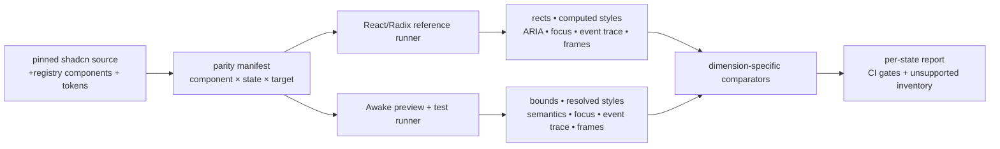

# Shadcn 100% parity tool plan

## Goal

Build a versioned, reproducible UI-parity toolchain that can prove whether Awake matches a
**pinned** shadcn/ui + Radix reference in all supported component states:

- catalog and public recipe coverage;
- semantic tokens, typography, geometry, paint, and motion; and
- interaction, keyboard, focus, layering, and accessibility semantics.

"100%" does not mean a single screenshot mismatch reaches zero across unrelated rasterizers.
It means every supported component/state has an explicit compatibility contract and passes the
oracle appropriate to that contract under a declared reference environment. A component outside
the pinned catalog is reported as unsupported, never silently counted as parity.

This plan extends the current toolchain; it does not replace its distinct proof lanes with one
opaque score.

## Target contract

Each parity run is identified by a `referenceId` containing:

| Field | Required value |
|---|---|
| shadcn source | `tools/fetch_shadcn_reference.sh` pinned SHA |
| registry/style | exact registry family and component source path |
| behavior source | exact Radix dependency/version used by the local reference app |
| browser | Playwright Chromium revision and launch flags |
| render environment | viewport, DPR, color scheme, reduced-motion policy, and font assets |
| Awake target | backend/platform/density/font implementation under test |

The first supported target is the existing desktop, DPR 1 reference environment. Android,
wasm/WebGPU, alternate density, and GPU-rendered screenshots become additional target rows;
they must not redefine or weaken the desktop reference.

## Current evidence and gaps

| Area | Exists now | Gap preventing full parity |
|---|---|---|
| Official source | pinned shadcn checkout and token extractor | local reference app is separately versioned and must be tied to the same `referenceId` |
| Browser reference | 26 static cases in `tools/shadcn_reference_cases.json`; PNG, DOM rectangle, and selected computed-style capture | no normalized ARIA/focus/event trace; state capture is not exhaustive |
| Awake preview | `AwakeUiPreview`, semantics JSON, snapshots, crop tooling | no one manifest maps every supported state to both runtimes |
| Geometry | `ShadcnGeometryParityTest` compares bounds against DOM rectangles | coverage is selective and allowances are manually scattered through test code |
| Style/paint | computed-style JSON, `ShadcnStyleParityTest`, cropped image diffs, regression baseline | image diff is intentionally demoted and cannot prove text/layout; focus rings, shadows, and state paint need first-class capture |
| Behavior | focused tests for click, Space, selection, and outside dismissal | no Radix/WAI-ARIA interaction matrix, trace oracle, Tab traversal, focus-scope, roving-focus, or motion proof |
| Status | `generate_ui_status.py` and parity reports | moved source roots make the status generator report stale/false findings; it is not yet a trustworthy CI artifact |
| Catalog | many recipe functions in `ui-designsystem` | current public shadcn catalog is broader than the pinned fixture; supported versus unsupported is not machine-readable |

The immediate remediation is to repair path assumptions in `tools/generate_ui_status.py` before
using its counts to prioritize work. This is already called out in
`2026-08-16-ui-tooling-simplification.md`; it is a prerequisite, not a separate competing plan.

## Architecture



### One manifest, several comparators

Create `tools/shadcn_parity_manifest.json` as the single public inventory. It replaces the
overlapping pairing responsibility of `shadcn_reference_cases.json`,
`ui_component_parity_cases.json`, and `shadcn_parity_pairs.json` only after migration is
complete; the old files become generated compatibility views during transition.

One manifest row represents **one testable state**, not merely one component screenshot:

```json
{
  "id": "tabs.default.horizontal.manual.focused-second",
  "component": "tabs",
  "referenceId": "shadcn-6261bd8-new-york-v4-radix-1.4.2",
  "themes": ["light", "dark"],
  "viewport": { "width": 640, "height": 360, "dpr": 1 },
  "state": { "orientation": "horizontal", "activation": "manual", "selected": "account" },
  "trace": ["focus:account", "key:ArrowRight", "key:Enter"],
  "oracles": ["catalog", "tokens", "geometry", "style", "behavior", "semantics", "motion"],
  "awake": { "preview": "awake-tabs-manual", "semanticIds": ["tabs", "account", "password"] },
  "status": "required"
}
```

`required`, `unsupported`, `blocked`, and `experimental` are explicit statuses. CI fails for a
missing required pair; it reports unsupported rows separately and does not let them inflate a
parity percentage.

### Reference runner

Extend `tools/shadcn-reference-app` and `capture_shadcn_local.py` to generate per-manifest-state
artifacts in addition to PNGs:

- DOM rectangle and computed-style snapshots for every declared `data-parity-id`;
- normalized semantic tree: role, accessible name/description, selected/checked/disabled/expanded,
  value/min/max/text, relationship ids, and visibility;
- focus timeline: active element before and after each action;
- interaction trace: normalized action, emitted state, open-layer stack, dismissal reason, and
  selected value; and
- motion samples at `t=0`, `t=50%`, and `t=100%`, with reduced motion captured as its own state.

Use deterministic named actions (`click`, `rightClick`, `hover`, `drag`, `key`, `type`,
`wait`) and wait for a stable frame rather than arbitrary sleeps. The reference app must remain
composed from the pinned shadcn source and Radix primitives; no hand-drawn lookalikes.

### Awake runner

Add an internal parity-observation API in `ui-core`/`ui-headless`, not in `ui-designsystem`:

- stable semantic id, role, accessible name/description, values, relationships, and visibility;
- focus owner and focus-scope stack;
- active popup/modal/dismissable-layer stack;
- state transition events; and
- resolved visual facts needed for comparison (fill, border, radius, shadow, ring, typography).

The public `shadcn*` recipes remain consumers. Generic focus, layer, selection, menu, dialog,
and slider behavior belongs in `ui-headless`; design-system code only supplies shadcn variants,
metrics, and visual recipes. This preserves the ownership rules in
`docs/reference/ui-ownership.md`.

### Comparators and exact pass meaning

| Comparator | Inputs | Pass criterion | Not a substitute for |
|---|---|---|---|
| Catalog | pinned registry + manifest + Awake recipes | every required reference feature is mapped or explicitly unsupported | behavior or visuals |
| Tokens | extracted reference tokens + `ShadcnThemeValues` | exact semantic token equality within documented color conversion tolerance | recipe composition |
| Geometry | DOM rects + Awake semantic bounds | exact bounds/content bounds, with named rationale for renderer-independent tolerance | paint |
| Style | computed styles + Awake resolved styles | declared color, alpha, border, radius, shadow, ring, font and line metrics match | layout or interaction |
| Paint | matched crops + masks | reviewed platform threshold, full-crop coverage, diff/heatmap retained | geometry or semantic behavior |
| Behavior | normalized interaction traces | identical observable state and callback/dismissal result per action | visual state |
| Semantics | normalized trees and focus timelines | roles/names/relationships/values/focus transitions match target pattern | screen-reader integration on a host platform |
| Motion | multi-frame trace | duration, easing, initial/final state, and reduced-motion behavior match | static paint |

No aggregate number is a release gate. The report can show completeness as
`passed required states / total required states` per dimension, never as a single pixel-score.

## Delivery phases

### Phase 0 — Make the existing evidence trustworthy

**Scope**

- Repair moved paths and stale module roots in `tools/generate_ui_status.py`.
- Make generation fail if a scanned source root does not exist; do not publish a plausible report
  from zero matches.
- Add the generator and `scripts/awake ui` contract tests to a normal CI verification path.
- Reconcile current reference files and explicitly mark legacy scraped pairs for migration/removal.

**Acceptance**

- The generated status report identifies the current source roots and commit.
- A deliberate missing path fails generation.
- `scripts/awake ui` tests run from the normal UI verification task.
- No report calls a reference authoritative without a reproducible origin.

### Phase 1 — Freeze the reference and catalog

**Scope**

- Define `referenceId` and commit it beside the manifest.
- Pin the local reference app dependencies (avoid loose `^` ranges in the lockfile-backed source
  contract) and record browser/font/DPR configuration.
- Generate a catalog inventory from the pinned registry and map it to Awake recipe capability.
- Choose the initial supported catalog: existing local-reference components plus a declared
  backlog for missing official components.

**Acceptance**

- A CI command verifies the pin, registry source paths, reference app lockfile, fonts, and manifest.
- Every pinned component is `required`, `unsupported`, `blocked`, or `experimental`.
- A reference bump produces a reviewable catalog/token/component diff.

### Phase 2 — Unify static-state artifacts

**Scope**

- Introduce `shadcn_parity_manifest.json` and migration generator/views for old manifests.
- Generate reference PNG, rectangle, computed-style, and semantic artifacts by manifest state.
- Generate Awake preview PNG, semantic bounds, and resolved-style artifacts from the same row.
- Migrate existing 26 reference cases and existing crop pairings first; do not invent new
  thresholds during migration.

**Acceptance**

- One command validates that every required static manifest row has both artifacts.
- A row cannot reference nonexistent preview ids or semantic node ids.
- Old manifests are derived or deleted; there is no duplicated mapping authority.

### Phase 3 — Build missing headless behavior foundations

**Scope**

- Focus order registry and deterministic Tab/Shift+Tab traversal.
- Focus scopes with initial focus, trap, restoration, and nested-scope ownership.
- Dismissable-layer stack with Escape, pointer outside, modal inertness, portal ordering, and
  scroll-lock policy.
- Roving focus/typeahead primitives for menus, select, combobox, radio groups, and tabs.
- Keyboard actions for buttons, toggles, sliders/range sliders, menus, tabs, dialog, and toast.
- Complete semantics model for roles, names, descriptions, values, expanded/selected/checked,
  labels, and control-to-content relationships.

**Acceptance**

- Headless unit matrices own generic behavior; recipes only prove wiring.
- Dialog tests cover initial focus, Tab loop, Shift+Tab loop, Escape, outside policy, nested
  layers, and focus restoration.
- Tabs, menus, selects/comboboxes, and sliders pass their documented keyboard matrices.
- No behavior needed by an unbranded consumer remains implemented only in `ui-designsystem`.

### Phase 4 — Add behavioral and semantic parity traces

**Scope**

- Implement the reference and Awake normalized trace formats.
- Add `awake ui trace --component <name> --state <state> --theme <theme>`.
- Add `awake ui validate --dimension behavior|semantics` and a CI test that fails on trace drift.
- Start with dialog, tabs, dropdown menu, select, combobox, radio group, slider, tooltip, and toast.

**Acceptance**

- Every required composite component has at least pointer, keyboard, focus, dismissal, disabled,
  and controlled-state traces as applicable.
- Trace differences name the action, expected result, actual result, and relevant semantic id.
- A deliberately removed focus restoration or Arrow-key transition fails the correct gate.

### Phase 5 — Close visual and motion foundations

**Scope**

- Implement/verify shadcn focus rings, shadows, state opacity, clipping, popup placement, and
  responsive constraints.
- Align font selection, font metrics, line height, glyph positioning, and icon source policy.
- Add state capture for hover, active, focus-visible, disabled, selected/open, error, and dark mode.
- Add motion samples and reduced-motion artifacts.
- Verify CPU and real backend output separately; GPU evidence cannot be inferred from CPU goldens.

**Acceptance**

- Geometry, style, paint, and motion coverage is declared for every required visual state.
- Image comparisons reject poor crop coverage and unreviewed thresholds.
- Focus ring and shadow comparisons use dedicated semantic/style facts, not just a broad pixel diff.
- Each supported platform has its own tolerance/mask policy and report.

### Phase 6 — Complete the catalog in risk-ordered waves

1. Static/simple: typography, separator, skeleton, avatar, badge, card, alert, empty.
2. Basic controls: button, input, textarea, checkbox, switch, radio, toggle, field/input group.
3. Composite controls: tabs, slider/range slider, select, combobox, input OTP, scroll area,
   resizable panels.
4. Layered controls: tooltip, popover, dropdown/context menu, dialog/alert dialog, sheet, drawer,
   toast, sidebar.
5. Missing pinned/public catalog: accordion, aspect ratio, calendar/date picker, command,
   hover card, menubar/navigation menu, pagination, carousel, data table/chart, and any later
   pinned registry additions.

For every component wave: add the manifest state matrix first, then headless behavior, recipe,
reference fixture, Awake fixture, all relevant comparators, and final CI evidence. Never mark a
recipe complete from a screenshot alone.

### Phase 7 — Enforce and maintain

**CI gates**

```text
verifyShadcnReferencePin
verifyShadcnParityManifest
captureShadcnReferenceArtifacts
generateAwakeParityArtifacts
verifyShadcnCatalogParity
verifyShadcnGeometryParity
verifyShadcnStyleParity
verifyShadcnBehaviorParity
verifyShadcnSemanticsParity
verifyShadcnMotionParity
verifyShadcnPaintParity
verifyUiParityReportFreshness
```

The initial implementation may group these under the existing Gradle modules and `scripts/awake
ui`; names become Gradle tasks only after the operating flow is stable. A nightly job captures the
full reference/visual matrix; pull requests run the affected manifest rows plus validation that
the manifest is complete and fresh.

**Reference bump protocol**

1. Change only the reference pin and regenerate artifacts.
2. Review catalog/token/style/trace diffs separately.
3. Add or change required manifest states before implementation changes.
4. Implement Awake changes with per-dimension evidence.
5. Re-record Awake-only goldens last and only after reviewing official-reference diffs.

## Repository ownership

| Area | Owner |
|---|---|
| reference pin, local React/Radix runner, Playwright captures | `tools/`, `tools/shadcn-reference-app/` |
| manifest schema, report generation, CLI dispatch | `tools/`, `scripts/awake_ui.py` |
| semantics, focus, layers, reusable interaction state machines | `awake/ui/headless`, with essential runtime support in `awake/ui/ui-core` |
| tokens, shadcn variants, recipe composition | `awake/ui/designsystem` |
| Awake parity fixtures and cross-runtime comparator tests | `samples/ui-showcase` |
| lifecycle/ownership enforcement | `build-logic` and `docs/reference/ui-validation.md` |

## Non-goals

- Copying React, DOM, CSS, or Radix implementation structure into Kotlin.
- Treating an Awake-to-Awake snapshot as proof against shadcn.
- Hiding unsupported components behind a percentage or placeholder.
- Making MMO/game-specific UI policy part of Awake; this remains a reusable framework/UI
  capability plan under the framework-game boundary.

## Definition of done

The parity tool is complete when, for the selected pinned catalog and each declared supported
Awake target:

- every required manifest row has reproducible reference and Awake artifacts;
- catalog, token, geometry, style, behavior, semantic, motion, and paint results are reported
  independently and pass;
- inaccessible or behaviorally incomplete components cannot be marked visually complete;
- unsupported/blocked rows are explicit, reviewable, and excluded from the claim;
- reports are generated in CI from current source paths and fail when stale; and
- a documented reference bump changes the report rather than silently changing the target.

At that point the project can accurately claim **100% parity for its pinned supported catalog**.
