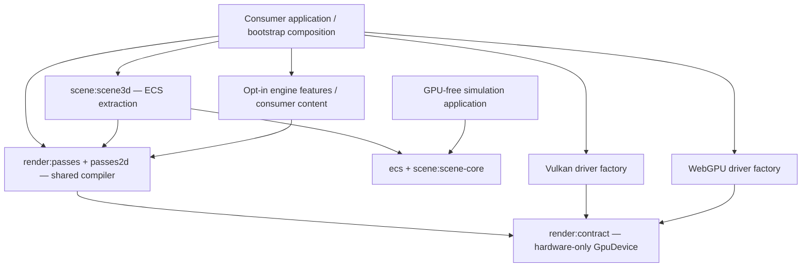

# Render architecture finalization

Status: **Active — implementation roadmap with A0/A1 complete and A2–A6 in progress.**

Last status audit: **2026-09-11**, commit `2c2efb6bf`; continuation notes are in the
[render architecture handoff](2026-09-10-render-architecture-handoff.md). The contract, passes,
scene-rendering, Vulkan/WebGPU backend, showcase, and focused shadow suites are green on desktop.
The generic resolver is now installed by both backend bootstraps; cross-backend feature parity and
legacy resource removal remain open.

Execution allocation: this migration is being completed in the current Luna medium session. Astra 6
and Gemini 3.8 Flash are optional reviewers for later independent follow-up, not prerequisites or
owners of blocked work. Phases after A0 remain open; the checklist below distinguishes landed
foundations from required integration and exit-gate work.

**How to use this document:** start with [Progress checklist](#progress-checklist), then read
[Open gates at the latest audit](#open-gates-at-the-latest-audit). The later architecture tables
explain ownership and rationale; they do not change phase status. A checked item means code or
documentation is landed and validated, while an exit gate remains unchecked until its listed
cross-backend evidence exists.

### Why A1–A7 is still open

A1–A7 is a migration sequence, not seven independent documentation labels. The first work was
deliberately stabilisation and evidence gathering: A0 closed the historical duplicate-submission
route, then A1 introduced the generic packet/lease boundary, then A2/A3 started moving authored
scene data through that boundary. Those foundations are useful only when the complete feature and
platform paths are proven; they do not by themselves satisfy the phase exit gates.

The remaining boxes are therefore intentional. The current implementation still has a deprecated
scene bridge, legacy backend helpers, incomplete environment/point-light/shadow execution on the
generic packet path, and missing production device-loss/resize and app-session integration. A7
cannot be checked until those gaps are removed or explicitly accepted with evidence. The checklist
records each landed slice with its commit; unchecked exit gates mean the required cross-backend or
consumer proof is still missing, not that the earlier work was discarded.

### What was done first, in order

1. **A0 stability:** preserved the complete scene route and enforced one presentation per update.
2. **A1 boundary:** introduced typed generic packets, leases, resolver ownership, and layering
   checks; deprecated the scene-shaped migration APIs instead of treating them as final design.
3. **A2 first slice:** moved resolved draw ordering and directional-light bytes through both
   backends, including the no-camera path.
4. **A3/A5/A6 foundations:** preserved feature payloads, added shadow planning, completion-backed
   uploads, bounded preparation, DI ownership, and lifecycle teardown.
5. **A4 cleanup:** moved generic Vulkan/WebGPU packet recording and the WebGPU UI overlay recorder
   behind executor membership, removed the scene-shaped `Renderer` bridge and descriptor, and moved
   scene-authored packet data into `render:passes`; environment and shadow policy now travels in
   generic packet state.

This ordering prevents a backend cleanup from hiding dropped scene features or reintroducing the
duplicate-submission bug. It also explains why the final architecture is not declared complete yet:
the proof obligations intentionally come after the first working path.

**A0 completed 2026-09-10:** commits `2c43224d9`, `3aa644879`, `dc6236ae6` and `68de82de2`
keep one render submission per `RenderSystem3D.update` and cover the current Vulkan scene/depth
regressions.
`RenderSystemTest.submitsExactlyOneRenderPathPerUpdateFor300Frames` passes on desktop. This closes
the historical flicker/duplicate-submission recovery at the selected scene route. It does not
claim full P3 parity: the generic `GpuPassInput` executor remains incomplete, and WebGPU/skinned
feature controls belong to the later A2/A3 slices.

Audited on 2026-09-11 at `2c2efb6bf`; unrelated application/UI edits remain unstaged in the
working tree. The requested outcome is stable rendering and an enforceable hardware boundary:
authored game content never requires a backend edit. The reported duplicate-submission flicker is
closed by A0; the remaining rows describe architecture and feature work after that recovery.

This is the follow-up to the [HAL migration tracker][previous-plan] and the rendering decision
**D31 in `docs/reference/decision-log.md`**. Its checked migration steps are historical progress,
not evidence that the architecture or rendering behavior is complete. The proposed refinements
below must be reflected in the [RHI reference][rhi] when implemented.

## Progress checklist

Use this section as the status source of truth. A phase is **in progress** until every item under
its exit gate is checked; commit references are evidence for a completed slice only.

### Current status snapshot — 2026-09-10

| Phase | Status | Verified result | Blocking evidence for completion |
|---|---|---|---|
| A0 | **Complete** | One submission per update and historical flicker regression covered. | None in the A0 scope. |
| A1 | **Complete** | Generic packet, lease, resolver, layering foundations, generic-only `Renderer`, render-pipeline scene data ownership, and packet-owned environment/shadow/viewport policy are landed. | None in the A1 boundary scope; A2 feature parity remains open. |
| A2 | **In progress** | `RenderSystem3D` emits `GpuPassInput` packets with shared ordering, directional/point-light bytes, planned shadow subpasses, preserved environment state, and one common batch-resolution path. | Generic execution does not yet reproduce environment, point-light, and shadow behavior on both backends. |
| A3 | **Foundation started** | Feature payload preservation, point-shadow planning, Vulkan forwarding, and WebGPU generic shadow-prepass forwarding are landed. | Cross-backend feature controls and pixel/trace parity remain incomplete. |
| A4 | **Advanced** | Executor ownership covers generic Vulkan/WebGPU recording; scene bridge methods, descriptor, backend scene aliases, and dead WebGPU scene lowering are removed. | Remaining work is backend policy deduplication and final consumer validation. |
| A5 | **Foundation started** | Completion-backed leases, bounded preparation, and atomic upload-lease transitions are tested. | Production device-loss/resize invalidation and upload-path evidence are missing. |
| A6 | **Foundation started** | DI ownership and lifecycle teardown are tested. | Explicit render-session/settings/effect integration is missing. |
| A7 | **Not started** | No final release audit has been accepted. | All earlier gates, API removal, changelog, and consumer checks must pass first. |

The snapshot summarizes phase state; the nested checklist below remains the item-level evidence
ledger.

- [x] **A0 — stability recovery (complete)**
  - [x] Preserve one generic packet submission per update.
  - [x] Enforce one render submission per `RenderSystem3D.update`.
  - [x] Add the 300-frame Vulkan regression coverage.
  - **Exit gate:** flicker/duplicate-submission recovery is covered; full generic parity remains outside A0.
- [x] **A1 — hardware contract and migration boundary (complete)**
  - [x] Typed handles, generic ranges and non-silent generic renderer defaults.
  - [x] Alias-aware backend layering checker and failing fixtures.
  - [x] Shared scene-to-command bridge and owner-confined command leases.
  - [x] Explicit `resolvedPath` marker so an empty resolved packet cannot fall back to legacy draws (`4c0bd51a7`).
  - [x] Mark legacy scene/offscreen overloads `@Deprecated` with an A7 removal milestone (`b6c4a0356`).
  - [x] Remove `ScenePassDescriptor` and all scene-shaped `Renderer` overloads from the hardware
    contract; migrate production and test callers to generic packet submission.
  - [x] Move `DrawCall`, `SceneLight`, `EnvironmentUniforms`, shadow uniform payloads, and scene
    defaults into `engine:render:passes`; lower environment state to `GpuEnvironmentState`.
  - [x] Move legacy scene uniform/shadow helpers out of `render:contract` into `render:passes`.
  - [x] Remove scene environment/shadow state from `Renderer`; keep it in `GpuEnvironmentState`.
  - [x] Remove remaining generic debug/viewport compatibility surface.
  - **Exit gate:** no scene vocabulary in the hardware contract; ownership/API decisions reviewed and packet viewport behavior covered by the Vulkan pixel test.
- [ ] **A2 — first shared compiler slice (in progress)**
  - [x] Shared resolver and deterministic opaque/transparent ordering.
  - [x] Resolved packets consumed by both backend onscreen/offscreen paths.
  - [x] Thread authored directional-light ABI bytes through `GpuPassInput.passUniforms` with a CPU regression test.
  - [x] Carry point-light position/range and colour slots through the same generic payload (`GpuSceneFrameResolverTest.genericPacketCarriesPointLightSlotsAfterDirectionalBlock`).
  - [x] Consume authored lighting in generic Vulkan/WebGPU offscreen preparation (`eef71151a`).
  - [x] Centralize the raw default-light fallback in `render:contract` so drivers do not duplicate packet policy.
  - [x] Preserve `EnvironmentUniforms` in `GpuPassInput` and both backend feature contexts
    (`ce62bf86b`, Vulkan recording follow-up `1c7368e9f`); compiler regression coverage proves
    the payload is not dropped.
  - [x] Route deprecated Vulkan/WebGPU scene and offscreen bridges through `ScenePassCompiler`
    and the generic executor (`71c63fcd7`, `637bad738`).
  - [x] Migrate the UI-only/no-camera live caller to `presentWithoutScene()` and cover its single GPU submission (`RenderSystemTest.stillCallsDrawWithNoContentWhenThereIsNoPrimaryCamera`).
  - [x] Migrate the live `RenderSystem3D` scene caller to `GpuSceneFrame.toPassInput` (`4a4b2e4c4`).
  - [x] Centralize scene-to-HAL packet compilation in `render:passes:ScenePassCompiler` while
    keeping scene vocabulary out of backend executors.
  - [x] Add the contract-neutral `GpuDrawPreparer` seam and compiler coverage
    (`7a5925109`, `0825e7295`); backend implementations remain the next cutover step.
  - [x] Route the live `RenderSystem3D` caller directly through `ScenePassCompiler`; retain
    `GpuSceneFrame` only for source-compatible/test migrations.
  - [x] Prove culling mode and authored PBR uniform payload survive compiler lowering before
    backend binding (`GpuSceneFrameResolverTest.compilerExposesCullAndPbrPayloadToTheResolverBeforeBackendLowering`).
  - [x] Carry resolved draw handles into generic shadow/pre-pass packets
    (`GpuSceneFrameResolverTest.resolvedPathCarriesResolvedDrawsIntoShadowPrePasses`).
  - [x] **Current implementation cutover (Luna medium):** give `GpuDrawPreparer` an explicit per-frame preparation
    context (frame slot, view/projection, pass payload and feature state), implement it in Vulkan
    and WebGPU, and resolve primary plus depth-prepass draws into `GpuResolvedDraw` only. The
    provider owns resource lookup and ABI packing; executors only record handles.
  - [x] Make resolved packet construction the default `GpuPassInput` shape; deprecated authored
    draw lists are optional compatibility fields (`89f688116`).
  - [x] Centralize command creation and ordered batch resolution in `ScenePassCompiler`
    (`dfa05f024`).
  - [ ] **Current deletion gate:** after the textured/PBR and depth controls are joined by the
    remaining feature-family controls, remove the `RenderDrawCommand` source-resource resolver
    and authored instance payloads. `GpuPassInput` and `GpuSubPass` already expose only resolved
    packet lists; there are no `opaqueDraws`/`transparentDraws` or `draws` fallback fields left to
    migrate.
  - [ ] **Follow-up queue:** migrate the remaining source-packet callers to the final resolver
    ownership, then remove only the now-unused compatibility imports/helpers identified by the
    compiler; run the contract, Vulkan, WebGPU, and showcase matrices. Gemini must return any
    behavior or ownership change to Astra.
  - [x] Prove textured/PBR bindings and coverage on both backends with an offscreen parity
    capture; aspect and culling controls remain part of the final deletion gate.
  - **Exit gate:** one canonical live path with both-backend evidence.
- [ ] **A3 — feature-family parity (foundation started)**
  - [x] Preserve animation, instancing, skinning, particle and culling payloads in the packet.
  - [x] Point-shadow lookup/binding math and six-face subpass planner.
  - [x] Forward generic Vulkan shadow subpasses to the existing onscreen/offscreen depth recorder (`7f07a0b80`).
  - [x] Preserve camera and shadow depth passes for Vulkan `resolvedPath` packets (`1d8143d6f`).
  - [x] Forward generic WebGPU shadow subpasses to its existing `DepthPrePassFeature` when the
    backend is constructed with depth shaders.
  - [x] Test that generic `GpuPassInput.prePasses` becomes WebGPU cascade uniforms, while an
    empty packet schedules no shadow work (`WebGpuGenericShadowPacketTest`).
  - [ ] Execute shadows, transparency, environment, skinned instancing, particles, remaining
    content features and UI/debug ordering through shared packets. Vulkan and WebGPU packet
    lowerers and depth pre-passes now preserve and bind instance, joint-palette, and particle
    data; cross-backend pixel/trace controls remain the gate.
  - **Exit gate:** positive/negative controls for every feature family on both backends.
- [ ] **A4 — backend cleanup (started)**
  - [x] Delete unused WebGPU transfer/pipeline-binding stubs.
  - [x] Add a backend-owned `GpuPassExecutor` composition seam around packet execution.
  - [x] Define that executor seam once in `render:contract` for both drivers.
  - [x] Move Vulkan's generic packet entrypoint body into the owned executor (`73c78a2b7`).
  - [x] Move WebGPU's generic packet recording body into the owned executor (`09c2af2cf`).
  - [x] Move WebGPU UI overlay recording into the owned executor; retain only a deprecated-scene forwarding seam (`32d25afef`).
  - [x] Move WebGPU generic offscreen packet execution into the owned executor (`849c817af`).
- [x] Move Vulkan generic offscreen packet execution into the owned executor (`9806a87f4`).
  - [x] Remove unreachable Vulkan/WebGPU scene draw and offscreen execution bodies after all
    callers route through `ScenePassCompiler` and the generic executor.
  - [x] Remove the unused Vulkan scene preparation policy/helpers; retain only generic packet
    preparation and the typed `PreparedDrawCall` contract used by backend features.
  - [x] Migrate `SceneAppLifecycleRuntime.readback` to compile `GpuPassInput` directly instead of
    calling a scene-shaped renderer overload.
  - [x] Remove WebGPU's redundant direct legacy offscreen overrides.
  - [ ] Remove remaining scene aliases and duplicate backend policy after scene data relocates.
  - **Exit gate:** clean driver classpaths and no legacy execution path or alias.
- [ ] **A5 — uploads and workers (foundation started)**
  - [x] Completion-backed upload leases, cancellation and bounded preparation queue.
  - [x] Use atomicfu for upload-lease terminal transitions and exactly-once payload release (`GpuUploadLeaseTest.completionAndFailureRaceHasOneTerminalOwner`).
  - [x] Deterministic queue-backed compiler preparation and close cancellation.
  - [ ] Integrate device-loss/resize invalidation and production upload flow; measure frame time/allocation effects.
  - **Exit gate:** bounded resources, deterministic output and delayed-completion tests.
- [ ] **A6 — composition/state/DI (foundation started)**
  - [x] Owner-created DI adapter and lifecycle-safe `AutoCloseable` teardown.
  - [ ] Add settings/effect boundaries and explicit render-session construction.
  - **Exit gate:** working app integration with lifecycle/effect-order evidence and no GPU objects in state.
- [ ] **A7 — closure and release audit (not started)**
  - [ ] Reconcile all A1–A6 exit gates and the Definition of Done below.
  - [ ] Remove migration-only deprecated adapters and record any breaking API in the changelog.
  - [ ] Review native/submodule/public API moves and publish the final architecture decision.
  - **Exit gate:** reviewed consumer compatibility, explicit capability gaps and no unchecked required item.

### Open gates at the latest audit

The latest implementation slice routes the live scene caller through generic packets, preserves
environment state, and forwards planned shadow matrices through both backend executors. The
WebGPU generic packet and feature suite now passes, and the Vulkan cascaded-shadow suite passes
all six cases. Backend environment execution, WebGPU shadow pixels, and the remaining feature
parity gates are still open.

### Current mixed-boundary inventory

The scene-authored model has moved above the hardware contract. The remaining mixed feeling comes
from transitional draw/resource APIs that still live beside the RHI primitives and are consumed by
the compatibility lowering path.

| Current contract type or route | Why it still exists | Final owner |
|---|---|---|
| `RenderDrawCommand.mesh` / `.material` and legacy instance payloads | The transitional render-pipeline compiler still owns source ordering and forwards opaque resource handles to backend preparation. The fields are now typed as `GpuMesh`/`GpuMaterial`; authored wrappers remain above the RHI. | Replace the source-resource resolver with a render-pipeline-owned preparation service after cross-backend parity; keep only opaque handles in the final compiler/RHI seam |
| `GpuPassInput.resolvedOpaqueDraws` / `.resolvedTransparentDraws` | Canonical resolved packet lists consumed by both backend executors. | Remain as the contract-owned packet surface; remove only the transitional source resolver that feeds them |
| `GpuPassInput`, `GpuResolvedDraw`, `GpuSubPass`, typed handles | Canonical generic packet path already used by `RenderSystem3D` and backend executors. | Remains in the hardware contract |
| `DrawCall`, `SceneLight`, `PointLight`, `EnvironmentUniforms`, `ScenePassDescriptor` | Former scene boundary debt. | Already moved to `render:passes` or removed |

The compatibility policy is therefore **temporary migration debt**, followed by elimination at A7.
The module split should happen after the legacy resource lowering disappears; moving files earlier
would preserve the same coupling under a new module name.

The remaining compiler-visible debt is the source `RenderDrawCommand` resolver and its authored
instance payloads. The resolved packet lists are already the canonical backend input and are not
legacy fallback fields.

These are the reasons the roadmap is still active; they are evidence-backed gaps, not placeholders:

| Gate | Current evidence | Required next proof |
|---|---|---|
| A1 public cutover | `Renderer` no longer exposes scene overloads, scene environment/shadow/viewport state, or debug logging state; scene data and scene uniform/shadow helpers moved to `render:passes`, and HAL packets carry `GpuEnvironmentState` plus optional viewport state. | None; A2 feature parity is the next gate. |
| A2 feature parity | Generic packets now carry directional/point-light bytes, planned shadow passes, and environment state; basic Vulkan/WebGPU pixel controls pass through the generic executor. A shared `Textured` pipeline now has an offscreen PBR coverage control on both backends. | Both-backend pixels/command traces for environment, shadow, and the remaining feature families. |
| A3 family parity | Payload preservation and point-shadow planning exist; backend execution is still on legacy feature helpers. | One positive and negative control per feature family, on both drivers. |
| A4 cleanup | `GpuPassExecutor` owns generic and WebGPU UI recording; unreachable backend scene draw/offscreen bodies, Vulkan scene preparation helpers, and backend scene aliases are removed. Scene bridge methods are gone. | Remove remaining duplicate backend policy, then make the final layering/classpath audit pass without exemptions. |

Audit correction: since `4a4b2e4c4`, the live `RenderSystem3D` caller emits generic packets; since
`7f07a0b80`, Vulkan forwards their planned shadow matrices, and WebGPU now forwards generic shadow
passes to its depth feature. The open A2/A3 proof is now equivalent environment/point-light/shadow
execution plus cross-backend pixel or command-trace evidence.

Resolved-path audit: Vulkan and WebGPU `resolvedPath` packets now preserve camera and planned
shadow depth passes, and both backend constructions build the ordinary, instanced, skinned,
skinned-instanced, and particle depth variants when the requested plan provides them. The
remaining A3 gate is execution evidence: the targeted Vulkan cascaded-shadow coverage now passes
all six cases after the generic depth-variant and payload fixes. WebGPU shadow pixels and the
cross-backend feature controls are still required before A3 can claim parity.
| A5 production integration | Upload leases and bounded preparation are tested in isolation. | Device-loss/resize invalidation and production upload-path evidence. |
| A6 composition | DI adapter and teardown are covered. | Explicit render-session construction and settings/effect ordering in an app integration. |
| A7 release audit | No final compatibility review has been performed. | Remove migration shims, reconcile changelog/API surface, and rerun the full matrix. |

## Recommendation

Finish the existing `GpuDevice` RHI and shared render runtime. Establish a measured rendering
baseline, complete the shared scene-to-GPU compiler, cut both backends over to it, and remove the
legacy scene API. Then add bounded asynchronous preparation and uploads. Native parallel command
recording is a separately measured capability, with a serial implementation always available.

Do not start with another facade, repository-wide moves, or a new threading model. Those changes
would obscure the current regression and preserve the same missing behavior under new names.

| Proposed idea | Decision for Awake |
|---|---|
| A hardware-only RHI | Adopt. Evolve `engine:render:contract` and `GpuDevice`; do not keep a second competing `awake:rhi` API. |
| A unified render pipeline | Adopt through `render:passes` / `passes2d`. ECS extraction stays in `scene:scene3d`; the compiler accepts scene snapshots without querying `World`. |
| Independent command encoders | Adopt exclusive ownership per encoder. Parallel CPU preparation comes first; parallel native recording is optional and capability-gated. |
| A unified pinned memory object | Replace with explicit upload ownership, ranges, and completion. JVM direct memory, Native pointers, and browser buffers remain implementation details. |
| Asymmetric backend targets | Preserve the current matrix; do not add unsupported Native/WebGPU targets as part of cleanup. |
| Backend selection using `expect` / `actual` | Use injected factories. Target entrypoints may select a default, but two backends must be selectable on the same target. |
| Headless server rendering pipeline | Separate GPU-free simulation, CPU compiler tests, and windowless GPU rendering. A simulation server installs no renderer. |
| Final repository renaming | Follow the already-decided `awake:render:*` grouping after behavior is stable; do not introduce another naming scheme. |

## What the latest commits actually changed

| Evidence | Finding and consequence |
|---|---|
| `2eb616490`, [RenderSystem3D][render-system] | Its parent called `draw(GpuPassInput)` and the legacy-shaped scene API in the same update, including the no-camera branch. Both ultimately reached the HAL executor, through different converters. The fix leaves one legacy-shaped call. The duplicate submission is confirmed historical code and is closed by the A0 one-submission regression test. |
| `2eb616490`, [Vulkan RendererDraw3D][vk-draw] | The new HAL path previously recorded an empty draw list. The fix adds `prepareGpuDraws`, with hardcoded light floats, `CullMode.Back`, MVP packing and pipeline selection inside Vulkan. Geometry submission improved, but the architectural boundary remains violated. |
| `36fe7c2f0`, [WebGPU draw preparation][wg-prepare] | Adds similar preparation to WebGPU. It creates a per-draw uniform slot and packs the same fallback lighting. The local `material` is unused in this function; this path needs explicit texture/material binding validation before parity is claimed. |
| [GpuSceneFrame][scene-frame] | Copies mesh, material, model and instance count; loses the rest of `DrawCall`'s payload, including actual instance transforms, joint palettes, colors/frames, culling, vertex animation and extra uniforms. `passUniforms` is empty. Cascade passes have a null target. Neither sorting nor full shader packing is implemented here. |
| [HAL inputs][pass-input], [draw command][draw-command] | Inputs still require backend scene interpretation: camera position, model transform and opaque/transparent lists; draws have no explicit pipeline. Instance resource fields now use opaque typed buffer/binding handles rather than `Any?`, but a data-class `val` does not make its arrays, matrices or resource objects immutable. |
| [Renderer contract][renderer] | Both API generations remain. The generic `draw(GpuPassInput)` and offscreen sibling now fail loudly when a renderer has not implemented them, so a submission cannot silently disappear. A second scene-to-pass converter remains in the contract and uses aspect `1f`. Scene fields and defaults still live here temporarily. |
| [Vulkan][vk-draw] and [WebGPU][wg-draw] HAL draw paths | The primary entrypoints do not consume `input.prePasses` or `input.passUniforms`. The new packet therefore cannot reproduce full depth, lighting and environment behavior merely by being passed through. |
| [Vulkan Renderer][vk-renderer] / [WebGPU Renderer][wg-renderer] | Neither overrides the legacy onscreen draw signature: `RenderSystem3D` reaches the contract converter with aspect `1f`, then the HAL executor. Both generic onscreen and offscreen packet paths now record through backend-owned executors; the deprecated scene overloads still use separate legacy helpers until the live caller and feature parity gates close. |
| [Layering configuration][layering-plugin] and [checker implementation][layering-check] | The checker now detects imports, `typealias` indirection and direct qualified references for the forbidden legacy scene types. The backend exemption ledger is empty after the `RenderDrawCommand` resolver migration; A4 must keep it empty while removing remaining duplicate policy and legacy auto-layout paths. |
| [Contract build][contract-build] and [pipeline declarations][pipeline-spec] | Scene types remain physically in `contract`. `PipelineKey.Particle`, shadow/joint binding semantics, content pipeline variants, PBR defaults and selection algorithms also need classification; moving only three types is insufficient. |
| [Backend build files][vk-build] / [WebGPU build][wg-build] | Production dependencies still include passes, shader-pack, platform and render-testing. Backend construction, fixtures, shared policy and driver implementation are not isolated by Gradle. |

Read-only verification performed for this draft:

- `./gradlew projects :awake:backend:vulkan:verifyBackendLayering :awake:backend:webgpu:verifyBackendLayering --console=plain` — **passed**. This demonstrates the checker gap above, not architectural correctness.
- `./gradlew :awake:engine:render:contract:dependencies --configuration desktopCompileClasspath --console=plain` — **passed**. Its project closure includes graphics2d, text, geometry, color, math and math2d. It does **not** currently pull Compose modules into this classpath; older diagrams claiming that are stale. Scene vocabulary is present in the module itself.
- No GPU capture, browser run, bisect, concurrency test or rendering regression suite was run for this planning task. Performance bottlenecks and remaining flicker causes are unmeasured.

The current main scene call chain is
`RenderSystem3D.update → Renderer.draw(camera, draws, light, environment) → contract toPassInput(aspect = 1f) → backend draw(GpuPassInput)`.
Do not infer that the old `performDraw(camera, ...)` helpers run merely because they still exist.

## Final ownership and dependency direction

Arrows below mean “depends on.” Names retain today's Gradle paths until the final mechanical move.



| Owner | Responsibilities | Excluded dependencies / decisions |
|---|---|---|
| Consumer/game or private feature pack | Authored scenes, assets, effect choices, environment presets, gameplay, quality policy | No edits to backend source to add content. |
| `scene:scene3d` | Query ECS after transforms/animation; extract a coherent frame snapshot; bind rendering to the scene schedule | Driver objects, concurrent reads of a mutating World, window/presentation ownership. |
| `render:passes` | Visibility algorithms on snapshots, light/shadow math, shader ABI packing, pipeline resolution, sorting, feature order and resource-use planning | ECS dependency, platform IO, native handles, game defaults. Existing reusable algorithms are moved here once. |
| `render:passes2d` | Lower 2D geometry, text and UI drawing to ordered GPU work | Retained widgets/themes or paint-order sorting. UI clipping and overlap order remain authoritative. |
| `asset:shader-pack` / consumer feature packs | Opt-in shaders, named uniform layouts and feature recipes | Backend initialization deciding which content exists. Generic built-in shader artifacts may be packaged separately from content recipes. |
| `render:contract` | Buffers, texture views/samplers, pipeline descriptors/handles, bind groups, attachment operations, command recording/submission, limits and completion | Scene types, PBR recipes, particle cases, camera math, ECS, state stores, DI, text shaping, test fixtures. |
| Vulkan / WebGPU drivers | API-specific resource creation, binding caches, command lowering, transitions, queue submission and presentation mechanics | Selecting scene features, interpreting lighting bytes, sorting draws, allocating authored defaults. |
| Bootstrap / app platform | One lifecycle owner, factory selection, application services, worker ownership and teardown | A second scene host, a second DI graph, or hidden backend-to-feature dependencies. |

Move hardware handle interfaces and `CommandRecorder` out of `render:passes` into the clean
contract. Keep sorting, `PipelineTable` resolution policy, feature dispatch and shared execution
loops above it. Split mixed files by responsibility; moving their current contents wholesale
would carry the leak across the new boundary. `Mesh`/material convenience APIs can remain in
the runtime, composed from generic buffers, bindings and textures.

The [module architecture decision][modules] already chooses this final grouping:

```text
awake:ecs                         unchanged
awake:scene:scene3d             ECS binding only
awake:render:contract             existing RHI, cleaned and moved
awake:render:passes               shared scene/render compiler
awake:render:passes2d             shared 2D compiler
awake:render:testing / parity     diagnostics and conformance harnesses
awake:render:vulkan / bindings    driver and platform bindings
awake:render:webgpu               driver
awake:app:platform / bootstrap    application ownership and composition
awake:core:state / di             optional application support
```

This plan covers rendering-related moves. Do not bundle unrelated physics, editor or UI
reorganizations. Backend-specific app adapters belong at the composition edge; package them
separately if required to keep the driver's production dependency graph closed.

## Hardware contract to finish before cutover

These are required semantics, not frozen public Kotlin signatures. Reuse existing primitives
where they satisfy them; prototype internally and review the public API once both drivers work.

1. **A draw is fully resolved.** It carries an opaque pipeline handle, typed vertex/index buffer
   ranges, binding groups/ranges and draw parameters: first vertex/index, count, base vertex and
   first instance/count as applicable. Replace `Any?` and named joint/particle buffers with typed
   generic bindings. The compiler chooses culling, blending, topology and skinning/instancing
   layouts and packs matrices. No backend derives a pipeline from mesh format or light state.
2. **A pass describes attachments and ordered commands.** Specify color/depth views, layer/mip,
   load/store/clear operations, viewport/scissor and depth bias. A depth-only pass is ordinary
   GPU work. Replace ambiguous `target = null` with an explicit presentation attachment or a
   concrete texture view. `GpuSubPass` is not a requirement for Vulkan native subpasses.
3. **The packet has no primary-scene special case.** Lower opaque, transparent, sky, depth and UI
   into one ordered pass sequence. Store semantic names and sorting keys in the compiler;
   backends execute the supplied order. A shader-generated, vertex-less draw also works.
4. **Bytes have an explicit ABI and destination.** Every upload declares its buffer, offset,
   length and alignment requirements. Derive layouts through the existing uniform/vertex
   declarations and shader generation pipeline. Named light/fog/skin layouts and PBR fallback
   textures belong above the RHI; the driver copies bytes without interpreting them.
5. **Resource hazards are declared.** Passes identify read/write use and attachment dependencies.
   The shared compiler determines ordering and validates incompatible uses; Vulkan lowers this
   to its barriers/layouts and WebGPU validates/executes its usage model. Raw Vulkan barriers,
   descriptor-set assumptions and multi-queue synchronization are optional extensions.
6. **Lifetime is explicit.** A frame owns immutable data or exclusive leases until submission
   consumption; GPU-visible allocations remain alive until completion of their last use.
   Device/surface generations invalidate stale handles and queued work after loss or resize.
7. **Required operations cannot silently succeed.** Remove default no-op draw implementations.
   Unsupported capabilities return an explicit result; recording errors report the offending
   pipeline/binding/pass. A diagnostic label is allowed, but no backend branches on its name.

Use a WebGPU-shaped core and optional capabilities for Vulkan-specific acceleration. An explicit
pipeline polygon mode is hardware state; an application “wireframe” toggle is compiler input.
Where polygon line mode is unavailable, shared code selects the line topology/index expansion
fallback and tests its appearance. Do not have two backends independently design that fallback.

An ordered pass compiler is sufficient for this migration. Automatic graph scheduling, transient
resource aliasing and a general render-graph optimization framework are deferred until needed.

## Frame, threading and memory model

### One frame owner

The app lifecycle owns a frame ID and, for each active surface, at most one presentation per
successful frame. GPU submissions may be multiple when transfers or offscreen work need them;
“one present” must not accidentally become a ban on valid submissions.

The order is: drain application effects → update simulation/animation/transforms → extract
snapshot → compile passes and uploads → acquire a reusable frame slot/surface image → execute
GPU work → present once → retire resources when completion is observed. Staged UI/debug data is
consumed once. Zero-size, out-of-date or unavailable surfaces may skip presenting explicitly;
UI-only and no-camera frames still follow the same presentation path.

Preparation may happen before acquire, but writes into GPU-visible per-frame slots happen only
after that slot is reusable. Offscreen work uses the same compiler and executor with another
attachment; it must not overwrite uniforms or staging ranges referenced by uncompleted work.
Frame-slot index and acquired image index are distinct identities. Compile projection/viewport
data against explicit surface dimensions; if acquire reveals a different surface generation,
discard or rebuild the affected packet rather than presenting stale dimensions.

### Exclusive builders, bounded workers

- Keep today's render-owner thread/dispatcher for device operations first. The canonical
  architecture currently requires one owner for Vulkan calls; native parallel recording needs
  an explicit policy amendment and conformance evidence before enabling it.
- Parallelize asset IO/decode and pure culling/packing over an immutable extracted snapshot.
  Never pass a live `World`, mutable `Mat4` storage or growing resource pool into workers.
- Give each CPU command builder one owner. `finish()` seals it; the producer cannot mutate or
  recycle its payload afterward. Workers return CPU packets or resource IDs, not native encoders.
  Merge by declared pass/order keys, not worker completion order. Stable transparent ties and
  UI paint order must survive different worker counts.
- Validate builder/lease transitions: recording → sealed → submitted → retired, with a separate
  cancelled state for unsubmitted work. Reject writes after sealing and accidental duplicate
  submission of one-shot packets; any future reusable bundle has a separate lifetime contract.
- Scope jobs to the app/device session. Bound queued frames and upload bytes, propagate failures,
  cancel/join workers before teardown, and discard stale scene/device-generation results.
- Native parallel recording, if profiling justifies it, uses independently owned command pools
  and per-frame/per-worker allocation domains. A queue has an explicit submission owner. Vulkan
  command pools require external synchronization; independent pools are the normal parallel
  recording mechanism. [Khronos threading guidance](https://docs.vulkan.org/guide/latest/threading.html).
- Browser WebGPU being available in workers does not establish that GPU objects can be passed
  between arbitrary workers. The portable path sends CPU payloads to one device-owning context;
  sequential preparation remains valid for the current Wasm runtime. Any multi-context device
  sharing must be separately demonstrated against the actual binding/browser versions.
  [WebGPU specification](https://gpuweb.github.io/gpuweb/),
  [GPUWeb multi-threading design discussion](https://github.com/gpuweb/gpuweb/wiki/The-Multi-Explainer).

### Upload ownership instead of universal pointer pinning

Distinguish **CPU source memory**, **staging/mapped GPU memory**, and **destination GPU resources**.
An internal `UploadSlice`/lease can expose byte count, aligned range, exclusive writer and release
state in common code. It must not expose `ByteBuffer`, `CPointer`, `Pinned` or browser objects.

| Boundary | Contract |
|---|---|
| Producer → upload queue | Transfer an owned immutable payload, or copy borrowed bytes before return. The producer must know which operation occurred. |
| CPU bytes → backend staging | Release CPU storage once the backend has copied/consumed it, not merely when a job was queued. |
| Staging → GPU destination | Recycle staging and referenced resources only after the last relevant submission completes. |
| Cancellation / loss / resize | Release unsubmitted CPU leases exactly once; retire submitted resources through the device owner and generation-aware loss handling. |

On JVM, benchmark pooled direct buffers against existing copies; direct allocation does not
eliminate all allocations, GC pauses or synchronization. On Native, shared Kotlin objects do
not need pinning simply to cross threads under the modern memory manager. Pin only for the
duration a native API retains an address; `usePinned`/`memScoped` pointers must not escape their
lifetime. Persistent native allocations require explicit ownership and release.
[Kotlin/Native memory model](https://kotlinlang.org/docs/native-memory-manager.html),
[C interoperability and pinning](https://kotlinlang.org/docs/native-c-interop.html).

On WebGPU, a queue write and a GPU copy have different consumption points. The backend adapter
must document when caller bytes are consumed and when GPU resources become reusable. Do not
add blocking browser `waitIdle()` semantics or interpret today's default no-op as completion;
use completion tokens/callbacks with an explicit device-loss outcome.

## Where `kotlinx.atomicfu`, `awake.state` and `awake.di` fit

The repository names are `:awake:core:state` and `:awake:core:di`.

| Tool | Appropriate use | Keep out of |
|---|---|---|
| `kotlinx.atomicfu` | Proven cross-thread publication state, cancellation/generation counters, upload-lease terminal transitions and low-frequency telemetry counters | GPU fencing/barriers, shared mutable encoders, unsynchronized maps, mutable scene snapshots, replacing every scalar with an atomic. |
| `awake:core:state` | Immutable render settings, editor diagnostics, backend-selection UI and asset-load progress. Reducer effects request changes at a named app/session boundary. | Per-draw command transport, ECS truth, live renderer/material/World objects, GPU resource ownership. |
| `awake:core:di` | Construct a device session once: chosen backend factory, compiler, upload service, worker scope and diagnostics; hand explicit dependencies to runtime components | Container lookups per draw/entity, service location inside a driver, global device singletons, nested scene service containers. |

**Atomicfu adoption:** `render:contract` now uses atomicfu only for the upload lease's terminal
state and exactly-once release guard; the dependency is declared in the version catalog and the
desktop contract test covers a completion/failure race. Add it only to modules implementing a
real concurrent boundary, with Kotlin/plugin compatibility and all supported targets checked.
Atomicfu supports JVM, Native,
JS and Wasm, but representation differs across targets; its presence does not create threads or
make a queue lock-free. Prefer a bounded channel or a small lock-protected handoff until a
benchmark demonstrates the need for a custom atomic queue. Never CAS-publish a snapshot while
another thread can still mutate its arrays. [Atomicfu upstream documentation](https://github.com/Kotlin/kotlinx-atomicfu).

**State prerequisites:** [Store][store] already uses `MutableStateFlow.update`; no extra atomic
wrapper is needed. [ReducerStore][reducer-store] publishes an effect to both an `ArrayDeque` and
`SharedFlow`, and enqueues after updating state. These are not one coordinated, ordered,
exactly-once transaction under concurrent dispatch. For app actions, initially serialize dispatch
and drain on the app owner; worker completion arrives through a bounded handoff. Execute effects
through one consumption path. If concurrent dispatch becomes a requirement, fix and test ordered
state/effect commitment first. Review the Native `PlatformLock` lifecycle too: its current Arena
and pthread mutex have no explicit cleanup path. Do not put this store on the GPU command path.

**DI prerequisites:** the [DI README][di-readme] calls singleton resolution thread-safe, but
[SingletonBinding][di-binding] uses ordinary mutable `cached` / `initialized` fields and
[DefaultContainer][di-container] shares a mutable `resolving` set. Treat construction and
resolution as owner-confined today. Eagerly resolve session dependencies before launching workers
and inject those references directly. If concurrent resolution is later supported, it needs safe
publication, concurrent cycle-detection semantics and tests; one atomic flag is insufficient.
`Container` has no disposal contract, so the session owner closes services in reverse dependency
order. Adapt DI to existing `AppServiceLookup` at the app root instead of creating a parallel
service registry. Driver interfaces do not depend on the DI module.

## Platform and headless scope

| Target | Current repository configuration | Plan |
|---|---|---|
| Desktop JVM | Vulkan; WebGPU desktop exists for testing with JVM toolchain 25 | Preserve both testable implementations. Shipping WebGPU desktop is a separate product decision. |
| Android | Vulkan through the library convention and native bindings | Keep Android renderer/lifecycle regression coverage. |
| iOS arm64 / Apple Silicon simulator | Vulkan through the library convention and MoltenVK | Preserve compile/link and runtime smoke evidence; do not call this direct Apple Vulkan support. |
| Browser WasmJs | WebGPU; Vulkan explicitly sets `awake.target.wasmJs=false` | Compile and run the browser path; native WebGPU pixels do not validate browser interop or presentation. |
| Other Native desktop targets / WebGPU Native | Not declared by the inspected renderer build files | Deferred; no support claim based on an interface compiling in `commonMain`. |

The shared contract/compiler are common Kotlin without browser or native bindings. Platform
default selection can remain in target entrypoints; the backend dependency is a factory interface,
not `expect class VulkanRHI` / a matching WebGPU `actual`. Native memory helpers are a valid narrow
use of `expect` / `actual` when platform allocation really requires it.

GPU-free simulation depends on ECS/scene-core and selected simulation capabilities, without
installing rendering, window or Compose modules. CPU compiler tests use snapshots and recording
ports without a device. Windowless pixel tests still require a real GPU backend. Validate each
dependency closure separately; do not call all three “headless support” and infer one from another.

## Implementation sequence and acceptance gates

Each phase lands as reviewable changes. No status becomes complete from import counts, a build
alone, an API dump rebaseline or a renderer line-count target.

| Phase | Work | Required exit evidence |
|---|---|---|
| **P0 — Reproduce and stabilize** | Identify the affected app/scene/backend; instrument frame IDs and presentations; capture HEAD and a verified good revision; isolate the first bad revision in a separate checkout. Keep one active draw path. | Repeated frames reproduce the reported symptom or explicitly document what remains unreproduced. A focused regression fails under the identified faulty behavior and passes after the fix. No architecture cutover while the baseline is unexplained. |
| **P1 — Specify the seam** | Inventory every `DrawCall` field, shader ABI, pipeline variant, material binding and pass. Prototype the hardware packet and ownership semantics above. Add a symbol-aware architecture audit that detects aliases and qualified names. | Field-by-field lowering checklist with no silent drops; serial recorder tests; explicit diagnostics for unsupported work; migration debt truthfully listed by file. Establish existing violations before ratcheting to zero. |
| **P2 — Complete shared preparation** | Extract backend scene algorithms/defaults into one snapshot compiler; resolve pipelines and pack all bindings upstream. Lower depth/content/UI work to ordered passes. Existing scene input types may remain temporarily until their signatures move in P3. | Compiler tests cover all inventoried fields and shader layouts; recording-port traces preserve required behavior. Array/matrix mutation after publication cannot change a sealed frame. |
| **P3 — Cut over drivers and callers** | Implement the generic executor in both drivers; migrate scene types and their signatures/callers together. Move onscreen/offscreen/UI-only paths, app adapters, production fixtures and content construction to their final owners. Delete legacy preparation, aliases, fallback light packing and no-op implementations. | App-level temporal pixel tests and command traces pass on both backend paths; browser smoke passes. One presentation per surface/frame; no lost materials, instances, effects or depth passes. Backends cannot depend on render-runtime or shader-pack feature classes. |
| **P4 — Bound uploads and scheduling** | Implement completion-backed upload leases and retirement, then bounded async IO/decode/CPU preparation. Reuse existing pools behind their owner; do not make `GpuResourcePool` shared by adding atomics around it. | Delayed-completion, cancellation, device-loss, resize and pool-growth tests; deterministic output across worker counts. Queue/byte bounds observed. Allocation and p95/p99 frame-time measurements justify each optimization. |
| **P5 — Integrate app services** | Use state for settings/progress and DI for composition where useful. Establish owner-confined resolution/dispatch or fix their concurrency contracts first. | Settings apply at one frame boundary; stale async results cannot mutate a replacement scene; disposal happens once in reverse order; no per-draw DI lookup or GPU objects in Store state. |
| **P6 — Close architecture and publication** | Enforce dependency gates, remove compatibility bridges, synchronize canonical docs/skills, review API changes and update consumer examples. Perform the mechanical render/app regroup when the tree and release process permit. | Clean dependency closures and negative architecture fixtures; full affected-target validation; reviewed API/migration notes and changelog; external consumer build; no obsolete Phase 2 completion claims. |

P2/P3 may land as feature-sized vertical slices, but each change must compile and execute through
one selected path. Move a type, its public signature and all consumers together; never add a
`contract → passes` dependency to keep an intermediate step compiling. Compare old/new paths in
separate captures, not by presenting both within one app frame.

P4 native parallel GPU recording is an optional follow-on after the serial and CPU-worker paths
are stable and measured. It is not required to declare the hardware boundary clean. P5 can stay
small: do not redesign either support library merely to use it in this renderer.

### Compatibility policy

The final architecture **eliminates** legacy scene-facing renderer APIs, backend scene aliases and
backend-owned scene execution. Backward compatibility is migration-only: if an existing consumer
needs a bridge, keep a named adapter above `render:contract`, mark the old entry point
`@Deprecated` with a removal version or milestone, and route it through the canonical compiler.
Adapters must not be referenced by either driver and A4/A7 must remove them before completion.
This provides a controlled migration window without making legacy APIs part of the finished
architecture; any published breaking change is recorded in the release changelog.

### Why `RendererDraw3D.kt` currently uses extensions

`performDraw(...)` is an `internal` extension because the platform `Renderer` is an `expect`/`actual`
class and the two backends currently keep their large lowering routines in separate source files.
The extension gives the implementation access to the backend instance without adding another
public contract method or duplicating the `expect`/`actual` class declaration. It is a file-level
organization technique, not a polymorphic boundary: dispatch is static and the helper still owns
backend policy today.

This is transitional legacy debt. During A4, the extension must become a backend-owned
`GpuPassExecutor` (or an equivalent private member) that accepts only `GpuPassInput` and generic
RHI handles. Keep the executor composed behind `Renderer` rather than moving scene vocabulary into
the class; that gives real ownership and test seams without recreating a monolithic renderer.

### Execution ownership: Astra 6 and Gemini 3.8 Flash

**Start with Astra 6 task A0.** Stabilize the actual rendering path before undertaking the large
refactor. Gemini 3.8 Flash can prepare the read-only F1 inventory while A0 runs, using the audit
commit as its explicit baseline. The architecture work should advance in small complete slices;
finishing all “hard code” first and handing an unfinished integration to Flash is not the split.

| Phase | Astra 6 owns | Gemini 3.8 Flash owns after the prerequisite |
|---|---|---|
| P0 — Stability | Reproduction, cause isolation, temporal test design, the fix and its negative control | Run established capture commands and organize evidence; report unexpected results to Astra |
| P1 — Contract | GPU packet design, ownership/lifetime semantics, shader ABI decisions and architecture-checker implementation | Source/field/caller inventories and fixtures matching an already-defined checker rule |
| P2/P3 — Compiler and drivers | Shared algorithms, both driver implementations, rendering parity and every first migration of a feature family | Repeat a proven caller migration, remove verified dead internals, update comments and execute specified checks |
| P4 — Uploads and workers | Completion, cancellation, backpressure, atomicfu use and any native parallel-recording design | Repeat an established benchmark/capture protocol and summarize measurements |
| P5 — State and DI | State/effect ordering, DI construction/thread ownership, disposal and the first app adapter | Wire remaining settings/progress fields through the demonstrated adapter |
| P6 — Closure | Final architecture/API review, native/submodule moves, publication compatibility and acceptance | Reconcile docs/skills, update exact path references and run the prescribed validation matrix |

**Complex work queue — Astra 6**

| ID | Dependencies | Implementation task | Evidence required before handoff |
|---|---|---|---|
| **A0 — complete** | None | Trace the active overloads, isolate duplicate submission/payload loss and preserve the complete scene route while the generic executor is unfinished. | Completed by the commits and regression named above. The user confirmed the flicker is fixed; no new flicker investigation is planned. |
| **A1 — in progress** | A0 stable; F1 inventory reviewed | Define and implement the internal hardware packet, typed bindings and pass/lease lifetimes. Implement the alias/qualified-reference-aware checker and dependency rules. Plan the public API transition. The typed command handles, generic pipeline/buffer-range fields, owner-confined lease state machine (`6a88b86ec`), contract ownership move, loud generic-renderer defaults, F1 inventory, alias-aware checker, resolved packet execution in both backends, explicit resolved-path selection (including an intentional zero-draw result), a centralized transitional scene-to-command bridge (`91625735f`), and explicit sealed command leases for async compilation (`b08f47c8f`) have landed; public bridge cleanup and complete pass-lifetime integration remain. | Contract/recorder tests, compiler inventory mapping, failing architecture fixtures, no default no-op draw semantics, exact public/internal ownership decisions. |
| **A2 — in progress** | A1 | First P2/P3 vertical slice: static opaque and textured/PBR draws, correct aspect/culling, shared pipeline selection and ABI packing, executed onscreen and offscreen by **both** backends. The shared draw resolver owns source-order resolution (`f00dcbeb6`, `8adac837d`), and Vulkan/WebGPU consume resolved packet lists in onscreen and offscreen paths (`92df4aa20`, `50914537c`, `a031b800f`). `GpuSceneFrame` now exposes a resolver-backed compiler port (`GpuDrawResolver`), a CPU test proves opaque/transparent lowering (`d44a27073`), and an offscreen parity test proves textured PBR coverage with the shared `Textured` pipeline. A backend caller, aspect/culling controls, and the remaining environment/depth evidence remain. | App-path pixels and command traces for both drivers; correct texture bindings and shared-material slots; one canonical caller migration for F2. Keep one selected live path. |
| **A3 — foundation started** | A2 | Complete the remaining feature families as separate P2/P3 slices: transparency/order; instancing/skinning/vertex animation/particle payloads; depth/shadows/environment; content features and UI/debug composition. Shared point-shadow face matrices/lookup, generic point-shadow binding semantics, and a six-face generic subpass planner now exist (`5fb4975d9`, `a0c96b4f8`, `93a7a094b`, `eb433424a`); the transitional `RenderDrawCommand` now preserves animation, culling, instancing, skinning and particle payloads (`0ccee1804`), and legacy Vulkan/WebGPU lowering honors culling and extra uniform payloads (`3c9d3ed14`); backend shadow execution and the remaining feature families are still open. | Each family has compiler-field coverage, positive/negative pixel controls and both-backend evidence. No missing payload is silently ignored; UI paint order and transparent order are preserved. |
| **A4 — cleanup started** | A3; F2/F3 reviewed | Finish the cutover: move scene types with their signatures, remove legacy bridges, isolate driver dependencies and eliminate duplicate backend policy. Unused WebGPU transfer and pipeline-binding stubs are now deleted (`e9814e2a4`, `c01a93f67`); the legacy scene executors and backend scene aliases remain. | Clean driver classpaths, no scene aliases/legacy execution paths, required APIs implemented, app/browser temporal gates. Final deletion/API decisions are owned here. |
| **A5 — foundation started** | A4 | Implement upload ownership and completion-backed retirement, then bounded asynchronous decode/CPU preparation. Introduce atomicfu only for identified shared-state transitions. The common `GpuUploadLease` now separates prepared, submitted, completed, cancelled, and failed states and invokes an exactly-once payload release callback (`c3a2aee3e`, `765e34307`); Vulkan’s transfer fence now completes the lease at the actual GPU completion point (`2d601ae7e`); WebGPU now has a suspendable queue completion adapter using `onSubmittedWorkDone` (`54ad73fd5`); `render:passes` now provides a bounded owner-scoped CPU preparation queue with worker, backpressure, and close-cancellation tests (`5a2343965`, `148d4f7de`), and the shared compiler exposes deterministic queue-backed preparation with real-draw ordering coverage (`96a9f4517`, `66417af13`). The unused WebGPU transfer TODO stub was removed (`e9814e2a4`); device-loss policy and production integration remain. | Delayed-completion and cancellation/loss/resize tests; bounded bytes/jobs; deterministic output; measured frame-time/allocation results. Native parallel GPU recording remains an optional separate task. |
| **A6 — composition foundation started** | A4; A5 before enabling async integrations | Establish the app composition adapter, owner-confined DI construction, settings snapshot/effect boundary and teardown. `engine:bootstrap` adapts an owner-created `core:di` container to the existing `AppServiceLookup` boundary (`c8779813f`) and exposes it through `app { di(container { ... }) }` with lifecycle coverage (`ffa8b9f3a`); `AwakeAppLifecycle` now closes registered `AutoCloseable` services once after dispose callbacks (`969035e5d`). Settings/effect integration and explicit render-session construction remain. Fix support-library concurrency semantics only if the integration actually requires concurrent access. | First working app integration; lifecycle/effect-order tests; no GPU objects in state, per-draw DI resolution or concurrent singleton initialization. |
| **A7** | A4–A6; F4–F6 reviewed | Final architecture and release-readiness audit. Own any native/submodule or public-API migration, plus the first module move if regrouping proceeds. Verify that all migration-only adapters are deprecated, have removal milestones, and are deleted before the final architecture tag. | Definition of done reconciled with evidence; reviewed API/changelog/consumer compatibility; explicit remaining capability gaps. Publishing is a separate action. |

For A3, the listed feature families are separate implementation tasks even though they share
one roadmap ID. Complete and verify one family before beginning the next; do not submit one
large patch containing all remaining features. UI/debug work follows the existing UI verification
skills as well as this rendering plan.

**Bounded work queue — Gemini 3.8 Flash**

| ID | Ready when | Task and permitted scope | Return to Astra when |
|---|---|---|---|
| **F0** | A0 supplies a runnable capture recipe and expected observations | Run the prescribed commands against named revisions/scenes. Assemble frame metrics, logs, artifact paths and environment details in the evidence report. | The test fails, capture appears stale, output differs unexpectedly or a threshold needs changing. Do not diagnose by changing renderer code. |
| **F1** | Immediately; read-only against `36fe7c2f0` | Inventory `DrawCall` fields, `GpuSceneFrame`/contract conversion mappings, public draw/offscreen callers and current shader layouts. Record source paths and “unmapped” fields; make no architecture decisions. | Mapping requires interpreting shader math, choosing a fallback or inventing a new API. Record the question for A1. |
| **F2** | A2 supplies a proven migration; A3 supplies one for each additional family | Migrate an explicit list of equivalent sample/test callers to the demonstrated API, one module per task. Copy the migration pattern and run the named tests. | The caller uses a different feature family, ordering, lifecycle or resource ownership. First-of-kind migrations stay with Astra. |
| **F3** | Astra provides an exact deletion list after caller migration | Remove verified unused **internal** helpers/imports and stale comments; apply formatting to the touched files and run targeted compilation. | Any symbol has a live use or public API exposure, or removal changes execution behavior. Do not expand the deletion list independently. |
| **F4** | A1/A5 provide implementations and fixed validation protocols | Add simple checker fixtures for specified illegal references; execute the agreed target/benchmark matrix and summarize failures and measurements. | A checker rule, benchmark design, concurrency behavior or baseline/tolerance needs modification. Those choices stay with Astra. |
| **F5** | A6 demonstrates and tests the app integration | Wire an explicit set of existing settings/progress fields through the established Store/DI adapter; update corresponding basic state/mapping tests. | Work requires reducer concurrency, new effect semantics, worker dispatch or resource disposal changes. |
| **F6** | Astra supplies accepted decisions and an exact final path map | Reconcile canonical docs, skills and task status with accepted evidence. Apply approved path-only references outside native/submodule/public-API changes and validate links/commands. | A path changes a native build, publication coordinate, API, platform target or behavior. A7 owns those changes and their validation. |

### Dispatch order and handoff format

1. **Now:** Astra runs A0; Flash may run F1 independently. Flash F0 follows once A0 has a capture
   recipe. Evidence gathering does not authorize changing baselines or declaring the flicker fixed.
2. **After stability:** Astra runs A1 → A2. Flash can add the exact architecture fixtures from F4
   after A1, and perform F2 for proven static-draw callers after A2.
3. **Feature completion:** Astra runs the A3 slices. After each slice, Flash migrates its listed
   remaining callers and performs approved F3 cleanup. Astra reviews these before A4 closes the
   shared/compiler/driver boundary. Worker changes do not start during this cutover.
4. **Ownership and app integration:** Astra runs A5, then enables any async A6 integration.
   The synchronous composition part of A6 may start after A4. Flash runs the established F4
   measurement protocol and F5 wiring once their prerequisites are met.
5. **Closeout:** Flash prepares F6 documentation and prescribed validation results; Astra runs
   A7 and owns final acceptance. Module regrouping stays a separate mechanical change.

Every Flash task must include a **base commit, exact file/module scope, completed exemplar,
required commands, expected observations and stop conditions**. It returns the diff/commit,
commands actually run, exit status, artifact locations and unresolved failures. “Build passed”
is insufficient when the task requires pixels or a lifecycle measurement. Astra reviews behavior
and integration before the next dependent task begins.

Concurrent work uses separate branches/worktrees. Do not assign the same production files to
both models at once; the useful overlap is an Astra implementation slice with Flash inventories,
evidence or already-unblocked caller migrations. Refresh each task's base after its prerequisites
land. A failure or unexpected dependency returns the task to Astra with the evidence collected;
Flash does not widen the architecture or weaken a gate to finish its assignment.

### Flicker investigation and regression matrix

> **Unscoped rendering report (2026-09-10):** shadow/depth rendering and skinned meshes may
> render incorrectly. This is a separate reported symptom, not evidence that the historical
> duplicate-submission route is its cause. Before changing the compiler or either driver, record
> the affected app/scene, backend, revision, expected and observed pixels, and whether the fault
> occurs in onscreen, offscreen, or both paths. Add focused positive and negative controls for
> each feature family once that baseline exists.

> **P0 finding (2026-09-10, Vulkan desktop):** `ShowcasePlanFrameTest` reproduced the
> `RenderSystem3D` terrain frame as unlit (`[37, 37, 37]`, below its ambient-light control). The
> scene-to-`GpuPassInput` conversion had discarded the scene light's cascades and the environment
> payload before the backend executed it. Preserve the complete `ScenePassDescriptor` through the
> existing scene executor until P3 supplies a fully-resolved generic executor; the complete
> Showcase plan frame suite now passes through direct onscreen, direct offscreen, and
> `RenderSystem3D` paths. This does **not** yet verify a skinned-mesh control or WebGPU.

> **Instanced shadow follow-up (2026-09-10):** the non-skinned instanced path now uses the shared
> `instanced_lit_shadow` shader on Vulkan and WebGPU, writes the complete `LitShadow` uniform ABI,
> and binds the depth target when present. A source-level regression covers its instance-matrix
> and cascade-shadow declarations. Skinned-instanced remains intentionally unshadowed: its joint
> palette occupies the same secondary binding slot as `ShadowDepth` on both backends. Enabling
> shadows there without first separating those bindings would bind one resource over the other;
> the next task is a dedicated skinned-shadow ABI/binding migration with a positive pixel control.

> **Skinned-shadow verification (2026-09-10):** the migration is complete on both backends. The
> instanced-skinned showcase now allocates the full shadow uniform block, binds joint palettes at
> slot 3 and shadow depth at slot 1, and its Vulkan headless control changes presented pixels when
> Shadows is toggled. WebGPU shader-source and shadow-binding tests also pass. The remaining gap is
> a real WebGPU instanced-skinned headless pixel capture, which is the next verification task.

> **WebGPU binding verification (2026-09-10):** `WebGpuShadowBindingTest` now compiles the
> skinned-instanced shader and validates that group 1 (shadow depth) and group 3 (joint palette)
> both exist on the generated pipeline. A full animated pixel capture remains optional follow-up
> coverage; the ABI/resource validation no longer relies on source inspection alone.

> **Depth-family integration update (2026-09-10, Luna medium):** Vulkan and WebGPU now construct
> and bind ordinary, instanced, skinned, skinned-instanced, and particle depth variants. The
> earlier missing-skinned/particle behavior was migration debt in the depth pre-pass, not an
> intentional cleanup decision. Remaining proof is cross-backend pixel/trace coverage, not
> pipeline construction.

> **View-shape finding (2026-09-10):** the cube becoming a taller rectangle was a projection
> aspect mismatch: the live surface aspect was replaced by a conservative culling aspect during
> packet lowering. The renderer now uses the actual surface aspect; this was a camera/projection
> bug, separate from the architecture cleanup and separate from the duplicate-submission flicker.

Use the actual app's `RenderPlan` and scene file. Existing starting points include
`ShowcasePlanFrameTest`, `RendererHeadlessFrameTimingTest`, `DynamicMeshSlotGrowthTest`, the
Vulkan material/transparency/shadow tests and `WebGpuHeadlessPixelTest`; verify each exercises
the intended entrypoint before relying on it.

- Capture a sequence, initially **300 frames after warmup**, spanning repeated reuse of every
  frame-in-flight slot. Freeze camera, simulation time, random seeds and temporal effects for the
  static probe. Measure geometry coverage, luminance in known regions and inter-frame differences;
  record actual thresholds from a verified good control rather than inventing a universal tolerance.
- Log app frame ID, extraction revision, chosen path, slot, acquired image, surface generation,
  upload ranges, pass/draw counts, submissions and presentation count. Check duplicate presentation
  first; then slot overwrite/reuse, uniform ABI truncation, omitted passes, attachment clears,
  resize/projection drift and unstable sorting. These are investigation hypotheses until measured.
- Exercise shared materials across opaque/transparent draws, textured/PBR meshes, cull modes,
  skinned and instanced meshes, particle color/frame data, depth/shadows, content features, UI overlap,
  debug geometry, no camera, offscreen → onscreen composition, repeated resize and growing pools.
- Compare onscreen/presented pixels as well as offscreen output. A readback after every frame can
  serialize the GPU and hide lifetime bugs: include an asynchronous or batched capture path and
  stress several frames in flight before collecting results.
- Record a negative control per pixel regression: reintroduce the duplicate draw, omit the pass,
  or deliberately reuse a live uniform slot in an isolated test path. Document the measured broken
  value. Do not accept a static screenshot or a golden update as proof of temporal stability.
- Run Vulkan validation/synchronization diagnostics where available and WebGPU error scopes;
  collect failures alongside pixels. Native tests serialize GPU access using the existing exclusive
  GPU test service. Browser, Android and iOS checks remain distinct from desktop headless tests.

### Architecture and compatibility gates

The final driver production classpath may include the clean RHI, necessary platform primitives,
binding/shader-translation libraries and driver internals. It must exclude `scene:*`, ECS,
`render:passes`, `passes2d`, feature-pack recipes, Compose, app DI/state and `render:testing`.
Move shared execution into the runtime calling a driver port; `implementation` instead of `api`
alone does not remove a forbidden dependency. Test fixtures may use higher layers in test or
dedicated integration modules.

Use Gradle closure checks plus symbol-aware source checks, with failing fixtures for a normal
import, import alias, fully qualified reference, local typealias, wildcard import and indirect
forbidden dependency. Keep comments and diagnostic labels legal. Restrict algorithm placement
through module boundaries and review; lexical word bans alone cannot detect duplicated policy.

Run affected common/desktop tests and target compilation, focused temporal GPU tests, browser
smoke, Detekt and `desktopApiCheck`. Inspect changed API dumps rather than accepting removals as
bookkeeping. Public API removals and coordinate moves need the repository's release-policy version
decision, changelog and consumer migration guidance before publishing. If a temporary compatibility
adapter is required, keep it above the RHI with a named removal milestone; the driver must never
depend on it. The final completion gate requires its removal.

For regrouping, update settings, dependency references, native submodule paths, CI, publications,
samples and documentation in a separate mechanical change. Until that lands, describe the
architecture as behavior/boundary complete with the namespace migration still open.

## Definition of done

- [x] Reported flicker cause (duplicate scene submission) is recorded and the A0 temporal regression proves the one-submission fix.
- [ ] Every supported scene feature survives lowering; unsupported capabilities fail or use an
      explicitly selected shared fallback, never disappear silently.
- [ ] One shared compiler feeds both drivers for onscreen, offscreen and UI-only frames.
- [ ] RHI inputs contain explicit GPU operations and typed bindings, with no scene interpretation.
- [ ] Production driver dependency closures contain no scene/compiler/content implementation.
- [ ] No legacy scene draw overloads, alias loopholes, default no-op draw methods or backend light defaults remain.
- [ ] Frame publication, upload consumption and GPU completion have distinct tested lifetimes.
- [ ] Existing platform targets pass their required checks; unsupported targets are honestly listed.
- [ ] A consumer-defined feature built from the public shader/pass API runs without backend source edits.
- [ ] GPU-free simulation, CPU compilation and windowless GPU tests each have their own proof.
- [ ] State/DI remain optional composition tools, and any concurrency claims match their implementation.
- [ ] Canonical docs, operational skills, task status, API migration and final module paths agree.

[previous-plan]: 2026-09-09-hal-vs-render-graph-phase-1-plan.md
[rhi]: ../reference/render-hardware-interface.md
[modules]: ../reference/module-architecture.md
[render-system]: ../../awake/scene/rendering/src/commonMain/kotlin/com/awakekt/awake/scene/rendering/RenderSystem3D.kt
[vk-draw]: ../../awake/backend/vulkan/src/commonMain/kotlin/com/awakekt/awake/vulkan/renderer/RendererDraw3D.kt
[wg-draw]: ../../awake/backend/webgpu/src/commonMain/kotlin/com/awakekt/awake/webgpu/renderer/RendererDraw3D.kt
[wg-prepare]: ../../awake/backend/webgpu/src/commonMain/kotlin/com/awakekt/awake/webgpu/renderer/RendererOpaqueDraws.kt
[vk-offscreen]: ../../awake/backend/vulkan/src/commonMain/kotlin/com/awakekt/awake/vulkan/renderer/RendererOffscreen.kt
[vk-renderer]: ../../awake/backend/vulkan/src/commonMain/kotlin/com/awakekt/awake/vulkan/renderer/Renderer.kt
[wg-renderer]: ../../awake/backend/webgpu/src/commonMain/kotlin/com/awakekt/awake/webgpu/renderer/Renderer.kt
[scene-frame]: ../../awake/engine/render/passes/src/commonMain/kotlin/com/awakekt/awake/render/passes/GpuSceneFrame.kt
[pass-input]: ../../awake/engine/render/contract/src/commonMain/kotlin/com/awakekt/awake/render/command/GpuPassInput.kt
[draw-command]: ../../awake/engine/render/passes/src/commonMain/kotlin/com/awakekt/awake/render/command/RenderDrawCommand.kt
[renderer]: ../../awake/engine/render/contract/src/commonMain/kotlin/com/awakekt/awake/render/renderer/Renderer.kt
[pipeline-spec]: ../../awake/engine/render/contract/src/commonMain/kotlin/com/awakekt/awake/render/pipeline/PipelineSpec.kt
[layering-plugin]: ../../build-logic/src/main/kotlin/com.awakekt.awake.plugin.backend-layering.gradle.kts
[layering-check]: ../../build-logic/src/main/kotlin/com/awakekt/awake/build/tasks/VerifyBackendLayeringTask.kt
[contract-build]: ../../awake/engine/render/contract/build.gradle.kts
[vk-build]: ../../awake/backend/vulkan/build.gradle.kts
[wg-build]: ../../awake/backend/webgpu/build.gradle.kts
[store]: ../../awake/core/state/src/commonMain/kotlin/com/awakekt/awake/core/state/Store.kt
[reducer-store]: ../../awake/core/state/src/commonMain/kotlin/com/awakekt/awake/core/state/ReducerStore.kt
[di-readme]: ../../awake/core/di/README.md
[di-binding]: ../../awake/core/di/src/commonMain/kotlin/com/awakekt/awake/core/di/Binding.kt
[di-container]: ../../awake/core/di/src/commonMain/kotlin/com/awakekt/awake/core/di/Container.kt
