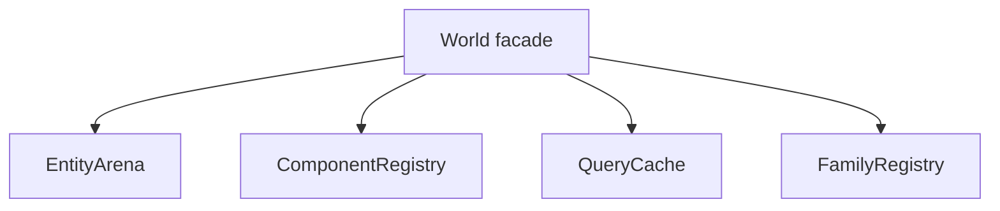

# 2026-07-09: Decouple World

Status: completed. The implemented ownership was later refined by the focused storage registries
in [`2026-08-21-ecs-storage-decoupling.md`](2026-08-21-ecs-storage-decoupling.md).

## Goal

Split `World` into smaller internal managers without losing the benchmark gains already in
place.

## Current State

- `EntityArena`, `ComponentRegistry`, and `QueryCache` are now extracted.
- `World` delegates lifecycle, component storage/pooling, and query cache state to those
  helpers.
- `:awake:ecs:allTests` and `:awake:scene:desktopTest` both pass after the split.
- The churn benchmark and scorecard were subsequently refreshed; current results live in
  [`docs/ecs-benchmark-scorecard.md`](../../ecs-benchmark-scorecard.md).

## Why This Matters

Before the split, `World` owned:

- entity creation, destruction, generations, alive flags, and signatures
- component type ids, store allocation, and store lookup
- pooling and recycle routing
- query caching and invalidation
- family registry coordination

That made `World` the place where every ECS concern landed. The implemented direction kept it as
the public facade and moved implementation details behind narrower internal collaborators.

## Proposed Split

### 1. EntityArena

Own:

- `create()`
- `destroy()`
- `isAlive()`
- entity generations, alive bits, signatures, and recycled ids

Keep `World` methods as thin delegates so the public API stays stable.

### 2. ComponentRegistry

Own:

- `typeId()`
- store allocation and lookup
- pool registration and fast pool lookup
- `componentCount()`
- store iteration needed during destroy/clear

This is the natural home for the dense arrays already used for stores and pool lookup.

### 3. QueryCache

Own:

- `queryCache`
- `queryVersion`
- `hasQueryCache`
- `collectQuery()`
- empty-query and typed-query invalidation rules

This keeps query-specific state separate from entity and component bookkeeping.

### 4. FamilyRegistry Stays Separate

`FamilyRegistry` is already a useful boundary. It should remain focused on maintained
families only, rather than absorbing more `World` responsibilities.

## Completed Order

1. `QueryCollector` now owns query collection while `QueryCache` owns cached results/invalidation.
2. `FamilyRegistry` remains separate from entity, component, and query ownership.
3. Cross-target ECS tests and the churn scorecard were refreshed after the split.

## Guardrails

- Do not add extra allocation on add/remove/query hot paths.
- Preserve the type-id fast path for benchmarked churn scenarios.
- Keep pool behavior and recycle semantics identical.
- Do not move scene components back into `awake-ecs`; the module boundary is already
  correct.

## Validation

- `:awake:ecs:allTests`
- `:awake:scene:desktopTest`
- `:awake:ecs:benchmark:mainBenchmark` filtered to the family churn cases

## Done When

- `World` reads as a thin facade instead of the central bucket for every ECS concern.
- The public behavior stays the same.
- The benchmark scorecard is refreshed from a verified run after the split.
