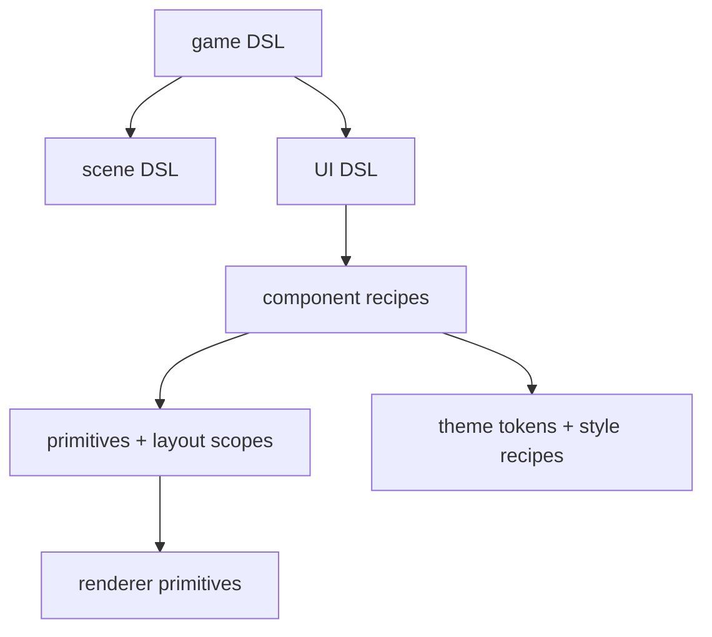

# 2026-07-14: UI DSL and Style Audit

## Goal

Fix the bitmap text noise in the sample UI, then define a cleaner path toward reusable
Awake UI primitives, component recipes, and DSL layers for game, scene, and UI authoring.

## Result

- Snapped bitmap text rendering to whole-number scale steps via `pixelPerfectTextScale()`
  so retro-font glyphs stay stable instead of expanding unevenly at fractional scales.
- Switched the glyph atlas samplers to explicit nearest filtering in both Vulkan and
  WebGPU, which keeps the 8x8 atlas crisp instead of letting generic texture defaults
  soften it.
- Aligned the hello-cube sample to a 2x text scale so the demo constants match the new
  bitmap-text behavior.
- Reviewed the new Jetpack Compose Style API docs and release notes as the reference model
  for the next Awake UI architecture pass.

## External Reference Baseline

The reference model for this note is the new Jetpack Compose Style API docs and release
notes as they existed on 2026-07-14:

- Styles overview
- Fundamentals of Styles
- State and animations in Styles
- Styles versus modifiers
- Theming with Styles
- Performance benefits with Styles
- Do's and don'ts with Styles
- Current limitations
- `androidx.compose.foundation.style` API reference
- Compose UI / Compose Foundation release notes

The most important constraints from those docs:

- The API is still experimental and changing.
- Styles replace visual parameters, not modifiers.
- Components should expose one `style` parameter rather than many visual parameters.
- Style properties are overwriteable, not additive.
- State-driven styling and built-in style animation are first-class.
- Material support is not the mature center of the API yet; custom design systems are.

## Audit Findings

### 1. `UiContext` is still the central bucket

`UiContext` currently owns frame state, input routing, widget-local state, primitive
staging, overlay ordering, and clip-stack resolution. That works for a small immediate-mode
UI, but it is too much authority in one class if Awake wants a richer UI surface.

### 2. `Widgets.kt` is carrying too many roles

Buttons, toggles, checkboxes, sliders, dropdowns, text, property rows, panel helpers, and
paint utilities all live together. The API is usable, but it is not yet shaped as reusable
primitives plus component recipes.

### 3. `UiStyle` is only a color callback

Today the style seam is:

- widget state in
- one fill color out

That is enough for hover/active tinting, but not for a shadcn-compose-like style API where
component recipes also own padding, border, radius, typography, and slot treatment.

### 4. `UiModifier` is structural, not expressive

`UiModifier` has the right spirit, but it currently covers size, corner radius, and border
only. That makes it useful for layout and shape overrides, not yet for a real style system.

### 5. Sample UI constants are duplicated

The hello-cube overlay and its debug readout still own their own text-scale and spacing
constants. That duplication is small, but it points to a missing metrics/typography layer
for engine-owned UI.

## Compose-Style Decisions For Awake

These are the recommended decisions for the Awake v1 style model.

### 1. `modifier` stays structural, `style` becomes visual

Awake should copy Compose's separation of concerns here:

- `modifier` for structure, size overrides, layout positioning, hit region adjustments, and
  behavior hooks
- `style` for padding, border, background, text treatment, visual state changes, and
  component defaults

This means today's `UiModifier` should not grow into a second styling language.

### 2. Replace visual parameter soup with one style parameter

Where a widget currently has visual knobs like color, border width, shape, text scale, and
 padding, the long-term API should converge on:

```kotlin
fun UiScope.button(
    id: String,
    modifier: UiModifier = Modifier,
    style: Style = Style,
    onClick: () -> Unit
)
```

That does not mean every current widget signature must flip in one pass, but it should be
the target direction.

### 3. Defaults should be merged internally

Compose's guidance here is important: do not expose a non-empty style as the default
parameter value. Instead:

- public API uses `style = Style`
- component implementation merges `defaultStyle then style`

That keeps component defaults overrideable without forcing consumers to re-specify them.

### 4. Last-write-wins should be a hard rule

Awake should prefer overwrite semantics for style properties:

- new border replaces old border
- new content padding replaces old content padding
- new background replaces old background

This is a better fit for theming and variants than additive stacking.

### 5. Style composition should exist in v1

Awake should support a `then`-like composition operator early:

```kotlin
val primaryButtonStyle =
    baseButtonStyle then roundedStyle then densePaddingStyle
```

That gives us reusable atoms, variants, and theme overrides without inventing a second API.

### 6. Typed style state should exist in v1

Awake should not stop at `hovered` and `active` booleans.

We should plan for:

- `MutableStyleState`
- `StyleState`
- `StyleStateKey<T>`

This lets style react to richer states like:

- pressed / hovered / focused / disabled
- selected / expanded / checked
- custom states such as `PlaybackState`, `ValidationState`, or `ToolMode`

### 7. Interaction logic stays outside style

Style can react to state, but it should not own state transitions or business logic.

Examples:

- `onClick`, drag logic, and toggle semantics stay in widget/runtime code
- style only describes how those states look

### 8. Custom style scopes/types should be planned, not forced immediately

Compose just added better support for custom style types and custom style scopes. That is a
useful direction for Awake too, but not necessarily in the first migration slice.

Recommended staging:

- v1: one shared `Style` + `StyleScope`
- v2: specialized scopes like `TextStyleScope`, `ButtonStyleScope`, `PanelStyleScope`
- v3: narrow per-family style types if needed

### 9. Theme should own component styles, not only tokens

Awake should keep tokens, but theme should also expose component recipe defaults.

Target shape:

- tokens: color / spacing / typography / shape
- recipes: button / checkbox / slider / dropdown / panel / field / text

## Recommended Target Shape



## Proposed Awake Style Model

This is the recommended v1 API direction, intentionally inspired by Compose's model
without copying unstable details too literally.

```kotlin
interface Style

interface StyleScope

class MutableStyleState

class StyleStateKey<T>(defaultValue: T)

infix fun Style.then(other: Style): Style
```

Recommended supporting concepts:

- `Modifier.styleable(...)` equivalent for Awake internals
- component-level default styles merged with incoming overrides
- state blocks such as `hovered { }`, `pressed { }`, `focused { }`
- optional `animate { }` blocks later, after the property model is stable

## Recommended API Boundaries

### Public primitive layer

- `UiScope`
- layout scopes
- primitive emission
- clipping
- hit testing
- slot claiming

### Public component layer

- `button`
- `checkbox`
- `slider`
- `dropdown`
- `panel`
- `field`
- `text`

Each of these should move toward:

- public `modifier`
- public `style`
- caller-owned value / interaction state

### Internal style application layer

- style property resolution
- state merging
- theme default merging
- style inheritance rules
- style-to-primitive translation

That layer should sit between widget APIs and the renderer primitives.

### 1. Keep primitives small and public

The current `UiScope` idea is solid. Keep the low-level surface public:

- layout scopes
- slot claiming
- hit testing
- primitive emission
- clipping

This is the layer custom widgets should build on.

### 2. Split widgets into primitives and recipes

Break `Widgets.kt` into smaller files:

- `Text.kt`
- `Button.kt`
- `Toggle.kt`
- `Checkbox.kt`
- `Slider.kt`
- `Dropdown.kt`
- `Panel.kt`
- `PropertyRow.kt`
- `Paint.kt`

That keeps behavior local and makes future style recipes easier to evolve.

### 3. Replace `UiStyle` with a real Style system

Today `UiStyle` is too narrow to survive as-is. Replace it with a general style model, then
build component recipes on top of that.

Recommended path:

- rename or retire today's `UiStyle`
- introduce `Style` / `StyleScope`
- introduce style composition with `then`
- introduce style state
- only then add component recipe aliases

### 4. Add component recipe types on top

Introduce component-level recipe types or named style holders instead of one generic color
callback:

- `ButtonStyle`
- `CheckboxStyle`
- `SliderStyle`
- `DropdownStyle`
- `PanelStyle`
- `FieldStyle`
- `TextStyle`

Each recipe should own:

- container/background treatment
- border and corner radius
- padding and spacing
- text color and text scale
- variant-specific defaults
- style-state-specific overrides

`UiModifier` should stay mostly structural while style recipes own the visual defaults.

### 5. Add a real theme object

Keep color tokens, but add metrics and component defaults:

- `UiColorTokens`
- `UiTypographyTokens`
- `UiSpacingTokens`
- `UiShapeTokens`
- `UiComponentStyles`

That gives Awake the same kind of "set once, consume everywhere" styling story that makes
shadcn-compose pleasant to build with.

### 6. Build the DSL in layers

#### Game DSL

High-level app composition:

```kotlin
game {
    window(title = "Awake")
    scene("cube") { mainScene() }
    ui { debugHud() }
}
```

#### Scene DSL

Author runtime scenes without leaking raw ECS plumbing:

```kotlin
scene {
    entity("camera") {
        transform { position(0f, 2f, 8f) }
        camera { perspective() }
    }
    entity("cube") {
        transform { position(0f, 0f, 0f) }
        meshRenderer("cube")
    }
}
```

#### UI DSL

Expose composed components instead of direct primitive soup:

```kotlin
panel {
    section("Camera") {
        select("Mode", cameraModes, selectedMode)
        slider("Azimuth", orbitYaw, -PI.toFloat(), PI.toFloat())
        checkbox("Grid", showGrid)
    }
}
```

The important part is that these DSL calls stay thin wrappers over reusable component
recipes, not another monolith.

## What We Should Not Mimic Yet

Because the Compose API is still experimental, Awake should not mirror every detail yet.

Avoid in v1:

- blind naming parity with every Compose type
- over-specialized style scopes before the property model is proven
- infinite-animation assumptions in the style layer
- custom-shape animation commitments
- heavy Material-shaped abstractions that do not match Awake's engine/editor use cases

## Open Questions We Should Answer Before Implementing

1. Should Awake v1 use one universal `Style`, or should text/button/panel be separate style
   types immediately?
2. Which properties are legal in `UiModifier`, and which must move into `Style`?
3. Should text scale become a typography token rather than a per-scope loose value?
4. Do we want style inheritance across nested scopes, or only explicit composition?
5. Should the first UI DSL slice target inspector panels only, or include HUD/menu
   composition too?
6. Do we want `animate { }` support in the first style pass, or only after static style
   properties settle?

## Suggested Order

1. Split `Widgets.kt` into focused files with no behavior change.
2. Define the Awake `Style` core model: `Style`, `StyleScope`, `MutableStyleState`,
   `StyleStateKey`, and `then`.
3. Decide the `UiModifier` versus `Style` property boundary and document it.
4. Add `UiTypographyTokens`, `UiSpacingTokens`, `UiShapeTokens`, and
   `UiComponentStyles`.
5. Migrate one narrow widget family first, ideally button/panel/text.
6. Introduce inspector-focused `Field` and `Section` recipes.
7. Add the first public UI DSL layer on top of those recipes.
8. Add game and scene DSLs only after the UI recipe layer is stable.

## Guardrails

- Keep the immediate-mode renderer path; the DSL should compile down to today's staged
  primitives, not replace the renderer model.
- Do not move scene/runtime concerns into `awake:engine:ui`.
- Keep custom game components outside `awake:ecs`; the ECS module should stay library-like.
- Prefer design-token and recipe seams before adding more widget parameters.
- Keep interaction logic out of style definitions.
- Treat Compose's current Style API as directional guidance, not a byte-for-byte contract.

## Validation

- `:awake:ui:allTests`
- hello-cube sample run on Vulkan
- hello-cube sample run on WebGPU

## Done When

- Awake UI has a real `Style` core model plus a theme + component-style layer, not only
  color callbacks.
- Engine widgets are split into reusable files with clearer ownership.
- The first public game/scene/UI DSL calls read declaratively without hiding runtime cost.
- The public API clearly separates structural modifiers from visual styles.
