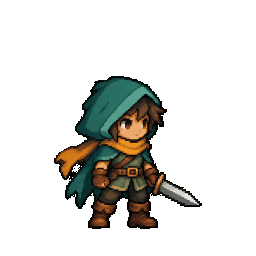
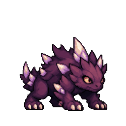

<!--
SPDX-FileCopyrightText: 2023-2026 Ron June Valdoz

SPDX-License-Identifier: Apache-2.0
-->

# engine-showcase

A catalogue of focused engine demonstrations — one scene per capability, each proving a single
thing works end to end.

The sample uses Core runtime components. Editor behaviour — selection, gizmos, play mode — belongs
to Awake Studio. Anything an engine change can break, including frame rate, should be reproducible
here first, without Studio.

Navigation uses the shadcn sidebar with a pinned header/footer and a scrollable scene list.
Below 768dp, the hamburger opens it in a dismissible mobile sheet; choosing a scene closes the
sheet. On wider windows the sidebar can be hidden and restored from the toolbar.

The toolbar shows the active scene, FPS, and **Debug**. Debug opens a right sheet on wide windows
or a bottom sheet on compact windows. **Render** contains global toggles and the active scene's
controls, **Scene** contains fog settings, **Buffers** captures framebuffer attachments, and
**Stats** contains detailed performance measurements. The close button, backdrop, and Escape
dismiss the panel. Its content scrolls independently of its close button.

## Running

```bash
./gradlew :samples:engine-showcase:run
```

Starts on `point-lights`, the default. **To open a specific demo, pass its id** — without this you
get the default no matter which demo you are working on:

```bash
./gradlew :samples:engine-showcase:run -Pawake.showcase=nav-chase
```

Web:

```bash
./gradlew :samples:engine-showcase:wasmJsBrowserDevelopmentRun
```

**Web audio:** select **Spatial audio** to hear the two looping emitters. A click/tap or key press
unlocks browser playback; volume and mute controls affect the active sources. The browser player
supports mono/stereo signed 16-bit PCM, including the sample's synthesized tones.

**Replacing the lit shader while it runs (desktop):** press L to toggle between the shipped
`lit_shadow` and a brighter-ambient variant built at runtime. Press K to try a variant that does not
compile; it is refused, a warning is printed, and the current shader keeps drawing. See
`ShowcaseShaderSwap` and the ASL README's dev-loop section.

## Showcases

| Id | Title | What it proves |
|---|---|---|
| `empty` | Empty | The scene document, camera and clear pass with nothing in them: the baseline a broken frame is compared against. |
| `point-lights` | Point lights | Several coloured point lights over a ground plane and lit cubes. |
| `heightfield-terrain` | Heightfield terrain | A Heightmap becomes drawable geometry and a Jolt heightfield that boxes and a character land on. |
| `cascaded-shadows` | Cascaded shadows | One shadow caster per cascade, so the near shadow is sharp and the far one still exists. |
| `gltf-viewer` | glTF viewer | glTF mesh, material and texture import. |
| `skinned-mesh` | Skinned mesh | Joint palette upload and GPU skinning. |
| `instanced-cubes` | Instanced cubes | One draw call for a 16x16x4 block of cubes through InstancedMeshRenderer. |
| `instanced-skinned` | Instanced skinned | Instancing and skinning together, animated per frame. |
| `nav-chase` | Navigation chase | A cube paths around a terrain ridge it cannot climb; bakeNavGrid reads the slope, no collider says a wall exists. |
| `particles` | Particles | A CPU emitter driving a quad batch, advanced every frame. |
| `sprites-2d` | 2D sprites | Animated 2D layers in a virtual viewport. Resize to compare framing; press V to cycle Fit, Extend, Fill, Stretch and Screen. |
| `rpg-sprites-2d` | RPG characters | An original ranger and thorn beast playing separate manifest-imported idle loops. |
| `runtime-2d` | 2D runtime | An animated sprite falls onto a chunked tile floor in an orthographic viewport. Press T to edit a tile and V to cycle scaling. |
| `spatial-audio` | Spatial audio | 3D positional audio emitters with distance attenuation and panning relative to the camera listener. |
| `ecs-stress` | ECS stress | Up to 100,000 moving entities, each with Transform and MeshRenderer components, drawn in a few instanced calls. |

`EngineShowcaseReadmeTest` fails when this table and `EngineShowcases` disagree.

The `sprites-2d` showcase uses an original lantern-firefly idle atlas generated with
[sprite-gen](https://github.com/aldegad/sprite-gen): four transparent 256×256 frames at 4 fps.
Run it with `./gradlew :samples:engine-showcase:run -Pawake.showcase=sprites-2d`.
The [atlas](src/commonMain/resources/assets/sprites/lantern-firefly/sprite-sheet-alpha.png),
[animation preview](src/commonMain/resources/assets/sprites/lantern-firefly/idle.gif), and generated
manifest and request are packaged together. The manifest supplies atlas dimensions and named idle
clips to the dedicated `sprite` and `sprite_clips` components before the scene is instantiated.


The `rpg-sprites-2d` showcase adds an original teal-cloaked ranger and purple crystal thorn beast,
each breathing through a twelve-frame idle at 8 fps baked by sprite-gen's Breathe. Both use one
transparent two-row atlas, imported from its
manifest; the enemy is flipped in scene data to face the hero. Run it with
`./gradlew :samples:engine-showcase:run -Pawake.showcase=rpg-sprites-2d`.
The [atlas and provenance](src/commonMain/resources/assets/sprites/woodland-rivals/PROVENANCE.md)
record the generation and sprite-gen packing steps.




## Integrated 2D runtime

Run `./gradlew :samples:engine-showcase:run -Pawake.showcase=runtime-2d`, or choose **2D runtime**
in the browser showcase. The scene combines the existing `tilemap`, `sprite`, `sprite_clips`,
`camera` and `physics_body` components. Original geometric atlas cells are generated by the
sample; dimensions, clip timing, collider sizes and planar motion are authored in
[`runtime-2d.scene.json`](src/commonMain/resources/assets/examples/runtime-2d.scene.json).

The gold/red sprite falls onto the green tile row through the fixed-step Jolt system. Its floor
collider is explicit scene data; tile rendering does not generate collisions. Press **T** to
toggle a blue cell and **V** to cycle viewport policies, then resize to compare framing. Switching
away destroys the sample's physics bodies before its scene entities. The standard runtime owns
sprite animation, chunk batching, culling and GPU resource cleanup.

`Runtime2dSceneParityTest` loads this showcase through `engineShowcaseApp` with the same public
`EngineShowcaseRenderPlan` used by its launchers. Vulkan and WebGPU readbacks check tile edits,
clip changes, physics settling, viewport framing and export/reload. WebGPU scheduled frames
use an offscreen target; browser presentation is outside this test. The separate
`Runtime2dShowcaseLifecycleTest` checks native collider cleanup when switching away and authored
tile restoration when switching back.

## Measuring frame time

Click the toolbar's FPS readout, or open **Debug → Stats**, to read:

| Line | Meaning |
|---|---|
| FPS, Frame | Average over the last 30 frames |
| p99, Worst | The 99th-percentile and slowest frame over the last 240. A stall shows here, not in the average |
| Game | Fixed and frame systems: gameplay, physics, animation |
| Render | Transform propagation, scene extraction, command recording and present |
| UI, Wait | Building and staging the UI; time blocked on the GPU's previous frame |
| Visible | Renderables that survived culling, before instancing folds them into a few draws |
| Recorded | Every draw the backend issued, shadow cascades and UI included, and its triangles |
| GPU | GPU time of the frame, where the backend can time it |

Enable **Phase timings** in Stats, or press F2, to measure the Game/Render/UI/Wait split and GPU
time. The stress showcase and perf log turn them on themselves.

To reproduce a frame-rate drop without Studio, open the stress showcase with vsync off, so the frame
rate shows headroom past the display, and log a summary line every 240 frames:

```bash
./gradlew :samples:engine-showcase:run -Pawake.showcase=ecs-stress -Pawake.showcase.entities=50000 \
  -Pawake.showcase.vsync=false -Pawake.showcase.perfLog=true -Pawake.vulkan.validation=false
```

```text
PERF ecs-stress renderables=50001 fps=… avg=… p99=… max=… game=… render=… ui=… wait=… draws=… instances=… tris=… gpu=…
```

- Turn validation off (`-Pawake.vulkan.validation=false`): a `run` task enables it, and it costs
  milliseconds per frame.
- Keep the window focused and in front. An unfocused window is capped at 15 FPS.
- Compare two builds on the same machine back to back. Before blaming code, check `uptime` and
  `ps -Ao pcpu,command -r`: a busy machine drops frames on its own.

The entity count can also be changed from the debug card, and "Move entities" off measures the same
entities standing still. `EcsStressSceneFrameTest` runs the same showcase headless and prints its
frame times.

## Adding a showcase

1. Author `src/commonMain/resources/assets/examples/<id>.scene.json`. Its `"name"` **must** equal
   the id — `EngineShowcaseTest` asserts it.
2. Register an `EngineShowcase(...)` entry in `EngineShowcase.kt` with a one-sentence `summary`.
   Use `onActivated` for state a scene document cannot express, `driver` for per-frame work,
   `onDeactivated` to destroy anything it spawned, and `controls` for knobs only it has.
3. Register any new mesh or material in `registerEngineShowcaseAssets()`.
4. Add its row above, with the same summary.

`EngineShowcaseTest` then checks the id is unique and that the scene loads and instantiates. A demo
whose content is hand-tuned — terrain heights, spawn positions — deserves its own test guarding
that content, the way `NavChaseExampleDriverTest` asserts the ridge really blocks and both cubes
start on walkable ground. A demo that runs, renders, and quietly shows nothing is the failure mode
worth testing for. Frame tests boot the real render plan headless through `HeadlessPlanEngine`.
