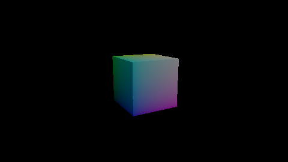

# Your first scene

<p class="awake-lede">Put a camera, a sun, and a cube in the window from the last page, then write a system that spins the cube.</p>

<div class="awake-badges" markdown>
<span class="awake-badge">components: <code>camera</code> · <code>light</code> · <code>mesh_renderer</code> · <code>spin_control</code></span>
<span class="awake-badge awake-badge--ok">Vulkan</span>
<span class="awake-badge awake-badge--ok">WebGPU</span>
</div>

<div class="awake-figures" markdown>
<figure markdown>

<figcaption>The finished scene, rendered by the engine</figcaption>
</figure>
</div>

This page adds `awake-scene-authoring` to `commonMain` (see [Installation](installation.md)) and
reuses `GameRenderPlan` from [Your first window](first-window.md).

## Build the scene

A scene is a set of ECS entities, each with components. This one has three: a camera, a
directional light, and a cube. Both forms below describe the same entities. This page runs the
scene DSL form; [Load a scene document](load-a-scene-document.md) runs the other.

=== "Scene document"

    ```json title="first.scene.json"
    --8<-- "website/docs/snippets/get-started/first.scene.json"
    ```

=== "Scene DSL"

    ```kotlin title="Kotlin"
    --8<-- "samples/engine-showcase/src/commonTest/kotlin/com/awakekt/awake/showcase/docs/FirstSceneDocsSampleTest.kt:scene-dsl"
    ```

- **camera** looks from `eye` towards `center`.
- **sun** is a directional light. `direction` is where the light comes from, so it shines down and
  across the cube. See [Lights and shadows](../guides/lights-and-shadows.md).
- **cube** is a one-unit cube centred half a unit up, so its base is at `y = 0`. It draws the mesh named `cube` with the
  material named `lit`, and carries a `SpinControl` with a speed of 1 radian per second.

| Scene DSL | Component id | ECS component |
| --- | --- | --- |
| `camera(lens = …)` | `camera` | `Camera`. The DSL also adds a `CameraRig`, which does nothing until a camera system runs. |
| `directionalLight(…)` | `light` | `Light` |
| `transform(…)` | the node's `transform` | `Transform` |
| `mesh(mesh, material)` | `mesh_renderer` | `MeshRenderer` |
| `configure(::SpinControl) { … }` | `spin_control` | `SpinControl` |

## Spin it with a system

A `SpinControl` only holds an angle and a speed. A `System` does the work: the engine calls its
`update` every frame with the world and the seconds since the last frame. This one advances each
angle by `speed × delta` and writes it into the entity's Y rotation.

```kotlin title="commonMain/kotlin/Turntable.kt"
--8<-- "samples/engine-showcase/src/commonTest/kotlin/com/awakekt/awake/showcase/docs/FirstSceneDocsSampleTest.kt:turntable"
```

`queryEach` visits every entity that has both components, without allocating.

## Put it in the app

Replace `firstWindow()` with an app that installs the scene:

```kotlin title="commonMain/kotlin/Game.kt"
--8<-- "samples/engine-showcase/src/commonTest/kotlin/com/awakekt/awake/showcase/docs/FirstSceneDocsSampleTest.kt:imports"

--8<-- "samples/engine-showcase/src/commonTest/kotlin/com/awakekt/awake/showcase/docs/FirstSceneDocsSampleTest.kt:app"
```

- `assets { }` names the GPU assets the scene can use. Each factory runs the first time something
  asks for its name, and the result is shared after that.
- `frameSystem("turntable")` adds the system to the scene's schedule.
- `onReady` runs once the renderer exists, with the scene runtime as its receiver. That is where
  `requireMesh` and `requireMaterial` can build the assets, so the entities are created there.

Then launch it from `desktopMain`:

```kotlin title="desktopMain/kotlin/Main.kt"
--8<-- "samples/engine-showcase/src/desktopTest/kotlin/com/awakekt/awake/showcase/docs/firstscene/FirstSceneMainDocsSampleTest.kt:main"
```

Run `main`: the cube turns once every six seconds or so, lit from one side.

## How it works

Each frame, the scene runs your frame systems first, then the engine's own: `TransformSystem` turns
each `Transform` into a matrix, and `RenderSystem3D` draws every `MeshRenderer` from the primary
camera. That order is why `Turntable` only has to write a rotation.

When the app is disposed, the scene destroys the meshes and materials that `assets { }` built.

!!! warning "Asset names must match"
    `requireMesh("cube")` fails with "No scene mesh named 'cube' is registered" unless `assets { }`
    declares a mesh with that exact name. The same holds for materials.

!!! tip "Fixed-step systems"
    `frameSystem` runs once per rendered frame. Use `fixedSystem` for simulation that must advance in
    equal steps, such as physics.

## See also

- [Load a scene document](load-a-scene-document.md): run the same scene from `first.scene.json`.
- [Lights and shadows](../guides/lights-and-shadows.md) for the `light` component.
- [ECS](../guides/ecs.md) for components, queries, and systems.
- [Scene authoring](../guides/scene-dsl.md) for the rest of the scene DSL.
