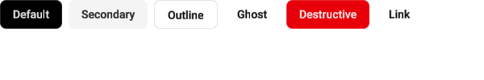

# Button

`ShadcnButton` is a slot-based button from `awake:ui:shadcn`.

## Usage

The example below is extracted from the compiled UI showcase, so the docs use the same API that
the sample builds.

````markdown
```kotlin
--8<-- "samples/ui-showcase/src/commonMain/kotlin/com/awakekt/awake/sample/uishowcase/ui/pages/inputs/ButtonPage.kt:button-basic"
```
````



The image is a reviewed CPU-rasterized capture from
[`renderButtonVariants`](https://github.com/awakekt/awake/blob/main/samples/ui-showcase/src/desktopTest/kotlin/com/awakekt/awake/sample/uishowcase/ui/ShadcnComposeParityPreviewTest.kt),
using a `600 × 100` viewport and the default light Shadcn theme.

See the [complete compiled sample](https://github.com/awakekt/awake/blob/main/samples/ui-showcase/src/commonMain/kotlin/com/awakekt/awake/sample/uishowcase/ui/pages/inputs/ButtonPage.kt),
[theming guide](../theming.md), and [Shadcn component overview](../../ui/shadcn.md) for the next
steps.

## Variants

Available variants include:
- `Default`
- `Secondary`
- `Outline`
- `Ghost`
- `Destructive`
- `Link`
