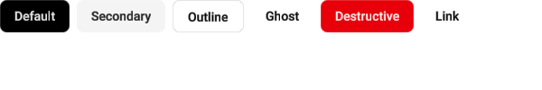

# Button

`ShadcnButton` from `awake:ui:shadcn`, package `com.awakekt.awake.ui.shadcn.components`. Guide:
[shadcn components](../../guides/shadcn.md).

!!! warning "Needs a theme"
    `ShadcnButton` throws unless it is inside `provideShadcnTheme(values) { … }`. See
    [Wrap your UI in a theme](../../guides/shadcn.md#wrap-your-ui-in-a-theme).

```kotlin title="Kotlin"
--8<-- "samples/ui-showcase/src/commonMain/kotlin/com/awakekt/awake/sample/uishowcase/ui/pages/inputs/ButtonPage.kt:button-basic"
```



The image is a CPU-rasterized capture from `renderButtonVariants` in the UI showcase's
`ShadcnComposeParityPreviewTest`: a `600 × 100` viewport, light theme.

## Overloads

| Overload | Use it for |
| --- | --- |
| `ShadcnButton(label: String, …, leadingIcon: ImageVector? = null)` | A text label, with an optional icon before it. |
| `ShadcnButton(…, content: context(Composer) () -> Unit)` | Any content, such as an icon-only button with `size = Icon`. |

```kotlin title="Kotlin"
--8<-- "awake/ui/shadcn/src/desktopTest/kotlin/com/awakekt/awake/ui/shadcn/ShadcnDocsSampleTest.kt:button-overloads"
```

## Parameters

| Parameter | Type | Default | What it does |
| --- | --- | --- | --- |
| `label` | `String` | required (label overload) | The button text. |
| `modifier` | `Modifier` | `Modifier` | Layout, test tag and other modifiers. |
| `variant` | `ShadcnButtonVariant` | `Default` | Visual style. See [Variants](#variants). |
| `size` | `ShadcnButtonSizeVariant` | `Default` | Height and padding. See [Sizes](#sizes). |
| `enabled` | `Boolean` | `true` | Whether the button takes clicks. |
| `onClick` | `() -> Unit` | `{}` | Called when a press and release both land on the button. |
| `shape` | `Shape?` | `null` | Replaces the theme's corner shape. |
| `leadingIcon` | `ImageVector?` | `null` | Icon before the label (label overload). |
| `content` | `context(Composer) () -> Unit` | required (content overload) | What the button shows. |

## Variants

`ShadcnButtonVariant`, in `com.awakekt.awake.ui.shadcn.components`.

| Variant | shadcn classes it translates |
| --- | --- |
| `Default` | `bg-primary text-primary-foreground hover:bg-primary/90` |
| `Destructive` | `bg-destructive text-white hover:bg-destructive/90` |
| `Outline` | `border bg-background hover:bg-accent hover:text-accent-foreground` |
| `Secondary` | `bg-secondary text-secondary-foreground hover:bg-secondary/80` |
| `Ghost` | `hover:bg-accent hover:text-accent-foreground`, no fill at rest |
| `Link` | `text-primary underline-offset-4 hover:underline`, no chrome |

## Sizes

`ShadcnButtonSizeVariant`, in `com.awakekt.awake.ui.shadcn.components`.

| Size | Height | Horizontal padding |
| --- | --- | --- |
| `Default` | 36 dp | 16 dp, plus 8 dp vertical |
| `Xs` | 24 dp | 8 dp |
| `Sm` | 32 dp | 12 dp |
| `Lg` | 40 dp | 24 dp |
| `Icon` | 36 dp square | none |
| `IconXs` | 24 dp square | none |
| `IconSm` | 32 dp square | none |
| `IconLg` | 40 dp square | none |
