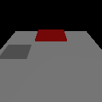
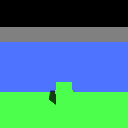

# Lights and shadows

<p class="awake-lede">A sun for your scene: one directional light that lights everything at the same angle and casts cascaded shadows out to a distance you choose.</p>

<div class="awake-badges" markdown>
<span class="awake-badge">component: <code>light</code></span>
<span class="awake-badge awake-badge--ok">Vulkan</span>
<span class="awake-badge awake-badge--ok">WebGPU</span>
<span class="awake-badge">Desktop · Android · iOS · Web</span>
</div>

<div class="awake-figures" markdown>
<figure markdown>

<figcaption>Lit scene</figcaption>
</figure>
<figure markdown>

<figcaption>Shadow visibility debug view: each cascade tinted</figcaption>
</figure>
</div>

## Add a sun

Give an entity a `light` component of type `Directional`. It casts shadows unless you turn them off.
Both forms below build the same component; the scene document is what AwakeKt Studio saves.

=== "Scene document"

    ```json title="sun.scene.json"
    --8<-- "website/docs/snippets/scene/sun.scene.json"
    ```

=== "Scene DSL"

    ```kotlin title="Kotlin"
    --8<-- "awake/scene/authoring/src/desktopTest/kotlin/com/awakekt/awake/scene/authoring/LightingDocsSampleTest.kt:sun-dsl"
    ```

=== "Studio"

    1. Select an entity in the **Hierarchy**, or add a new one.
    2. In the **Inspector**, open **Add Component** and choose **Light**.
    3. Set its type to **Directional**, then adjust direction, color, intensity and shadow
       distance.

    Studio writes the scene document shown in the first tab.

## Properties

| Property | Type | Default | What it does |
| --- | --- | --- | --- |
| `type` | `Directional` · `Point` | `Point` in a scene document | `Directional` is a sun; `Point` is a lamp with a `range`. |
| `direction` | vector | `(0.4, 0.8, 0.4)` | The direction the light comes *from*, so `y > 0` is a sun overhead. |
| `color` | RGB | white | Light color, multiplied by `intensity`. |
| `intensity` | number | `1.0` | Brightness multiplier. |
| `shadowsEnabled` | boolean | `true` | Whether this light casts shadows. |
| `shadowDistance` | number | `100` | How far from the camera shadows reach, in world units. |
| `ambient` | number or none | the scene's | Overrides the scene's ambient share, between 0 and 1. |

## How it works

The view from the camera out to `shadowDistance` is split into cascades, and each cascade gets its
own slice of the shadow map. Nearby shadows stay sharp while distant ones stay cheap. Past the shadow
distance, surfaces are lit with no shadow.

!!! tip "Choosing a shadow distance"
    Keep it as short as your camera needs. Shadow detail near the camera grows as the distance
    shrinks, because the same shadow map covers less of the world.

!!! warning "A far caster casts no shadow"
    A caster more than `shadowDistance` from the camera casts nothing, even onto a mesh right under
    it. That is the light's range, not a rendering bug.

## Debugging

Turn on the **Shadow visibility** debug view to see each cascade tinted and where shadows stop. In the
Engine Showcase it is under **Diagnostics**.

## See also

- [Scene rendering](rendering.md) for the other visible components.
- [Scene authoring](authoring.md) for the scene DSL.
- [Scene engine overview](../engine/scene.md) for loading scene documents.
